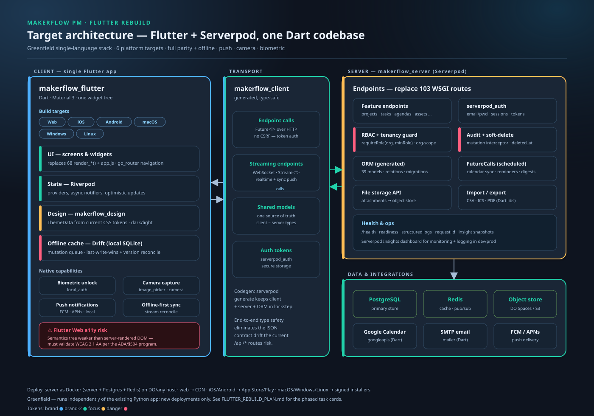

# FLUTTER_REBUILD_PLAN.md

> A **resumable, pause-able, agent-executable** plan to rebuild MakerFlow PM as a single-language **Dart** stack: a **Flutter** client across six platforms on a **Serverpod** backend. Same task-card schema and loop as [`FEATUREROADMAP_workplan.md`](FEATUREROADMAP_workplan.md) so an agent or human can pick it up cold.

<p align="center">
  
</p>

- Existing product (the thing being rebuilt): [`ProductSpec.md`](ProductSpec.md) · [`README.md`](README.md)
- Existing roadmap (the Python app's forward plan): [`FEATUREROADMAP_workplan.md`](FEATUREROADMAP_workplan.md)
- This plan governs a **separate, greenfield** Dart codebase. It does not modify `app/server.py`.

---

## Table of contents

- [0. How to use this file](#0-how-to-use-this-file)
  - [0.1 The loop](#01-the-loop)
  - [0.2 The regeneration prompt (find new features)](#02-the-regeneration-prompt-find-new-features)
  - [0.3 The execution prompt (build the next task)](#03-the-execution-prompt-build-the-next-task)
  - [0.4 Task-card schema](#04-task-card-schema)
  - [0.5 Status legend, personas, scales](#05-status-legend-personas-scales)
  - [0.6 Resumability & context-window protocol](#06-resumability--context-window-protocol)
- [1. Decisions of record](#1-decisions-of-record)
- [2. Target architecture](#2-target-architecture)
- [3. Stack translation: Python → Dart](#3-stack-translation-python--dart)
- [4. Data model translation (39 tables → Serverpod models)](#4-data-model-translation-39-tables--serverpod-models)
- [5. Tenancy, RBAC, audit, soft-delete](#5-tenancy-rbac-audit-soft-delete)
- [6. Feature-parity matrix](#6-feature-parity-matrix)
- [7. Native-only capabilities](#7-native-only-capabilities)
- [8. Accessibility — the hard part](#8-accessibility--the-hard-part)
- [9. Design system port](#9-design-system-port)
- [10. Monorepo layout](#10-monorepo-layout)
- [11. Infrastructure & deployment](#11-infrastructure--deployment)
- [12. Risks & open questions](#12-risks--open-questions)
- [13. Phased task cards](#13-phased-task-cards)
- [14. Sequencing & milestones](#14-sequencing--milestones)
- [Appendices (deep dives)](#appendices-deep-dives)
  - [A. Endpoint map (103 routes → Serverpod endpoints)](#a-endpoint-map-103-routes--serverpod-endpoints)
  - [B. Auth & session architecture](#b-auth--session-architecture)
  - [C. Realtime & offline-sync architecture](#c-realtime--offline-sync-architecture)
  - [D. Error taxonomy & API conventions](#d-error-taxonomy--api-conventions)
  - [E. State management & navigation conventions](#e-state-management--navigation-conventions)
  - [F. Testing strategy](#f-testing-strategy)
  - [G. Security hardening (threat-model port)](#g-security-hardening-threat-model-port)
  - [H. Performance & scaling](#h-performance--scaling)
  - [I. Observability](#i-observability)
  - [J. Internationalization](#j-internationalization)
  - [K. Platform & store compliance](#k-platform--store-compliance)
  - [L. Cost, infra sizing & effort](#l-cost-infra-sizing--effort)
  - [M. Parity acceptance checklist](#m-parity-acceptance-checklist)
- [15. Checkpoint log](#15-checkpoint-log)

---

## 0. How to use this file

**This file is self-contained.** It carries its own regeneration prompt (§0.2), execution prompt (§0.3), task-card schema (§0.4), legend/personas/scales (§0.5), and resumability protocol (§0.6). You do not need any other document to run the loop — though it stays consistent with the Python app's [`FEATUREROADMAP_workplan.md`](FEATUREROADMAP_workplan.md) so a reader who knows one knows both. Companion docs for the Dart rebuild: [`Flutter_ProductSpec.md`](Flutter_ProductSpec.md) (onboarding) and [`makerflow_dart/BUILD_STATUS.md`](makerflow_dart/BUILD_STATUS.md) (what's on disk).

> All state lives in this Markdown file. There is no external tracker. Restart cold by reading the checkpoint log (§15) and scanning task statuses (§13).

### 0.1 The loop

This plan drives an **A → B → C → D → E → F → A** loop, the same one diagrammed in [`docs/diagrams/08-roadmap-loop.svg`](docs/diagrams/08-roadmap-loop.svg):

- **A. Regenerate** — paste §0.2 into a fresh agent. It scans the repo + this file and proposes new task cards (planning only, no code).
- **B. Triage** — a human edits Spec/DOD, adjusts Priority/Complexity, promotes `backlog → ready`, confirms Agent Persona.
- **C. Execute** — paste §0.3 into a fresh agent. It picks the top-ready task, implements, verifies, records Agent Decisions, ticks the Status box.
- **D. Verify** — the agent runs the task's tests/a11y checks; on failure, Status flips back to `in_progress`.
- **E. Propagate** — the agent walks the completed task's `Unblocks`, promotes newly-eligible cards to `ready`, appends a checkpoint-log line (§15).
- **F. Loop or stop** — ready queue empty → re-run A; context > 70% → stop & checkpoint (§0.6); else → C again.

### 0.2 The regeneration prompt (find new features)

Paste this into a fresh agent session to refresh the backlog. It is self-contained.

````text
SYSTEM: You are a senior Flutter + Serverpod (Dart) architect extending
MakerFlow PM's GREENFIELD Dart rebuild. The repository path is in the user
message; the rebuild lives under `makerflow_dart/`. `FLUTTER_REBUILD_PLAN.md`
is the canonical state — respect its existing task IDs (prefix `fl-`),
decisions of record (§1), and statuses.

GOAL: Propose new task cards (features / refactors / hardening) for the Dart
rebuild. Do NOT write code. Modify ONLY `FLUTTER_REBUILD_PLAN.md`.

PROCEDURE:
1. Read FLUTTER_REBUILD_PLAN.md in full, plus Flutter_ProductSpec.md and
   makerflow_dart/BUILD_STATUS.md.
2. Skim the deep-dive appendices (A–M) so proposals fit the established
   architecture (Serverpod endpoints, RBAC/tenancy/audit contract, offline
   sync model, a11y posture).
3. Survey makerflow_dart/ with targeted reads (do NOT read every file):
     - `lib/src/endpoints/*` to see what server surface exists
     - `lib/src/models/*.spy.yaml` for the data model
     - `makerflow_flutter/lib/src/features/*` for built screens
     - grep `TODO|FIXME|fl-` for debt + cross-references
4. Compare against the feature-parity matrix (§6) and the parity checklist
   (Appendix M). Identify gaps: unbuilt parity, missing native features,
   missing tests, a11y debt, ops/observability holes.
5. For each NEW card use the schema in §0.4. Each MUST have:
     - a unique ID `fl-{phase}-{kebab-slug}` (never reuse an existing ID)
     - non-empty Spec with a measurable Definition of Done
     - explicit Dependencies (other fl- IDs that must be `[x] done` first)
     - explicit Unblocks
     - ranked Priority (P0–P3) + Complexity (XS–XL) + Agent Persona (§0.5)
     - concrete Files to modify (real makerflow_dart/ paths)
6. Insert new cards into §13 under the correct phase; update the §13 phase
   list and any Dependencies/Unblocks on adjacent cards.
7. Append a one-line entry to §15 (checkpoint log) describing what you added.

CONSTRAINTS:
- Cap at 7 new cards per pass (keep triage tractable).
- Concrete + shippable over broad. "Improve UX" is too vague; "Add a list +
  calendar view to the tasks feature with shared filters" is right.
- Never violate the decisions of record (§1): do not propose dropping
  Serverpod, cutting a platform, or migrating legacy data (greenfield, D3).
- Any UI card MUST state its WCAG 2.1 AA impact (the rebuild's a11y mandate,
  §8). If a proposal would regress accessibility, pair it with the mitigation.
- If nothing is worth proposing, say so in a §15 entry. No busy-work.

OUTPUT:
- Modified FLUTTER_REBUILD_PLAN.md only.
- A short summary to the human: new task IDs + one-line rationale each.
````

### 0.3 The execution prompt (build the next task)

Paste this into a fresh agent session to do the work.

````text
SYSTEM: You are an implementation agent for MakerFlow PM's Dart rebuild
(Flutter + Serverpod), in `makerflow_dart/` within the repo. The rebuild is
GREENFIELD — it does not modify the Python app at the repo root.
`FLUTTER_REBUILD_PLAN.md` is the canonical queue.

PROCEDURE:
1. Read FLUTTER_REBUILD_PLAN.md. Pick the next task:
     - Status `[ ] ready` (or `[~] in_progress` you are resuming),
     - all Dependencies `[x] done`,
     - highest Priority; tie-break by lowest Complexity.
2. Set its Status to `[~] in_progress`; add a Decisions entry: timestamp +
   "Picked up by execution prompt".
3. Read ONLY the files in that card's `Files to modify` plus any the Spec
   names, plus the appendix it references. Use the Agent Persona to set style
   (serverpod-backend writes endpoints + business logic; flutter-ui writes
   widgets + Riverpod; dart-data writes model YAML + migrations; etc.).
4. Plan briefly in Decisions: approach, alternatives rejected, open questions.
   If a question must be answered by a human first, set Status `[ ] blocked`,
   write the question, and STOP.
5. Implement, scoped to the listed files. Toolchain reminders:
     - after editing model YAML or endpoints, run `serverpod generate`
       (regenerates makerflow_client + ORM) before relying on generated types;
     - `melos bootstrap` after dependency changes;
     - keep the repository seam — UI talks to a repository, not the client
       directly (Appendix E).
   If the work bleeds into unlisted files, STOP, append a follow-up card
   (suffix `-followup`) to §13, and narrow or block the current task.
6. Verify against the Definition of Done. At minimum:
     - `melos run analyze` and `melos run test`;
     - for endpoints: serverpod_test integration + the role-matrix test;
     - for UI: widget test + a manual pass; for ANY UI change, verify WCAG
       2.1 AA on the affected surface and record the result (Appendix F/§8).
7. Write a verbose Agent Decisions entry: approach, alternatives, surprises,
   follow-ups, and the exact commands you ran to verify.
8. Flip Status to `[x] done`.
9. For each ID in this card's Unblocks, if all ITS Dependencies are now done,
   promote it `[ ] backlog → [ ] ready`.
10. Append a one-line entry to §15 (checkpoint log): timestamp, task ID, outcome.
11. Continue or stop (§0.6): if a ready task exists, context < 70%, and no P0
    question is open → go to step 2; else STOP and report.

CONSTRAINTS:
- NEVER commit/push unless the human asks.
- NEVER edit the schema (§0.4) or decisions of record (§1) from this prompt —
  each is its own dedicated change.
- NEVER touch other cards except to flip Unblocked statuses (step 9).
- NEVER skip the Decisions write-up — it is the audit trail.
- If a Spec is ambiguous or contradicts the code, set Status `[ ] blocked`,
  record the conflict, and STOP.

OUTPUT:
- Code changes for the picked task (under makerflow_dart/).
- Updated FLUTTER_REBUILD_PLAN.md (status + decisions + checkpoint log).
- A short summary to the human.
````

### 0.4 Task-card schema

Every card in §13 uses this structure. The execution prompt reads it; humans edit the Spec to steer.

```markdown
#### {ID} — {Title}

- **Status:** [ ] backlog · [ ] ready · [~] in_progress · [ ] blocked · [x] done · [~] deferred
- **Agent Persona:** {one of §0.5}
- **Priority:** P0 | P1 | P2 | P3
- **Complexity:** XS | S | M | L | XL
- **Dependencies:** {fl- IDs that must be done first, or —}
- **Unblocks:** {fl- IDs this clears, or —}
- **Files to modify:**
  - `makerflow_dart/path/to/file`

**Spec (human-editable):**
{Prose the human edits to drive the work, followed by a Definition of Done:}
- [ ] DOD item 1
- [ ] DOD item 2

**Notes:** {optional human triage notes}

**Agent Decisions (append-only, verbose):**
{The executing agent appends timestamped entries here — approach, alternatives,
commands run, surprises, follow-ups. Never overwritten.}
```

**Checkbox rules:** exactly one Status box checked at a time; the agent un-checks the prior box and checks the new one (the diff preserves history). `[~] deferred` needs a one-line reason in Decisions. A `[x] done` card is immutable except for post-hoc Decisions audit notes.

### 0.5 Status legend, personas, scales

**Status:** `[ ] backlog` (captured, not approved) · `[ ] ready` (triaged, deps met, claimable) · `[~] in_progress` (an agent owns it) · `[ ] blocked` (question/dep pending) · `[x] done` (DOD met + verified + Unblocks propagated) · `[~] deferred` (parked, reason in Decisions).

**Agent personas:**

| Persona | Scope |
|---|---|
| `serverpod-backend` | Server endpoints, `serverpod_auth`, business logic, FutureCalls, integrations. |
| `dart-data` | Model YAML, ORM, migrations, repositories, tenancy/audit/soft-delete plumbing. |
| `flutter-ui` | Screens, widgets, navigation, Riverpod state, design system. |
| `flutter-platform` | Per-platform concerns: web, iOS, Android, macOS, Windows, Linux builds, native plugins. |
| `flutter-a11y` | Semantics, focus traversal, screen-reader passes, WCAG conformance on Flutter. |
| `devops-dart` | Docker, Postgres/Redis, CI/CD, app-store + desktop release pipelines, observability infra. |
| `qa-automation-dart` | Test harness: serverpod_test, widget/golden, integration_test/Patrol E2E, role-matrix + a11y gates. |
| `security-reviewer` | Threat-model port, auth hardening, audit immutability, dependency + secret scanning. |
| `docs-curator` | This plan, `Flutter_ProductSpec.md`, README, diagrams, BUILD_STATUS. |

**Priority:** **P0** foundational / blocks downstream / data-loss or security risk · **P1** production hardening or critical UX · **P2** new capability / growth · **P3** nice-to-have / experimental.

**Complexity (order-of-magnitude):** **XS** <½ day · **S** ½–2 days · **M** 2–5 days · **L** 1–2 weeks · **XL** multi-week — split before executing.

### 0.6 Resumability & context-window protocol

The plan is built to **pause and resume across context windows and sessions** without losing state:

- **Read-only-your-task rule:** an executing agent reads the one card it is working plus the files in its `Files to modify` plus the single appendix that card references — never the whole plan or repo. This keeps each task within a fraction of a context window.
- **Checkpoint cadence:** after every completed card, the agent appends a §15 line and (if asked) commits. A line in §15 + the card's `[x]`/Decisions is a complete, resumable savepoint.
- **The 70% rule:** when context usage approaches ~70%, finish the current card to a clean state (`[x] done` or `[~] in_progress` with Decisions describing exactly where it stopped), append a checkpoint, and STOP. Do not start a card you cannot finish before the window fills.
- **Cold restart:** a brand-new agent resumes by reading §15 (what happened last), scanning §13 statuses (what's ready), and running §0.3. No memory of prior sessions is required.
- **Pause anytime:** because all state is in this file, a human can stop the loop after any card and hand off — to a different agent, a teammate, or future-self — with zero context transfer beyond "read FLUTTER_REBUILD_PLAN.md."

---

## 1. Decisions of record

These four decisions are locked. Reopen only with an explicit ADR appended here.

| # | Decision | Choice | Consequence |
|---|---|---|---|
| D1 | **Backend strategy** | **Full Dart — Serverpod** (Flutter + Serverpod server + Postgres). | Single language end to end. Generated type-safe client, ORM, auth, migrations, scheduled jobs. Rewrites all backend logic; does not reuse `app/server.py`. Heavier infra than the $6-droplet ethos (Postgres + Redis), but production already used Postgres. |
| D2 | **Platforms** | **Web + iOS + Android + macOS + Windows + Linux** (all six). | Maximum reach from one codebase. Largest QA + accessibility surface; app-store + desktop signing pipelines required. |
| D3 | **Migration** | **Greenfield, new deployments only.** | No data migration. The Python app stays for existing deployments. Two products coexist for the foreseeable future. Lets the rebuild move fast without a cutover. |
| D4 | **Scope** | **Full parity + native-only features** (offline-first, push, camera, biometric). | The most ambitious scope. Parity with all 39 tables and every feature, plus capabilities Flutter unlocks. Longest runway; sequence native features after parity foundations. |
| D5 | **Deployment target** | **DigitalOcean** — App Platform (deploy-from-Git) for the Serverpod server + **DO Managed PostgreSQL + Managed Redis/Valkey**; Flutter web to a CDN / Pages; mobile/desktop to the stores. | Matches where the Python app already runs. The server ships as a Docker image built on push; config + secrets come from DO managed-DB bindings + app secrets. Spec: [`makerflow_dart/.do/app.yaml`](makerflow_dart/.do/app.yaml); image: [`makerflow_dart/makerflow_server/Dockerfile`](makerflow_dart/makerflow_server/Dockerfile). **The rebuild must deploy on DigitalOcean.** |

**Why Serverpod over Dart Frog / Supabase (recorded for posterity):** a 39-table, RBAC-heavy, multi-tenant app benefits most from Serverpod's batteries — generated typed client (kills JSON contract drift), ORM with relations + migrations, `serverpod_auth`, streaming endpoints (for realtime + offline sync), and scheduled `FutureCall`s (for calendar sync). Dart Frog would mean hand-writing all of that; Supabase would mean vendor-hosted data and an RLS-centric model that fights the existing audit/soft-delete design and the self-host story.

---

**D6 — Custom-field storage (2026-07-14):** custom field VALUES live in a **JSON property bag on the entity** (`customFieldsJson`, keyed by `FieldConfig.key`), not an EAV value table. Rationale: one-row reads for table rendering; Postgres GIN/expression indexes cover filter/sort at this scale; Serverpod codegen fights EAV joins; offline `version` reconcile stays single-row. Revisit only if per-cell audit history or cross-entity single-field queries become requirements. (Research: Phase 8 header, §15 2026-07-14 entry.)

## 2. Target architecture

See the diagram at the top of this file ([`docs/diagrams/11-flutter-target-architecture.svg`](docs/diagrams/11-flutter-target-architecture.svg)). In words:

- **Client (`makerflow_flutter`)** — one Flutter app compiled to six targets. Layered: `go_router` navigation → screens/widgets → **Riverpod** state → repositories → generated client. Local **Drift** SQLite cache for offline. Native plugins for biometric, camera, push.
- **Transport (`makerflow_client`)** — Serverpod's generated, type-safe client. `Future<T>` calls over HTTP; `Stream<T>` over WebSocket for realtime + sync push. Auth via `serverpod_auth` tokens in secure storage. No CSRF (token auth, not cookies).
- **Server (`makerflow_server`)** — Serverpod. Endpoints replace the 103 WSGI route branches. `serverpod_auth` replaces the sessions table + PBKDF2 + CSRF. A central **RBAC + tenancy guard** and a **mutation interceptor** (audit + soft-delete) wrap business logic. **FutureCalls** run scheduled work (calendar sync, reminders). ORM is generated from model YAML.
- **Data** — PostgreSQL (primary), Redis (cache + pub/sub for streaming), object storage (DO Spaces / S3) for attachments.
- **Integrations** — `googleapis` (Calendar), `mailer` (SMTP), FCM/APNs (push).

---

## 3. Stack translation: Python → Dart

| Concern | Current (Python) | Target (Dart / Serverpod / Flutter) |
|---|---|---|
| HTTP dispatch | `app(environ, start_response)` + 103 `if req.path` branches | Serverpod **endpoint** classes; public methods auto-exposed and called via generated client |
| HTML rendering | 68 `render_*()` f-string builders | Flutter widgets — **no server-side HTML** |
| Client interactivity | `app/static/app.js` (~6.5k LOC vanilla) | Flutter + Riverpod; logic moves into Dart |
| Styling | `app/static/style.css` tokens (~2.7k LOC) | `makerflow_design` package → `ThemeData` (see §9) |
| Persistence | SQLite default / psycopg; raw SQL; `?`→`$1` adapter | Serverpod ORM (generated); **PostgreSQL only** |
| Sessions / passwords | `sessions` table, PBKDF2-SHA256, HttpOnly cookies | `serverpod_auth` (email/password module); tokens in secure storage |
| CSRF | token on every mutating route | **Not needed** — bearer-token auth, not cookie-ambient |
| AuthZ | `get_auth_context()`, `role_allows()` | `serverpod_auth` session + custom **`requireRole(session, orgId, minRole)`** guard (see §5) |
| Tenancy | explicit `WHERE organization_id = ?` everywhere | repository base + guard enforcing active-org scope |
| Soft-delete | `deleted_at`, `deleted_by_user_id` + `/deleted` queue | same columns on models; repository filter; "deleted" screen |
| Audit | `audit_log` inserts | mutation interceptor writing `audit_log` model |
| Calendar sync | OAuth + pull/push routes | `googleapis` + scheduled **FutureCall**; `calendar_sync_*` models |
| Imports | `pypdf`, CSV/ICS parsing | Dart: `csv`, an iCalendar lib, a PDF parse lib; server-side endpoints |
| Health | `/healthz`, `/readyz` | Serverpod health + a custom readiness endpoint |
| Realtime / activity log | poll + refresh helper | Serverpod **streaming endpoint** pushing activity + sync deltas |
| Background jobs | none (in-request) | Serverpod **FutureCall** queue (reminders, digests, sync) |
| Deploy | gunicorn + nginx / DO App Platform | Docker (server + Postgres + Redis); web→CDN; mobile→stores; desktop→installers (see §11) |

---

## 4. Data model translation (39 tables → Serverpod models)

Serverpod defines models in YAML; codegen produces the Dart class, the table, and ORM bindings. Every operational model keeps the tenancy + soft-delete contract.

**Conventions (apply to every model):**

- `organizationId` (int, indexed, FK to `organization`) on every org-scoped row.
- `createdAt`, `updatedAt`, `createdByUserId`.
- `deletedAt`, `deletedByUserId` on soft-deletable entities.
- Indexes on the columns the current app filters by (`organizationId`, `status`, `assigneeId`, `dueAt`).

**Example — `task` model** (`makerflow_server/lib/src/models/task.spy.yaml`):

```yaml
class: Task
table: task
fields:
  organizationId: int, relation(parent=organization)
  projectId: int?, relation(parent=project)
  title: String
  description: String?
  status: TaskStatus            # enum, generated
  priority: TaskPriority
  assigneeId: int?, relation(parent=user_info)
  reporterId: int?, relation(parent=user_info)
  energy: String?
  estimateHours: double?
  dueAt: DateTime?
  spaceId: int?, relation(parent=space)
  teamId: int?, relation(parent=team)
  createdAt: DateTime
  updatedAt: DateTime
  createdByUserId: int?
  deletedAt: DateTime?
  deletedByUserId: int?
  version: int                  # for offline conflict reconcile (see §7)
indexes:
  task_org_idx:
    fields: organizationId
  task_status_idx:
    fields: organizationId, status
  task_assignee_idx:
    fields: organizationId, assigneeId
```

**ID & key strategy.** Serverpod tables get an auto `int id` PK by default. Keep that — it matches the legacy integer keys and keeps the generated ORM simple. For **offline** entities (task, project, comment) add a `clientUuid` (String, indexed, unique-per-org) so a row created offline has a stable identity before the server assigns its `int id`; the sync engine reconciles the two (Appendix C). Do **not** switch the whole schema to UUID PKs — it complicates relations and ORM ergonomics for marginal benefit.

**Relations & N+1.** Use Serverpod `relation` fields and fetch related rows with explicit `include:` in queries — never lazy per-row loads inside a loop (the classic N+1). The relation depth is shallow (task→project, meetingItem→task/project), so eager includes are cheap. See Appendix H.

**Pagination.** The legacy app renders full lists server-side; the Dart app must paginate. Standardize on **keyset/cursor pagination** (`limit` + `cursor` on `updatedAt,id`) for every `list` endpoint — never `offset` (it drifts under concurrent writes and scans). The sync engine reuses the same cursor shape (Appendix C/D).

**Full table inventory (39 + 3 new).** Each operational row carries the conventions above. `S`=soft-deletable, `O`=offline-cached, `T`=org-scoped (tenancy).

| Domain | Serverpod model | Legacy table | Flags | Notes |
|---|---|---|---|---|
| Tenancy | `Organization` | organizations | — | the tenant root |
| Tenancy | `UserInfo` | users | — | serverpod_auth owns auth; profile fields extend it |
| Tenancy | `Membership` | memberships | T | user × org × `MembershipRole` |
| Tenancy | `PasswordReset` | password_resets | — | mostly superseded by serverpod_auth flows; keep for parity/audit |
| Tenancy | *(serverpod_auth)* | sessions | — | replaced by serverpod_auth session/token store |
| PM | `Project` | projects | S T O | lanes, status, priority, owner |
| PM | `Task` | tasks | S T O | + `version`, `clientUuid`, `sortOrder` |
| PM | `CustomView` | custom_views | T | saved filters/columns (per user) |
| PM | `FieldConfig` | field_configs | T | per-org custom fields |
| PM | `ItemComment` | item_comments | S T O | polymorphic (entityType+entityId) |
| PM | `ItemWatcher` | item_watchers | T | drives push fan-out |
| PM | `ReportTemplate` | report_templates | T | saved report configs |
| Ops | `MeetingAgenda` | meeting_agendas | S T | team/space/status/owner |
| Ops | `MeetingItem` | meeting_items | S T | parent/child; links task/project |
| Ops | `MeetingItemUpdate` | meeting_item_updates | T | edit/comment timeline |
| Ops | `MeetingItemFile` | meeting_item_files | T | → migrate payloads to `Attachment` |
| Ops | `IntakeRequest` | intake_requests | S T | scored queue, feature-flagged |
| Ops | `EquipmentAsset` | equipment_assets | S T O | maintenance/certification |
| Ops | `Consumable` | consumables | S T O | stock/reorder |
| Ops | `Partnership` | partnerships | S T | external pipeline |
| People | `Space` | spaces | T | physical locations |
| People | `Team` | teams | T | groupings |
| People | `TeamMember` | team_members | T | user × team |
| People | `OnboardingTemplate` | onboarding_templates | T | role checklists |
| People | `OnboardingAssignment` | onboarding_assignments | T | progress/due/completion |
| People | `UserPreference` | user_preferences | — | theme/tz/notifs (per user); offline-pinned locally |
| People | `RoleNavPreference` | role_nav_preferences | T | per-role sidebar defaults |
| Calendar | `CalendarEvent` | calendar_events | T | imported/synced events |
| Calendar | `CalendarSyncSetting` | calendar_sync_settings | — | per-user Google OAuth |
| Calendar | `CalendarSyncLink` | calendar_sync_links | T | task ↔ gcal event bridge |
| Calendar | `MeetingNoteSource` | meeting_note_sources | T | cal-driven agenda metadata |
| Governance | `AuditLog` | audit_log | T | append-only; never soft-deleted/purged |
| Governance | `InsightSnapshot` | insight_snapshots | T | point-in-time aggregates |
| Governance | `EmailMessage` | email_messages | T | outbound mail log |
| **New** | `Attachment` | — | S T | object-store metadata (key, bytes, contentType, altText) |
| **New** | `DeviceToken` | — | — | push registry per user/device |
| **New** | `SyncCursor` | — | — | last-applied server change per device |

> The legacy `sessions` table has no model — serverpod_auth owns sessions/tokens (Appendix B). That is why the count is "39 legacy tables, ~38 models + 3 new."

**Polymorphic associations.** `ItemComment` / `ItemWatcher` / `Attachment` attach to many entity kinds. The legacy app uses an `(item_type, item_id)` pair; reproduce that with `entityType: String` + `entityId: int` (indexed together). Serverpod has no native polymorphic FK, so enforce integrity in the repository layer, not the DB.

**Enum inventory** (Serverpod-generated Dart enums — a strict-typing win over the legacy string constants): `MembershipRole`, `TaskStatus`, `TaskPriority`, `ProjectStatus`, `Lane`, `IntakeStage`, `PartnershipStage`, `EquipmentStatus`, `ConsumableStatus`, `OnboardingState`, `AuditAction`, `AttachmentKind`. Each replaces a cluster of legacy string constants in `app/server.py`.

The full per-field translation lives in the model YAML under [`makerflow_dart/makerflow_server/lib/src/models/`](makerflow_dart/makerflow_server/lib/src/models/) — the skeleton ships `organization`, `membership`, `project`, `task`, `audit_log`, and the first three enums; the rest are added per phase.

---

## 5. Tenancy, RBAC, audit, soft-delete

The current app's security contract is its crown jewel ([`docs/SECURITY.md`](docs/SECURITY.md), [`docs/DECISIONS.md`](docs/DECISIONS.md)). It must be reproduced exactly, not approximated.

**Roles** (unchanged): `viewer` < `student` < `staff` < `manager` < `workspaceAdmin` < `owner`, plus a platform-level `isSuperuser` flag. Model as a `MembershipRole` enum with an integer rank for comparisons.

**Guard helper** (every mutating endpoint calls it first):

```dart
// requireRole resolves the caller's membership in the target org,
// confirms minRole, and returns an AuthContext { userId, orgId, role }.
// Throws a 403-equivalent if the membership is missing or too low.
Future<AuthContext> requireRole(Session session, int orgId, MembershipRole minRole);
```

- **Tenancy:** a repository layer prepends `organizationId == ctx.orgId` to every query; cross-org reads are impossible by construction. `workspaceAdmin` is pinned to one org; only `isSuperuser` crosses orgs.
- **Audit:** a thin wrapper around mutations writes an `auditLog` row (actor, org, entity type, entity id, action, payload hash, timestamp). Centralize so no endpoint can forget it.
- **Soft-delete:** deletes set `deletedAt`/`deletedByUserId`; the default repository read filters them out; a "deleted" screen restores or purges (owner/workspaceAdmin).

This is the highest-fidelity-required part of the rebuild. It is sequenced into Phase 0 so every later feature inherits it.

---

## 6. Feature-parity matrix

Each row is a Flutter module + its server endpoints. Parity target = behavior of the current Python app.

| Area | Current surface | Rebuild module | Phase |
|---|---|---|---|
| Auth | `/login`, reset, sessions | `auth` (serverpod_auth + screens) | 0 |
| Multi-org / RBAC | memberships, org switch | `org`, guard | 0 |
| Dashboard | `/dashboard` | `dashboard` | 1 |
| Projects | `/projects` board + lanes | `projects` | 1 |
| Tasks | `/tasks` kanban/list/calendar | `tasks` (3 view modes) | 1 |
| Comments / watchers | `item_comments`, `item_watchers` | `collab` | 1 |
| Custom views / fields | `custom_views`, `field_configs` | `views`, `fields` | 1 |
| Meetings / agendas | `/agenda`, items, updates, files | `meetings` | 2 |
| Equipment | `/assets` | `equipment` | 2 |
| Consumables | `/consumables` | `consumables` | 2 |
| Partnerships | `/partnerships` | `partnerships` | 2 |
| Intake | `/intake` (flagged) | `intake` | 2 |
| Onboarding | templates + assignments | `onboarding` | 3 |
| Reports / insights | `/reports`, snapshots | `reports` | 3 |
| Admin / users | `/admin/*` | `admin` | 3 |
| Settings | `/settings/*`, prefs, nav | `settings` | 3 |
| Deleted queue | `/deleted` | `trash` | 3 |
| Calendar sync | Google pull/push | `calendar` + FutureCall | 4 |
| Import / export | CSV / ICS / PDF | `io` | 4 |
| Email | SMTP, `email_messages` | `mail` | 4 |

---

## 7. Native-only capabilities

Sequenced after parity (Phase 5). Each is a thin client capability backed by a server contract.

- **Offline-first sync.** Drift (local SQLite) mirrors the working set. Reads serve from cache; writes enqueue a mutation with a client-generated id + `version`. A Serverpod **streaming endpoint** pushes server deltas; the client reconciles by `version` (last-write-wins by default, with a conflict surface for tasks/projects). `syncCursor` tracks the last applied server change per device. Start read-only-offline, then enable offline writes per entity.
- **Push notifications.** `deviceToken` registry per user/device. Server emits on assignment, mention, comment, due-soon, onboarding-due via FCM (Android/web) + APNs (iOS); desktop uses local notifications. Respect per-user `userPreference` notification settings.
- **Camera capture.** `image_picker`/`camera` to attach photos to equipment, consumables, and meeting items. Upload via the server file-storage API to the object store; store metadata in `attachment`.
- **Biometric unlock.** `local_auth` gates app resume and re-auth, backed by a stored refresh token in secure storage. Pairs with the session-timeout policy from the accessibility program.

---

## 8. Accessibility — the hard part

> **This is the plan's biggest risk and it deserves to be read before committing.** MakerFlow just adopted a WCAG 2.1 AA mandate driven by ADA Title II (28 CFR Part 35 Subpart H) and Section 504 (45 CFR Part 84 Subpart I) — see [`FEATUREROADMAP_workplan.md` → Accessibility compliance program](FEATUREROADMAP_workplan.md#accessibility-compliance-program-ada-title-ii--section-504) and [`docs/diagrams/10-ada-504-compliance.svg`](docs/diagrams/10-ada-504-compliance.svg).

**The problem.** Today's product is **server-rendered HTML** — the most accessible substrate there is, with a mature DOM, native form semantics, and battle-tested screen-reader support. **Flutter Web renders to canvas/DOM via a synthesized semantics tree**, which historically lags real HTML on screen-reader fidelity, focus management, zoom/reflow, and assistive-tech compatibility. Rebuilding a compliance-driven *web* tool in Flutter Web can **regress** the very conformance the ADA/§504 program exists to guarantee.

**This does not block the rebuild — but it changes how the web target is treated:**

1. **Native mobile/desktop a11y is strong.** Flutter's `Semantics` maps well to TalkBack/VoiceOver and platform a11y APIs. The native targets are not the worry.
2. **The web target must be proven, not assumed.** Treat Flutter Web's WCAG 2.1 AA conformance as an explicit, gated deliverable (`P0-fl-a11y-web-spike` below), tested with real AT, *before* the web build is declared parity-complete.
3. **Keep an escape hatch.** If Flutter Web cannot reach AA for the compliance-critical surfaces, the fallback is to **serve the existing server-rendered Python app (or a small server-rendered Dart view) for the web target** while Flutter owns mobile/desktop. The diagram and plan already isolate the web target so this swap stays cheap.

**Mapping the WCAG criteria to Flutter mechanisms** (the same criteria enumerated in the ADA/§504 diagram):

| WCAG 2.1 AA criterion | Flutter mechanism | Watch-out |
|---|---|---|
| 1.1.1 Non-text content | `Semantics(label:)`, `image` semantics | Decorative vs meaningful must be marked |
| 1.3.1 Info & relationships | `Semantics`, `MergeSemantics`, headers | Custom widgets need explicit roles |
| 1.4.1 Use of color | non-color status cues (icons/shape) | port the status-semantics work directly |
| 1.4.3 / 1.4.11 Contrast | `ThemeData` tokens (see §9) | verify both themes on every platform |
| 1.4.10 Reflow | `LayoutBuilder`, responsive | Flutter Web zoom/reflow is a known weak spot — test |
| 2.1.1 Keyboard | `Focus`, `Shortcuts`, `Actions` | kanban needs a keyboard move pattern (as in the Python plan) |
| 2.4.3 Focus order | `FocusTraversalGroup`, `FocusTraversalOrder` | dialogs must trap + restore focus |
| 2.4.7 Focus visible | focus theme + `FocusableActionDetector` | default web focus can be invisible — style it |
| 4.1.2 Name/role/value | `Semantics` properties | the core of custom-widget correctness |
| 4.1.3 Status messages | `SemanticsService.announce` / live regions | replaces aria-live; verify on each AT |

**Approach:** every a11y task card from the Python program has a Flutter analog in Phase 6, and the `flutter-a11y` persona owns a manual NVDA + VoiceOver + TalkBack pass per platform plus a VPAT 2.4 ACR (now per platform). The web-target spike (`P0-fl-a11y-web-spike`) is a **Phase 0 gate**, not a Phase 6 afterthought — we learn early whether Flutter Web clears the bar.

---

## 9. Design system port

Port the token system documented in [`ProductSpec.md` §12](ProductSpec.md#12-design-system-tokens-components-diagrams) into a `makerflow_design` package.

- The 12 CSS custom properties (`--bg`, `--card`, `--brand`, `--brand-2`, `--focus`, `--danger`, …) become a `MakerflowColors` token set, with dark + light variants, surfaced through `ThemeData` / `ColorScheme` + a `ThemeExtension` for the non-Material tokens.
- Typography: Avenir Next stack → bundled font + `TextTheme`.
- Shape/elevation: 16 px card radius, 999 px pills, the signature flat `0 3px 0` offset shadow → `CardTheme` + a custom `BoxShadow`.
- Component primitives (card, pill chip, nav link, status badge, modal/dialog, danger button) → reusable widgets in `makerflow_design`.
- **Status semantics** (icon ↔ status, the non-color cue) ported as a single source so it satisfies WCAG 1.4.1 everywhere.
- The diagram look-and-feel (dark navy, accent strips) is the same token set — keep docs and app visually unified.

---

## 10. Monorepo layout

Serverpod scaffolds a three-package project; wrap it with **Melos** and add design + app-shared packages.

```
makerflow_dart/                  # melos workspace
├── melos.yaml
├── makerflow_server/            # Serverpod server (endpoints, models, business logic)
│   └── lib/src/{endpoints,models,business,future_calls}/
├── makerflow_client/            # generated, type-safe client (do not hand-edit)
├── makerflow_flutter/           # the app — all six targets
│   └── lib/src/{features,router,state,repositories}/
├── makerflow_design/            # tokens, ThemeData, shared widgets
└── makerflow_shared/            # enums/helpers shared beyond generated code
```

- `serverpod generate` keeps `makerflow_server` ↔ `makerflow_client` in lockstep — never hand-edit the client.
- `makerflow_flutter` depends on `makerflow_client` + `makerflow_design`.
- CI runs `melos run analyze|test|build` across packages.

---

## 11. Infrastructure & deployment

| Target | Pipeline |
|---|---|
| Server | **DigitalOcean App Platform** (required, D5): builds [`makerflow_server/Dockerfile`](makerflow_dart/makerflow_server/Dockerfile) on push via [`makerflow_dart/.do/app.yaml`](makerflow_dart/.do/app.yaml); DO **Managed PostgreSQL + Managed Redis** bound as env; `entrypoint.sh` renders config from those env vars, applies migrations, then serves. Local dev still uses `docker-compose`/brew Postgres+Redis. |
| Web | `flutter build web` → static host / CDN (DO Spaces+CDN, Netlify, or behind the same nginx). |
| iOS | `flutter build ipa` → TestFlight → App Store; signing + provisioning in CI (Codemagic/Fastlane). |
| Android | `flutter build appbundle` → Play Console (internal → production). |
| macOS | `flutter build macos` → notarized `.dmg` / Mac App Store. |
| Windows | `flutter build windows` → MSIX, signed. |
| Linux | `flutter build linux` → Flatpak/Snap/AppImage. |

- **CI/CD:** GitHub Actions per target; the existing repo has no `.github/workflows/` yet — this rebuild establishes it (mirrors the Python roadmap's `P1-ci-smoke-and-security`).
- **Infra weight note (D1 consequence):** Serverpod wants Postgres + Redis. This is heavier than the current $6-droplet SQLite story; budget a small managed Postgres + Redis, or a single droplet running all three via compose for low-traffic installs.
- **Secrets:** Serverpod `config/` + passwords files; map the current `MAKERSPACE_*` env contract to Serverpod config keys.

**Infra sizing (two profiles).** Detail and rough cost bands in [Appendix L](#l-cost-infra-sizing--effort).

| Profile | Shape | When | Rough monthly (USD) |
|---|---|---|---|
| Self-host (single node) | One droplet, `docker compose` runs server + Postgres + Redis; object store via DO Spaces; web behind the same nginx | Single workshop / pilot, preserves the cheap-host ethos | ~$12–24 + Spaces (~$5) |
| Managed | DO App Platform (or container host) + DO Managed Postgres + Managed Redis + Spaces/CDN | Multi-org, HA, backups, durability | ~$60–120+ |

Mobile/desktop add **fixed program costs** independent of traffic: Apple Developer ($99/yr), Google Play ($25 one-time), code-signing certs (Windows/macOS), and CI build minutes. Factor these into any "go to all six platforms" decision (D2).

---

## 12. Risks & open questions

| # | Risk | Severity | Mitigation |
|---|---|---|---|
| R1 | **Flutter Web accessibility** may not reach WCAG 2.1 AA for compliance-critical surfaces (see §8). | **High** | Phase-0 spike `P0-fl-a11y-web-spike` with real AT; keep server-rendered web fallback. |
| R2 | Scope is maximal on every axis (D1–D4) → long runway before anything ships. | High | Phase 0–1 deliver a usable core; ship per-platform incrementally; native features gated behind parity. |
| R3 | Infra heavier than current self-host story (Postgres + Redis). | Medium | Document a single-droplet compose profile; keep Redis optional where Serverpod allows. |
| R4 | Six platforms = six release pipelines + six a11y passes. | Medium | Automate signing/release in CI; start web + Android, add others as pipelines harden. |
| R5 | Offline sync conflict semantics are genuinely hard. | Medium | Start read-only offline; enable offline writes per entity with explicit conflict policy + tests. |
| R6 | Serverpod version/API drift vs this plan. | Low | Pin Serverpod version in Phase 0; treat YAML snippets here as illustrative, verify against the pinned docs. |
| R7 | Two products to maintain (Python + Dart) under D3. | Medium | Accept consciously; the Python app is feature-frozen except security fixes once Dart reaches parity. |
| R8 | **App-store review** can gate releases for weeks (rejections over privacy manifests, permission rationale, push entitlements). | Medium | Submit to internal/TestFlight tracks in Phase 1; get the privacy/permission paperwork right early (Appendix K). |
| R9 | **Offline write data-loss** if conflict reconciliation is wrong (a dropped or silently-overwritten edit). | High | Version every offline-writable row; never silently discard a losing write — surface conflicts; ship read-only-offline first; property-test the reconciler (Appendix C, R5). |
| R10 | Flutter **web bundle size / cold-load** hurts the very web target already at a11y risk. | Medium | Deferred/route-level code splitting, `--wasm` where viable, CDN + caching; measure in CI (Appendix H). |

**Open questions for the human (answer during triage):**

- Pin which Serverpod major version? (Affects model YAML syntax + auth module specifics.)
- Web target: commit to Flutter Web, or plan the server-rendered fallback from day one?
- Object storage: DO Spaces, S3, or self-hosted MinIO?
- Auth: stay email/password to match today, or add OIDC/SSO from the start (the Python roadmap has `P2-oidc-sso`)?

---

## 13. Phased task cards

Schema in [§0.4](#04-task-card-schema); legend/personas/scales in [§0.5](#05-status-legend-personas-scales). IDs use the prefix `fl-` (Flutter rebuild) so they never collide with the Python roadmap. **31 parity/native cards across 8 phases, plus Phase 8 (customization platform, 11 cards) and Phase 9 (enterprise readiness, 8 cards) added 2026-07-14.**

> **Build progress (2026-06-15, batch 2).** A large authoring pass advanced many cards from `backlog`/`in_progress`. On disk now: the **full parity data model** (35 models + 11 enums), the **cross-cutting layer** (cursor pagination, structured-logging, Redis-backed realtime channels, serializable-exception spec), and **endpoints across every domain** (org/membership, collab + streaming activity, meeting + convert, equipment, consumable, partnership, intake + convert, onboarding, trash restore/purge, realtime, sync pull + cursor) — plus the **Flutter app shell** (org switcher + nav), four feature screens, repositories, and a role-matrix test scaffold. **Authored to convention; not compiled** (no toolchain in the authoring env). Authoritative per-card state: [`makerflow_dart/BUILD_STATUS.md`](makerflow_dart/BUILD_STATUS.md). Statuses below are updated to `[~] in_progress` where code was authored but remains unverified (codegen + analyze + tests pending).

### Phase 0 — Foundations

> **Build progress (2026-06-15):** the skeleton is on disk under [`makerflow_dart/`](makerflow_dart/) and now **compiles** — see [`makerflow_dart/BUILD_STATUS.md`](makerflow_dart/BUILD_STATUS.md). Toolchain run on Dart 3.12.2 / Flutter 3.44.2 / Serverpod 3.4.10: `serverpod generate` ✓, `dart analyze` (server) ✓ + unit tests ✓, `flutter analyze` (design + app) ✓ + widget test ✓, `flutter build web` ✓, `serverpod create-migration` ✓ (112 tables). **R6 resolved** — Serverpod pinned to 3.4.10.

#### fl-0-monorepo-scaffold — Serverpod + Melos monorepo scaffold

- **Status:** [~] in_progress — workspace + 5 packages + docker-compose + `config/generator.yaml` (database feature on); **codegen, analyze, web build, and migration generation all pass** on the real toolchain. Remaining for done: `melos bootstrap` end-to-end (per-package pub get verified instead) + a live Flutter↔server endpoint round-trip.
- **Agent Persona:** devops-dart
- **Priority:** P0
- **Complexity:** M
- **Dependencies:** —
- **Unblocks:** every other fl- task
- **Files to modify:**
  - `makerflow_dart/melos.yaml` (new)
  - `makerflow_dart/makerflow_server/**` (serverpod create)
  - `makerflow_dart/makerflow_client/**`
  - `makerflow_dart/makerflow_flutter/**`

**Spec (human-editable):**
Scaffold the Serverpod 3-package project under a Melos workspace; pin the Serverpod version; get `serverpod generate`, `melos run analyze`, and a hello-world endpoint round-tripping to a Flutter app on web + one mobile target.

- [ ] `serverpod create` project committed; version pinned in a top-level doc
- [ ] Melos manages all packages; `melos bootstrap` works
- [ ] Local Postgres + Redis via `docker-compose`
- [ ] Example endpoint callable from Flutter on web + Android
- [ ] README in `makerflow_dart/` explains local bring-up

**Notes:** This replaces nothing in the Python app; it's a new top-level dir (or a new repo — decide during triage).

**Agent Decisions (append-only, verbose):**
- `2026-06-15` — Toolchain run validated the scaffold: `config/generator.yaml` added (DB feature), Serverpod pinned to 3.4.10, codegen + analyze + web build + migration all green. See checkpoint log `fl-toolchain-run`.

---

#### fl-0-health-route — Re-add a `/healthz` liveness web route (Relic)

- **Status:** [~] deferred — **largely unnecessary:** Serverpod's API server already answers `GET /` with `200 OK <timestamp>` (built-in liveness), and `HealthEndpoint.ready` covers readiness with a DB round-trip. Point container health checks at `GET http://host:8080/`. Only build a dedicated `/healthz` WidgetRoute if an orchestrator requires that exact path.
- **Agent Persona:** serverpod-backend
- **Priority:** P2
- **Complexity:** XS
- **Dependencies:** fl-0-monorepo-scaffold
- **Unblocks:** container health checks in fl-7
- **Files to modify:**
  - `makerflow_server/lib/src/web/routes/health_route.dart` (new)
  - `makerflow_server/lib/server.dart`

**Spec (human-editable):**
The 2.x `Route.handleCall(Session, HttpRequest) → bool` API was removed in Serverpod 3.x (web routing is now Relic-based: `handleCall(Session, Request) → FutureOr<Result>`). Re-add a bare `/healthz` string liveness route as a `WidgetRoute`/`Route` on the 3.x API for container orchestration. Readiness already exists via `HealthEndpoint.ready`.

- [ ] `GET /healthz` returns `200` + `{"status":"ok"}` without touching the DB
- [ ] Registered in `server.dart`
- [ ] `dart analyze` clean

**Agent Decisions (append-only, verbose):** _(empty)_

---

#### fl-0-design-tokens — Port design tokens to `makerflow_design`

- **Status:** [x] done (skeleton) — tokens (dark+light), ThemeData + ThemeExtension, MfCard, non-color StatusBadge built; font bundling + remaining primitives TODO
- **Agent Persona:** flutter-ui
- **Priority:** P0
- **Complexity:** M
- **Dependencies:** fl-0-monorepo-scaffold
- **Unblocks:** all `flutter-ui` tasks
- **Files to modify:**
  - `makerflow_design/lib/**`

**Spec (human-editable):**
Port the token system from [`ProductSpec.md` §12](ProductSpec.md#12-design-system-tokens-components-diagrams) into `ThemeData` + `ThemeExtension`, dark + light, plus the core widget primitives and the status-semantics (icon↔status) map.

- [ ] All 12 color tokens expressed for both themes
- [ ] Avenir Next bundled; `TextTheme` set
- [ ] Card (16px + offset shadow), pill, nav link, status badge, dialog, danger button widgets
- [ ] Status icon↔status map single-sourced (WCAG 1.4.1)
- [ ] A `--focus` ring style meeting 3:1 (WCAG 2.4.7 / 1.4.11)

**Agent Decisions (append-only, verbose):** _(empty)_

---

#### fl-0-auth-rbac-tenancy — serverpod_auth + RBAC + tenancy + audit + soft-delete

- **Status:** [~] in_progress — server contract done + verified live (RBAC/tenancy/audit/soft-delete; serializable exceptions); **client sign-in wired** (`SessionController` + `MakerflowKeyManager` + login screen → `client.modules.auth.email.authenticate`), an **authenticated round-trip is proven** (signed-in `task.list` returns the 6 seeded tasks, `tool/auth_smoke.dart`), the **role-matrix is now proven by a live serverpod_test integration suite** (6 tests, green against the `test`-mode DB; see `test/integration/role_matrix_test.dart`), and the **org switcher now reads live memberships** (`ServerpodOrgRepository` → `org.listMine`, membership-scoping proven by `feature_reads_test.dart`) and **defaults the active org to the caller's first membership**. **Session persistence is wired** via `flutter_secure_storage` (all six targets; web build verified) with a startup `restore()` gate. Remaining: password-reset flow; validate/refresh a restored key on launch (currently trusted until the first authed call fails)
- **Agent Persona:** serverpod-backend
- **Priority:** P0
- **Complexity:** L
- **Dependencies:** fl-0-monorepo-scaffold
- **Unblocks:** every feature phase (1–4)
- **Files to modify:**
  - `makerflow_server/lib/src/models/{organization,membership,userInfo,auditLog}.spy.yaml`
  - `makerflow_server/lib/src/business/{auth_context,rbac,tenancy,audit,soft_delete}.dart`
  - `makerflow_flutter/lib/src/features/auth/**`

**Spec (human-editable):**
Stand up `serverpod_auth` (email/password), the `MembershipRole` enum + rank, the `requireRole(session, orgId, minRole)` guard, the org-scoped repository base, the audit interceptor, and soft-delete filtering — the full security contract from §5 — before any feature is built on top.

- [x] Login + session key in secure storage on client (`MakerflowKeyManager` on `flutter_secure_storage`, startup `restore()` gate)
- [ ] Register + password-reset flows
- [x] `Membership` with role; org switch (live memberships; active org defaults to first membership); `workspaceAdmin` pinned to one org; `isSuperuser` crosses orgs (role-matrix integration-tested)
- [x] `requireRole` guard rejects under-privileged + cross-org access (integration-tested: viewer→Forbidden, unauth→Auth, cross-org→Forbidden)
- [x] Every mutation writes an `auditLog` row via the interceptor (integration-tested: create → one org-scoped `AuditLog` row w/ actor + payload hash)
- [x] Soft-delete sets `deletedAt`/`deletedByUserId`; default reads exclude deleted (integration-tested: soft-deleted task drops out of `list`, surfaces in trash, restores)
- [x] Tests cover the role matrix from [`docs/SECURITY.md`](docs/SECURITY.md) — `test/integration/role_matrix_test.dart` (staff/manager allow, viewer/unauth/cross-org/owner-grant deny) + `contract_test.dart` (audit, soft-delete, optimistic-concurrency conflict, tenant-scoped reads)

**Agent Decisions (append-only, verbose):**
- `2026-06-16` — Closed the role-matrix gap. Built a live serverpod_test suite (`test/integration/role_matrix_test.dart`, 6 cases) over the `test`-mode DB with rollback-per-test. **Two generator gotchas fixed:** (1) `serverpod generate` was silently *skipping* test-tools regeneration because `server_test_tools_path` was absent from `config/generator.yaml` — without it the harness file freezes; (2) the frozen file had baked `isDatabaseEnabled: false` (the CLI emits `literalBool(isFeatureEnabled(database))` at generation time, and it had been generated before the DB feature was effective) plus only the `realtime` endpoint wrapper. Adding the path key + regenerating produced `isDatabaseEnabled: true` and all 14 endpoint wrappers. **Test design:** rather than depend on the generated `endpoints.*` wrappers, the suite instantiates the endpoint classes and calls them with a built `Session` carrying `AuthenticationOverride.authenticationInfo('$userInfoId', {})` — exercises the real `requireRole`→tenancy→throw path. Result: 6/6 green; full server suite 8/8 (2 unit + 6 integration); `dart analyze` clean.

---

#### fl-0-a11y-web-spike — Flutter Web WCAG 2.1 AA feasibility spike (GATE)

- **Status:** [ ] blocked — fixture + report instrument built; **empirical AT pass is human-gated** (needs NVDA/VoiceOver/keyboard on a real toolchain)
- **Agent Persona:** flutter-a11y
- **Priority:** P0
- **Complexity:** M
- **Dependencies:** fl-0-design-tokens
- **Unblocks:** decision on the web target (§8, R1)
- **Files to modify:**
  - `makerflow_flutter/lib/src/features/_spike/**`
  - `docs/accessibility/flutter-web-spike-report.md` (new)

**Spec (human-editable):**
Build a small but representative slice (login form + a kanban board + a modal editor + a data table) in Flutter Web and test it against real assistive technology. Decide whether Flutter Web can meet WCAG 2.1 AA for compliance-critical surfaces, or whether the web target needs a server-rendered fallback (§8).

- [ ] Slice tested with NVDA+Firefox, VoiceOver+Safari, and keyboard-only — **HUMAN**
- [ ] Each relevant WCAG criterion from §8 marked pass/partial/fail with evidence — **HUMAN**
- [ ] Written recommendation: (a) Flutter Web is sufficient, or (b) ship server-rendered web fallback, with rationale — **HUMAN**
- [ ] If (b): a follow-up task card is filed for the fallback approach — conditional
- [x] Report committed under `docs/accessibility/` (instrument; results pending the human pass)
- [x] Representative fixture built (route `/spike`)

**Notes:** This is a **gate**. Do not declare the web target parity-complete until this resolves. Highest-value early task.

**Agent Decisions (append-only, verbose):**
- `2026-06-15` — Picked up by execution prompt (§0.3). Top-ready P0 card; deps (`fl-0-design-tokens`) done.
- `2026-06-15` — **Built the fixture** [`makerflow_flutter/lib/src/features/_spike/a11y_spike_screen.dart`](makerflow_dart/makerflow_flutter/lib/src/features/_spike/a11y_spike_screen.dart) exercising the four highest-risk surfaces from §8/Appendix F: (1) labelled form with validation + error-identify + `SemanticsService.announce` (1.3.5/3.3.1/3.3.2/4.1.2/4.1.3); (2) keyboard-movable kanban with live-region announcements (2.1.1/2.5.1/4.1.3); (3) Material `Dialog` modal for focus-trap + return-focus + dialog semantics (2.1.2/2.4.3/4.1.2); (4) `DataTable` with header semantics (1.3.1). Wired route `/spike` in `state/providers.dart`.
- `2026-06-15` — **Built the report instrument** [`makerflow_dart/docs/accessibility/flutter-web-spike-report.md`](makerflow_dart/docs/accessibility/flutter-web-spike-report.md): run instructions, an environment matrix, the full WCAG-2.1-AA criterion × surface results grid (empty, for the human), a CanvasKit-vs-HTML-renderer comparison prompt, and the binary go/fallback decision template.
- `2026-06-15` — **Decision: do NOT mark done.** Three DOD items are empirical (require running NVDA+Firefox, VoiceOver+Safari, and keyboard-only against a Flutter Web build) and cannot be produced in this no-toolchain/headless environment — and producing a fabricated verdict would defeat the purpose of the gate (R1). Considered marking `in_progress`; chose `[ ] blocked` because the remaining work is a hard **human + toolchain** dependency, not more authoring. **Verification run here:** none possible (no `flutter`/browser/AT); the fixture compiles in principle but is unverified like the rest of the skeleton.
- `2026-06-15` — **To unblock (human):** `cd makerflow_dart && melos bootstrap && cd makerflow_flutter && flutter run -d chrome`, open `/spike`, complete the report's matrix on NVDA+Firefox / VoiceOver+Safari / keyboard-only (test both CanvasKit and HTML renderers), record the decision, then set this card `[x] done` and propagate (the web target's fate in §8/R1, and whether to file `fl-0-web-fallback`).

---

#### fl-0-ci-pipelines — CI for analyze/test + first build targets

- **Status:** [~] in_progress — `dart-ci.yml` authored (analyze + test + web/android build on ephemeral PG/Redis); axe-core web gate still to add
- **Agent Persona:** devops-dart
- **Priority:** P1
- **Complexity:** M
- **Dependencies:** fl-0-monorepo-scaffold
- **Unblocks:** release pipelines (Phase 7)
- **Files to modify:**
  - `.github/workflows/dart-ci.yml` (new)

**Spec (human-editable):**
GitHub Actions: `melos run analyze` + `melos run test` on every PR; build web + Android artifacts; boot the server against ephemeral Postgres + Redis for endpoint tests.

- [ ] PR gate: analyze + test must pass
- [ ] Web + Android build artifacts produced
- [ ] Server integration tests run against ephemeral Postgres/Redis
- [ ] axe-core run against the Flutter Web build (ties to Phase 6)

**Agent Decisions (append-only, verbose):** _(empty)_

---

#### fl-0-error-taxonomy — Exception taxonomy & API conventions

- **Status:** [x] done (server) — 4 Serverpod **serializable** exceptions (auth/forbidden/conflict/notFound) generated + thrown across all endpoints; **verified live**: an unauthorized call returns `400` + a typed `MakerflowAuthException` the client deserializes (no more 500). Cursor-pagination envelope authored. Remaining (client-side, tracked under fl-1): map typed exceptions to the Flutter error surface + a11y announce; add a `ValidationException` when forms land.
- **Agent Persona:** serverpod-backend + flutter-ui
- **Priority:** P1
- **Complexity:** S
- **Dependencies:** fl-0-monorepo-scaffold
- **Unblocks:** every feature endpoint + screen (consistent errors)
- **Files to modify:**
  - `makerflow_server/lib/src/models/exceptions/*.spy.yaml` (serializable exceptions)
  - `makerflow_server/lib/src/business/*` (throw sites)
  - `makerflow_flutter/lib/src/state/error_surface.dart`

**Spec (human-editable):**
Codify the exception hierarchy + transport behavior + pagination shape from [Appendix D](#d-error-taxonomy--api-conventions) so every endpoint and screen handles errors uniformly (and accessibly).

- [ ] Serializable exceptions: `Forbidden`, `Conflict`, `NotFound`, `Validation` (with field map)
- [ ] Client maps each to a user-facing message + a11y announce (WCAG 4.1.3)
- [ ] Cursor-pagination request/response envelope standardized
- [ ] Validation errors carry per-field detail for form surfacing (WCAG 3.3.1)

**Agent Decisions (append-only, verbose):** _(empty)_

---

#### fl-0-state-conventions — Riverpod + go_router conventions

- **Status:** [~] in_progress — repository seam, providers, and go_router auth-redirect authored; need the documented patterns (AsyncNotifier, optimistic+rollback, deep links) codified as a reference + lints
- **Agent Persona:** flutter-ui
- **Priority:** P1
- **Complexity:** S
- **Dependencies:** fl-0-monorepo-scaffold
- **Unblocks:** all `flutter-ui` tasks
- **Files to modify:**
  - `makerflow_flutter/lib/src/state/**`
  - `makerflow_dart/docs/state-conventions.md` (new)

**Spec (human-editable):**
Establish the state + navigation patterns from [Appendix E](#e-state-management--navigation-conventions) as a short reference every UI task follows: provider shapes, AsyncNotifier for mutations, optimistic update + rollback, repository providers, go_router structure, deep/universal links.

- [ ] Conventions doc written with copy-paste patterns
- [ ] Optimistic-update + rollback helper exists and is used by the kanban
- [ ] go_router routes are typed + deep-linkable; auth redirect centralized
- [ ] Form pattern (label + autofill + error map) factored into a reusable widget

**Agent Decisions (append-only, verbose):** _(empty)_

---

#### fl-0-seed-data — Demo/seed data + first-run bootstrap

- **Status:** [x] done — `business/seed.dart` + `bin/seed.dart` create a default org, a serverpod_auth owner login (+ superuser scope + owner membership + profile), a project, 6 tasks, equipment + consumable. Verified live (psql row counts); idempotent; clean CLI exit. **Production seed path added (M0.3):** a `--seed` flag on the server binary (stripped pre-ArgParser in `lib/server.dart`; shared `runSeed` bootstrap — `createSession()` without `pod.start()`, no port bind/Redis, safe in the serving container) + a `serve|seed` dispatch in `deploy/entrypoint.sh`; verified via the compiled binary with ports 8080–82 occupied; idempotent re-run is a no-op.
- **Agent Persona:** dart-data
- **Priority:** P2
- **Complexity:** S
- **Dependencies:** fl-0-auth-rbac-tenancy
- **Unblocks:** demos, tests, the a11y spike
- **Files to modify:**
  - `makerflow_server/lib/src/business/seed.dart`
  - `makerflow_server/bin/seed.dart` (new CLI)

**Spec (human-editable):**
A seed routine that creates a default org, an owner admin (rotate-on-first-login), a couple of teams/spaces, and a realistic set of projects/tasks — the Dart analog of `scripts/load_sample_data.py`. Used by demos, the a11y spike, and integration tests.

- [x] `dart bin/seed.dart` populates a clean DB with a usable demo workspace (verified live)
- [x] Idempotent (safe to re-run). Production seeding is now an intentional one-off operator path (`entrypoint.sh seed` / `--seed`); idempotency is the guard — supersedes the original "never runs against production" wording
- [ ] Tests reuse the same seed fixtures (integration suites build their own fixtures instead)

**Agent Decisions (append-only, verbose):** _(empty)_

---

### Phase 1 — Core PM

#### fl-1-projects-tasks — Projects + tasks (kanban/list/calendar)

- **Status:** [~] in_progress — Project/Task models + endpoints (full security contract + optimistic version, **integration-tested**), keyboard-accessible kanban, projects list screen, **and live `ServerpodTaskRepository` + `ServerpodProjectRepository`** through the authenticated generated client (task read proven end-to-end via `tool/auth_smoke.dart`; project read-path proven by `feature_reads_test.dart`; toggle with `--dart-define=MAKERFLOW_LIVE=true`). **Task create + edit write-paths wired** end-to-end: `TaskRepository.create`/`update` (in-memory + live `client.task.create`/`update`, the latter sending the base `version` so the server's optimistic-concurrency check fires) behind one accessible create/edit dialog (labelled fields, required-field validation, busy state, typed-error surface + live-region announce). Edit is reachable three ways without disturbing the keyboard-move pattern: pointer tap, the `E` key, and a screen-reader "Edit" custom action. Widget-tested (validation + create + edit + board refresh) **and proven live** end-to-end via `tool/ui_writepath_smoke.dart` (create/list/update/move + the stale-edit conflict, against real Postgres). **Task List view + Board/List toggle shipped** (M1.3a — `SegmentedButton` in the Tasks AppBar; `_TaskListView` groups tasks by status under `Semantics(header)` groups, rows tap-to-edit; widget-tested) and **soft-delete wired from the edit dialog** (M1.2 — danger Delete → confirm → board refresh; `TaskRepository.softDelete`, in-memory + live). Remaining: task calendar view (M1.3b — needs `TaskVm.dueAt` plumbing + a due-date picker); project create/edit UI + `ProjectEndpoint.update`/`softDelete` (M1.4)
- **Agent Persona:** serverpod-backend + flutter-ui
- **Priority:** P0
- **Complexity:** XL
- **Dependencies:** fl-0-auth-rbac-tenancy, fl-0-design-tokens
- **Unblocks:** fl-1-collab, fl-1-views, Phase 2
- **Files to modify:**
  - `makerflow_server/lib/src/models/{project,task}.spy.yaml`
  - `makerflow_server/lib/src/endpoints/{project,task}_endpoint.dart`
  - `makerflow_flutter/lib/src/features/{projects,tasks}/**`

**Spec (human-editable):**
Projects board with lanes; tasks with three view modes (kanban / list / calendar). Full CRUD through endpoints; org-scoped; audited; soft-deletable. Kanban includes a **keyboard-accessible move** pattern from day one (WCAG 2.1.1 / 2.5.1).

- [x] Project + Task models + endpoints with role gates (Task endpoints integration-tested; `ProjectEndpoint.update`/`softDelete` still TODO)
- [x] Kanban drag-and-drop **and** keyboard move (Enter pick-up, arrows move, Enter drop, Esc cancel) with live-region announcements
- [x] List view (Board/List toggle; status-grouped under `Semantics(header)`, rows tap-to-edit)
- [ ] Calendar view (M1.3b — `dueAt` plumbing + due-date picker)
- [ ] Optimistic updates via Riverpod; errors roll back (currently invalidate-and-refetch; typed errors surface + announce)
- [x] Status badges use the non-color cue from `makerflow_design`
- [ ] Works on web + at least one mobile + one desktop target (web verified; mobile/desktop targets not yet exercised)

**Agent Decisions (append-only, verbose):** _(empty)_

---

#### fl-1-realtime-infra — Streaming endpoints + Redis pub/sub foundation

- **Status:** [~] in_progress — `ChangeEvent` model + `Channels` (Redis pub/sub via session.messages) + `RealtimeEndpoint.subscribe` (org-scoped, auth-gated) authored; reconnect-from-cursor + load test pending
- **Agent Persona:** serverpod-backend
- **Priority:** P1
- **Complexity:** L
- **Dependencies:** fl-0-auth-rbac-tenancy
- **Unblocks:** fl-1-collab, fl-5-offline-sync
- **Files to modify:**
  - `makerflow_server/lib/src/endpoints/realtime_endpoint.dart` (streaming)
  - `makerflow_server/lib/src/business/channels.dart`

**Spec (human-editable):**
Stand up the realtime substrate from [Appendix C](#c-realtime--offline-sync-architecture): a Serverpod streaming endpoint, org-scoped channels over Redis pub/sub, auth on subscribe, and reconnection/backfill semantics. This is the shared rail under both the activity stream and offline sync — build it once, correctly.

- [ ] Streaming endpoint authenticates + scopes subscriptions to the caller's org
- [ ] Redis pub/sub fans server-side mutations out to subscribers
- [ ] Reconnect resumes from a cursor (no missed deltas)
- [ ] Backpressure / disconnect handled; load-tested at a modest fan-out

**Agent Decisions (append-only, verbose):** _(empty)_

---

#### fl-1-testing-harness — Test pyramid scaffold

- **Status:** [~] in_progress — **19 server tests green** (2 unit `rbac_rank_test.dart` + a live serverpod_test integration harness of **17 cases**: `role_matrix_test.dart` 6 · `contract_test.dart` 5 — audit / soft-delete+trash / optimistic-conflict / tenant-scoped reads · `feature_reads_test.dart` 6; rollback-per-test over the `test`-mode DB; `dart_test.yaml` tags them `integration`, concurrency 1) + **10 Flutter tests** (kanban board/create/edit/delete/list-toggle 5 · ops create/edit dialogs 3 · trash-repo coordination 2). Still need golden tests + an E2E happy path — and **CI is inert** (`dart-ci.yml` sits under `makerflow_dart/.github/workflows/`, which GitHub Actions never reads; move to the repo root)
- **Agent Persona:** qa-automation-dart
- **Priority:** P1
- **Complexity:** M
- **Dependencies:** fl-0-auth-rbac-tenancy, fl-0-seed-data
- **Unblocks:** confidence for every later phase
- **Files to modify:**
  - `makerflow_server/test/**` (serverpod_test + role matrix)
  - `makerflow_flutter/test/**` + `integration_test/**`

**Spec (human-editable):**
Implement the strategy in [Appendix F](#f-testing-strategy): unit (business guards), serverpod_test endpoint tests against ephemeral Postgres, the **role-matrix test** (port of `scripts/comprehensive_feature_security_test.py`), Flutter widget + golden tests, and an `integration_test`/Patrol E2E happy path. Wire all into CI.

- [x] serverpod_test boots the server + DB; endpoint tests green (`withServerpod`, rollback-per-test, `test`-mode `makerflow_test` DB)
- [x] Role-matrix test asserts the RBAC table from `docs/SECURITY.md` (`test/integration/role_matrix_test.dart`)
- [ ] Golden tests lock the design-system widgets (both themes)
- [ ] One E2E flow (login → create task → move on kanban) runs in CI
- [ ] Coverage targets documented; CI fails below threshold

**Agent Decisions (append-only, verbose):**
- `2026-06-16` — Stood up the integration tier. Added `config/test.yaml` (`test` run mode → `makerflow_test` on :8090, redis off) and `dart_test.yaml` (declares the `integration` tag so `dart test -x integration` / `-t integration` split unit vs DB-backed tests). Brought up the `test` DB and applied migrations (56 tables). First green integration suite = the role-matrix (see `fl-0-auth-rbac-tenancy` for the generator fix that unblocked the test tools). Pattern established for the remaining endpoint suites.

---

#### fl-1-i18n-scaffold — Internationalization + localization

- **Status:** [ ] backlog
- **Agent Persona:** flutter-ui
- **Priority:** P2
- **Complexity:** M
- **Dependencies:** fl-0-state-conventions
- **Unblocks:** non-English deployments; supports WCAG 3.1.1/3.1.2
- **Files to modify:**
  - `makerflow_flutter/lib/l10n/**` (ARB files)
  - `makerflow_flutter/lib/main.dart` (localizationsDelegates)
  - `makerflow_server/lib/src/business/locale.dart`

**Spec (human-editable):**
Stand up `flutter_localizations` + ARB from [Appendix J](#j-internationalization) so strings are externalized from day one (retrofitting i18n later is expensive). English first; RTL-ready; server emits locale-aware dates/numbers; web sets `<html lang>` (WCAG 3.1.1).

- [ ] All user-facing strings come from ARB (no hard-coded literals; lint-enforced)
- [ ] Locale switch in settings; persisted to `UserPreference`
- [ ] RTL layouts verified on a sample locale
- [ ] Web build emits correct `lang`; dates/numbers localized

**Agent Decisions (append-only, verbose):** _(empty)_

---

#### fl-1-collab — Comments, watchers, activity stream

- **Status:** [~] in_progress — `ItemComment`/`ItemWatcher` models + `CollabEndpoint` (comments, watch/unwatch, `activityStream` over the realtime channel, publishes on comment) authored; client live-region wiring pending
- **Agent Persona:** serverpod-backend + flutter-ui
- **Priority:** P1
- **Complexity:** L
- **Dependencies:** fl-1-projects-tasks, fl-1-realtime-infra
- **Unblocks:** push (Phase 5)
- **Files to modify:**
  - `makerflow_server/lib/src/models/{itemComment,itemWatcher}.spy.yaml`
  - `makerflow_server/lib/src/endpoints/collab_endpoint.dart` (incl. streaming activity)
  - `makerflow_flutter/lib/src/features/collab/**`

**Spec (human-editable):**
Threaded comments + watchers on any entity; a **streaming activity feed** (replaces the poll-and-refresh helper). Activity updates announced via `SemanticsService.announce` (WCAG 4.1.3).

- [ ] Comment + watcher CRUD, org-scoped + audited
- [ ] Streaming endpoint pushes activity; client subscribes
- [ ] Live-region announcement on new activity
- [ ] Watcher list drives later push notifications

**Agent Decisions (append-only, verbose):** _(empty)_

---

#### fl-1-views-fields — Custom views + field configs

- **Status:** [ ] backlog
- **Agent Persona:** dart-data + flutter-ui
- **Priority:** P2
- **Complexity:** L
- **Dependencies:** fl-1-projects-tasks
- **Unblocks:** —
- **Files to modify:**
  - `makerflow_server/lib/src/models/{customView,fieldConfig}.spy.yaml`
  - `makerflow_flutter/lib/src/features/{views,fields}/**`

**Spec (human-editable):**
Saved filters/columns per user (`customView`) and per-org custom fields (`fieldConfig`), matching current behavior.

- [ ] Saved views: create, share, apply
- [ ] Custom fields render dynamically on project/task forms
- [ ] Org-scoped + audited

**Agent Decisions (append-only, verbose):** _(empty)_

---

### Phase 2 — Operations

#### fl-2-meetings — Meetings & agendas

- **Status:** [~] in_progress — `MeetingAgenda`/`MeetingItem`/`MeetingItemNote` models + `MeetingEndpoint` (agendas, items, saveAgenda/saveItem, `convertItemToTask`) authored; meetings list screen with **create + edit** ("New meeting" FAB + tap-a-card-to-edit → the shared accessible dialog; live edits via `saveAgenda` are non-destructive fetch-merge so `meetingAt`/owner/team survive; widget-tested). Agenda detail UI (nested items, notes timeline, convert-to-task) pending
- **Agent Persona:** serverpod-backend + flutter-ui
- **Priority:** P1
- **Complexity:** XL
- **Dependencies:** fl-1-projects-tasks
- **Unblocks:** fl-4-calendar
- **Files to modify:**
  - `makerflow_server/lib/src/models/{meetingAgenda,meetingItem,meetingItemUpdate,meetingItemFile}.spy.yaml`
  - `makerflow_flutter/lib/src/features/meetings/**`

**Spec (human-editable):**
Agendas with parent/child items, item updates timeline, file attachments, and **convert-item-to-task/project** (the meeting→execution bridge).

- [ ] Agenda + nested items CRUD
- [ ] Convert item → task or project
- [ ] Item update timeline + attachments
- [ ] Org-scoped + audited + soft-deletable

**Agent Decisions (append-only, verbose):** _(empty)_

---

#### fl-2-inventory — Equipment, consumables, partnerships, intake

- **Status:** [~] in_progress — all four models + endpoints authored (equipment, consumable w/ derived reorder status, partnership, intake + `convertToProject`); Flutter list screens for equipment + consumables with **live repositories and create + edit write-paths** (accessible create/edit dialogs in `features/inventory/feature_create_dialogs.dart`; FAB to create, tap-a-card-to-edit; consumable numeric validation; live edits are **non-destructive fetch-merge** — read row → `copyWith` edited fields → save — so server-only fields like assetTag/spaceId/maintenance dates survive; widget-tested). Known limit: clearing an optional field via `copyWith` is a no-op. Partnerships/intake screens + attachment fields + equipment space-name resolution pending
- **Agent Persona:** serverpod-backend + flutter-ui
- **Priority:** P2
- **Complexity:** XL
- **Dependencies:** fl-0-auth-rbac-tenancy
- **Unblocks:** camera capture (Phase 5)
- **Files to modify:**
  - `makerflow_server/lib/src/models/{equipmentAsset,consumable,partnership,intakeRequest}.spy.yaml`
  - `makerflow_flutter/lib/src/features/{equipment,consumables,partnerships,intake}/**`

**Spec (human-editable):**
Equipment (maintenance/certification), consumables (stock/reorder), partnerships (pipeline), intake (scored queue, feature-flagged). Parity with current screens.

- [ ] Four modules CRUD, org-scoped + audited + soft-deletable
- [ ] Consumable reorder warnings use non-color cue
- [ ] Intake behind a feature flag (matches `FEATURE_INTAKE_ENABLED`)
- [ ] Attachment fields ready for Phase-5 camera capture

**Agent Decisions (append-only, verbose):** _(empty)_

---

#### fl-2-pagination-perf — Cursor pagination + list performance

- **Status:** [~] in_progress — `Cursor`/`Page`/`normalizeLimit` helper authored and used by `SyncEndpoint`; rolling it across all `list` endpoints + client infinite-scroll pending
- **Agent Persona:** serverpod-backend + flutter-ui
- **Priority:** P2
- **Complexity:** M
- **Dependencies:** fl-1-projects-tasks
- **Unblocks:** large-workspace scale
- **Files to modify:**
  - `makerflow_server/lib/src/business/pagination.dart`
  - `makerflow_flutter/lib/src/state/paged_list.dart`

**Spec (human-editable):**
Apply the keyset/cursor pagination convention ([Appendix H](#h-performance--scaling)) to every `list` endpoint and back it with a lazy, virtualized infinite-scroll list on the client. Add the indexes the cursors rely on. The legacy app renders full lists; large workspaces need this before parity is claimed.

- [ ] Every list endpoint paginates by `(updatedAt, id)` cursor — no `offset`
- [ ] Composite indexes support every cursor + filter combination
- [ ] Client list virtualizes + fetches next page near the end
- [ ] Eager `include:` on relations to kill N+1; verified with query logs

**Agent Decisions (append-only, verbose):** _(empty)_

---

### Phase 3 — People & analytics

#### fl-3-onboarding — Onboarding templates + assignments

- **Status:** [~] in_progress — `OnboardingTemplate`/`OnboardingAssignment` models + `OnboardingEndpoint` (templates, assign, self-or-manager `setState`) authored; Flutter UI pending
- **Agent Persona:** serverpod-backend + flutter-ui
- **Priority:** P2
- **Complexity:** L
- **Dependencies:** fl-0-auth-rbac-tenancy
- **Unblocks:** —
- **Files to modify:**
  - `makerflow_server/lib/src/models/{onboardingTemplate,onboardingAssignment}.spy.yaml`
  - `makerflow_flutter/lib/src/features/onboarding/**`

**Spec (human-editable):**
Role-based onboarding checklists → assignments with progress/due/completion. Parity with current behavior.

- [ ] Templates + assignments CRUD
- [ ] Progress + completion tracking
- [ ] Due-soon feeds later push reminders

**Agent Decisions (append-only, verbose):** _(empty)_

---

#### fl-3-reports-admin-settings — Reports, admin, settings, trash

- **Status:** [~] in_progress — phase-3 models authored (`ReportTemplate`/`InsightSnapshot`/`UserPreference`/`RoleNavPreference`/`Space`/`Team`/`TeamMember`/`UserProfile`). **Trash queue shipped for tasks**: `TrashEndpoint` (list staff+; restore; purge `workspaceAdmin`+; restore/purge audited; integration-tested) + a `/trash` screen with nav entry, Restore, and confirm-gated Purge over `TrashRepository`/`ServerpodTrashRepository` (in-memory + live; unit-tested). Reports/admin/settings endpoints + UI TODO
- **Agent Persona:** serverpod-backend + flutter-ui
- **Priority:** P2
- **Complexity:** XL
- **Dependencies:** fl-0-auth-rbac-tenancy, fl-1-projects-tasks
- **Unblocks:** —
- **Files to modify:**
  - `makerflow_server/lib/src/models/{reportTemplate,insightSnapshot,userPreference,roleNavPreference}.spy.yaml`
  - `makerflow_flutter/lib/src/features/{reports,admin,settings,trash}/**`

**Spec (human-editable):**
Reports + insight snapshots; admin/users governance; settings (profile, password, teams, spaces, nav prefs); the deleted/restore/purge queue.

- [ ] Reports + snapshots parity
- [ ] Admin user management with role gates (owner/workspaceAdmin)
- [ ] Settings incl. teams + spaces + per-role nav
- [x] Trash queue: restore + purge with audit (tasks; other entity types TODO)

**Agent Decisions (append-only, verbose):** _(empty)_

---

### Phase 4 — Integrations

#### fl-4-calendar — Google Calendar sync (FutureCall)

- **Status:** [~] in_progress — `CalendarEvent`/`CalendarSyncSetting`/`CalendarSyncLink`/`MeetingNoteSource` models authored (generated + in the committed migration). googleapis OAuth + FutureCall sync + endpoints + UI TODO
- **Agent Persona:** serverpod-backend
- **Priority:** P2
- **Complexity:** XL
- **Dependencies:** fl-2-meetings, fl-1-projects-tasks
- **Unblocks:** —
- **Files to modify:**
  - `makerflow_server/lib/src/models/{calendarEvent,calendarSyncSetting,calendarSyncLink,meetingNoteSource}.spy.yaml`
  - `makerflow_server/lib/src/future_calls/calendar_sync.dart`
  - `makerflow_flutter/lib/src/features/calendar/**`

**Spec (human-editable):**
Bidirectional Google Calendar sync via `googleapis`, run on a schedule with a Serverpod **FutureCall**; `calendarSyncLink` bridges tasks↔events. Parity with current pull/push.

- [ ] OAuth connect per user
- [ ] Scheduled pull + push via FutureCall
- [ ] task↔event linking; conflict-safe
- [ ] Graceful "not configured" state

**Agent Decisions (append-only, verbose):** _(empty)_

---

#### fl-4-io-mail — CSV/ICS/PDF import-export + email

- **Status:** [~] in_progress — `EmailMessage` model authored (generated + in the committed migration). CSV/ICS/PDF endpoints + SMTP send + log TODO
- **Agent Persona:** serverpod-backend
- **Priority:** P2
- **Complexity:** L
- **Dependencies:** fl-1-projects-tasks
- **Unblocks:** —
- **Files to modify:**
  - `makerflow_server/lib/src/endpoints/io_endpoint.dart`
  - `makerflow_server/lib/src/business/mail.dart`
  - `makerflow_server/lib/src/models/emailMessage.spy.yaml`

**Spec (human-editable):**
CSV import/export (portability contract), ICS + PDF import (Dart libs), SMTP email with an `emailMessage` log. Parity with current scripts/routes.

- [ ] CSV export/import for core entities, backward-compatible columns
- [ ] ICS + PDF import endpoints
- [ ] SMTP send + log
- [ ] Maps `MAKERSPACE_SMTP_*` config to Serverpod config

**Agent Decisions (append-only, verbose):** _(empty)_

---

#### fl-4-observability — Structured logs, request IDs, error tracking

- **Status:** [~] in_progress — `Obs` structured-JSON logger with PII redaction authored; request-id propagation, Insights wiring, and the error-tracker hook pending
- **Agent Persona:** devops-dart
- **Priority:** P1
- **Complexity:** M
- **Dependencies:** fl-0-error-taxonomy
- **Unblocks:** safe operation in production
- **Files to modify:**
  - `makerflow_server/lib/src/business/observability.dart`
  - `makerflow_server/lib/server.dart`
  - `makerflow_flutter/lib/src/state/telemetry.dart`

**Spec (human-editable):**
Implement [Appendix I](#i-observability): single-line JSON logs with a `requestId`, `userId`, `orgId` per call (PII-redacted), Serverpod Insights enabled, an `X-Request-Id` echoed to the client, and optional error-tracker integration (disabled by default). Mirrors the Python roadmap's observability + error-tracking tasks.

- [ ] Every request logs JSON: ts, requestId, method/endpoint, status, durationMs, userId?, orgId?
- [ ] No secrets/tokens/PII in logs (redaction policy documented)
- [ ] `requestId` returned to client + attached to client-side error reports
- [ ] Optional `SENTRY_DSN`-style hook; off by default; smoke test passes with it off

**Agent Decisions (append-only, verbose):** _(empty)_

---

### Phase 5 — Native superpowers

#### fl-5-offline-sync — Offline-first cache + sync engine

- **Status:** [~] in_progress — server side started: `SyncCursor`/`TaskDeltaPage` models + `SyncEndpoint` (keyset `pullTasks` with tombstones, `ackCursor`); client Drift cache + mutation queue + conflict reconciler pending
- **Agent Persona:** flutter-platform + serverpod-backend
- **Priority:** P1
- **Complexity:** XL
- **Dependencies:** fl-1-projects-tasks, fl-1-realtime-infra
- **Unblocks:** —
- **Files to modify:**
  - `makerflow_flutter/lib/src/state/offline/**` (Drift)
  - `makerflow_server/lib/src/models/syncCursor.spy.yaml`
  - `makerflow_server/lib/src/endpoints/sync_endpoint.dart` (streaming)

**Spec (human-editable):**
Drift local cache; mutation queue with client id + `version`; streaming server deltas; reconcile policy. Start read-only-offline, then enable offline writes for tasks/projects.

- [ ] Reads serve from cache when offline
- [ ] Queued writes replay on reconnect
- [ ] Streaming deltas applied via `syncCursor`
- [ ] Conflict policy defined + tested (last-write-wins + surface)
- [ ] Works on mobile + desktop

**Agent Decisions (append-only, verbose):** _(empty)_

---

#### fl-5-push — Push notifications (FCM/APNs/local)

- **Status:** [~] in_progress — `DeviceToken` model authored (generated + in the committed migration). FCM/APNs plumbing + endpoints + client TODO
- **Agent Persona:** flutter-platform + serverpod-backend
- **Priority:** P2
- **Complexity:** L
- **Dependencies:** fl-1-collab, fl-3-onboarding
- **Unblocks:** —
- **Files to modify:**
  - `makerflow_server/lib/src/models/deviceToken.spy.yaml`
  - `makerflow_server/lib/src/business/push.dart`
  - `makerflow_flutter/lib/src/features/notifications/**`

**Spec (human-editable):**
Device-token registry; server emits on assignment/mention/comment/due-soon via FCM + APNs; desktop local notifications; honor user notification preferences.

- [ ] Token register/unregister per device
- [ ] Server push on the key events
- [ ] Per-user opt-in/out respected
- [ ] Tap routes to the right screen (deep link)

**Agent Decisions (append-only, verbose):** _(empty)_

---

#### fl-5-camera-biometric — Camera capture + biometric unlock

- **Status:** [~] in_progress — `Attachment` model authored (generated + in the committed migration). Capture/upload + `local_auth` biometric TODO
- **Agent Persona:** flutter-platform
- **Priority:** P3
- **Complexity:** M
- **Dependencies:** fl-2-inventory, fl-0-auth-rbac-tenancy
- **Unblocks:** —
- **Files to modify:**
  - `makerflow_server/lib/src/models/attachment.spy.yaml`
  - `makerflow_flutter/lib/src/features/capture/**`
  - `makerflow_flutter/lib/src/features/auth/biometric.dart`

**Spec (human-editable):**
`image_picker`/`camera` to attach photos to equipment/consumables/meeting items, uploaded to object storage via the file API; `local_auth` biometric unlock paired with a stored refresh token.

- [ ] Capture → upload → `attachment` metadata
- [ ] Attachments render with alt text (WCAG 1.1.1)
- [ ] Biometric unlock on resume; fallback to password
- [ ] Graceful no-camera / no-biometric degradation

**Agent Decisions (append-only, verbose):** _(empty)_

---

#### fl-5-store-compliance — App-store & platform compliance

- **Status:** [ ] backlog
- **Agent Persona:** flutter-platform
- **Priority:** P1
- **Complexity:** L
- **Dependencies:** fl-5-push, fl-5-camera-biometric
- **Unblocks:** fl-7-release-pipelines
- **Files to modify:**
  - `makerflow_flutter/ios/**` (privacy manifest, Info.plist usage strings, entitlements)
  - `makerflow_flutter/android/**` (data-safety, permissions, target API)
  - `makerflow_flutter/macos/**` (entitlements, notarization)
  - `makerflow_dart/docs/store-compliance.md` (new)

**Spec (human-editable):**
Get the per-platform store paperwork right ([Appendix K](#k-platform--store-compliance)) — the native features (camera, push, biometric) trigger review requirements that can otherwise block release for weeks (R8).

- [ ] iOS `PrivacyInfo.xcprivacy` + camera/Face ID/notification usage strings; ATT if needed
- [ ] Android data-safety form + runtime permissions + current target API level
- [ ] macOS entitlements (camera, notifications) + notarization profile
- [ ] Deep-link / universal-link / app-link association files configured
- [ ] A `store-compliance.md` checklist per platform, kept current

**Agent Decisions (append-only, verbose):** _(empty)_

---

### Phase 6 — Accessibility & compliance

#### fl-6-a11y-conformance — WCAG 2.1 AA across platforms

- **Status:** [ ] backlog
- **Agent Persona:** flutter-a11y
- **Priority:** P0
- **Complexity:** XL
- **Dependencies:** fl-0-a11y-web-spike, fl-1-projects-tasks, fl-3-reports-admin-settings
- **Unblocks:** fl-6-vpat
- **Files to modify:**
  - `makerflow_flutter/lib/src/**` (Semantics across features)
  - `docs/accessibility/**`

**Spec (human-editable):**
Bring every screen to WCAG 2.1 AA on every shipped platform, mirroring the Python program's task set (§8). Manual NVDA + VoiceOver + TalkBack passes; axe-core gate on web.

- [ ] Semantics, focus traversal, focus-visible, live regions across all features
- [ ] Keyboard kanban verified per platform
- [ ] Contrast pass both themes, all platforms
- [ ] Manual AT pass reports committed
- [ ] axe gate green on Flutter Web (or fallback per spike)

**Agent Decisions (append-only, verbose):** _(empty)_

---

#### fl-6-vpat — Per-platform VPAT 2.4 ACRs + accessibility statement

- **Status:** [ ] backlog
- **Agent Persona:** flutter-a11y + docs-curator
- **Priority:** P2
- **Complexity:** M
- **Dependencies:** fl-6-a11y-conformance
- **Unblocks:** —
- **Files to modify:**
  - `docs/accessibility/vpat-*.md`
  - `makerflow_flutter/lib/src/features/settings/accessibility/**`

**Spec (human-editable):**
Publish a VPAT 2.4 ACR per platform and an in-app accessibility statement, matching the Python program's `P2-a11y-vpat-acr` + `P0-a11y-statement-page`.

- [ ] ACR per shipped platform (web/iOS/Android/desktop)
- [ ] In-app accessibility statement + alt-format request channel
- [ ] Linked from README + docs

**Agent Decisions (append-only, verbose):** _(empty)_

---

#### fl-6-security-hardening — Threat-model port & hardening

- **Status:** [ ] backlog
- **Agent Persona:** security-reviewer
- **Priority:** P1
- **Complexity:** L
- **Dependencies:** fl-0-auth-rbac-tenancy, fl-4-observability
- **Unblocks:** production readiness
- **Files to modify:**
  - `makerflow_server/lib/src/business/security/**`
  - `makerflow_dart/docs/SECURITY.md` (new — Dart-stack analog of the Python doc)

**Spec (human-editable):**
Port the legacy [`docs/SECURITY.md`](docs/SECURITY.md) threat model to the Dart stack per [Appendix G](#g-security-hardening-threat-model-port): password-hash algorithm verified, login rate-limiting, web security headers (CSP/HSTS/XFO/XCTO), secret management, audit immutability, dependency + secret scanning in CI, and an incident-response runbook.

- [ ] Login rate-limit per IP/account; lockout policy
- [ ] Web build ships CSP + security headers equivalent to the Python app
- [ ] `audit_log` proven append-only (no update/delete path)
- [ ] `dart pub audit` / dependency + secret scanning in CI
- [ ] Incident-response runbook: disable user, revoke sessions, rotate `serviceSecret`
- [ ] Penetration checklist run against a staging deploy

**Agent Decisions (append-only, verbose):** _(empty)_

---

### Phase 7 — Release

#### fl-7-release-pipelines — App-store + desktop + web release pipelines

- **Status:** [~] in_progress — **server deploy assets authored + validated**: Dockerfile, `deploy/entrypoint.sh` (`serve|seed` dispatch, `sh -n` checked), `.do/app.yaml` (valid; deploys from `staging`), `dart compile exe` verified; full runbook in `makerflow_dart/DEPLOY.md`. Remaining: the live `doctl apps create` (needs DO credentials), signed builds for the six client targets, beta channels, rollback doc
- **Agent Persona:** devops-dart
- **Priority:** P1
- **Complexity:** XL
- **Dependencies:** fl-0-ci-pipelines, fl-1-projects-tasks
- **Unblocks:** GA
- **Files to modify:**
  - `.github/workflows/release-*.yml`
  - `makerflow_dart/makerflow_flutter/{ios,android,macos,windows,linux,web}/**`

**Spec (human-editable):**
Automated, signed releases for all six targets + the server image. TestFlight/Play internal tracks; notarized desktop installers; web to CDN; **server to DigitalOcean App Platform (D5)**.

- [x] Server Dockerfile + entrypoint + `.do/app.yaml` authored; `dart compile exe` verified (the image build step). DO managed PG + Redis bound via env.
- [ ] First DO deploy executed (`doctl apps create --spec makerflow_dart/.do/app.yaml`, or connect the repo) — needs DO credentials
- [ ] Signed builds for all six client targets in CI
- [ ] Beta channels (TestFlight, Play internal) live
- [ ] Rollback documented

**Agent Decisions (append-only, verbose):** _(empty)_

---

### Phase 8 — Customization platform (PoC → customizable tool)

> **Added 2026-07-14 from the customization research pass** (catalog of monday/Airtable/Notion/ClickUp patterns + a codebase-grounding audit; verbose sources in §15). The through-line: `FieldConfig` + `CustomView` models already exist **with no endpoints, no value storage, and a hardcoded-column Main Table** — this phase turns them into the customization platform the product needs to leave proof-of-concept. Decision of record **D6** (§1) fixes the storage model.

#### fl-8-view-field-endpoints — Serve CustomView / FieldConfig / UserPreference

- **Status:** [x] done (2026-07-14)
- **Agent Persona:** serverpod-backend
- **Priority:** P0 (phase gate)
- **Complexity:** M
- **Dependencies:** — (models + tables exist; both are endpoint-less today)
- **Unblocks:** fl-8-column-registry, fl-8-saved-views, fl-8-custom-fields, theme/sidebar persistence
- **Files to modify:** `makerflow_server/lib/src/endpoints/{view,field_config,preference}_endpoint.dart` (new), `models/custom_view.spy.yaml` (+`version`/soft-delete to match conventions), `models/user_preference.spy.yaml`, integration tests, regenerated client.

**Spec (human-editable):** CRUD endpoints following the task_endpoint recipe (requireRole → org-scope → audit → soft-delete): `ViewEndpoint` (list/save/delete/share for `CustomView`; owner-or-shared visibility), `FieldConfigEndpoint` (workspaceAdmin+ manages field definitions; validate `fieldType`; guard key uniqueness), `PreferenceEndpoint` (get/upsert own `UserPreference`; theme/sidebar/nav persistence — closes the fl-3 stub comments in `providers.dart:25-31`).
- [x] Three endpoints + integration tests (role gates incl. shared-view read, admin-only field mutation)
- [x] `CustomView` gains `version` + soft-delete fields (migration `20260714…`; `UserPreference` also gained `uiJson` for layout prefs)
- [x] Theme + sidebar-collapse providers persist via PreferenceEndpoint (survive restart)

**Unblocks:** everything below. **Agent Decisions:**
- `2026-07-14` — Built as specced. `ViewEndpoint` (owner-or-shared list; owner/workspaceAdmin edit gate; version conflict; ownership + tenancy pinned server-side; soft-delete), `FieldConfigEndpoint` (workspaceAdmin+ mutations; server-side `allowedFieldTypes` set so clients can't invent types; duplicate-key → typed Conflict; `key` immutable after create since values will key on it; hard-delete acceptable until value storage exists), `PreferenceEndpoint` (strictly self-service — userInfoId pinned from the session, verified by a spoof-attempt test; NOT audited because Audit is org-scoped and prefs are personal). Client: `PreferenceRepository` (in-memory + live), `prefsLoadProvider` + `ref.listen` hydration in the shell, persist on theme flip + sidebar collapse, invalidate on sign-out. **Gotcha recorded:** first attempt mutated providers during build (Riverpod forbids it — 26 test failures); the listen-based hydration is the build-safe pattern. Suites: server **29/29** (+5 customization cases incl. shared-view visibility + stale-version conflict + admin gates), app **28/28** (+2 prefs round-trip tests), analyze clean, live demo rebuilt + demo DB migrated.

---

#### fl-8-column-registry — Main Table column system (resize · reorder · show/hide · pin)

- **Status:** [x] done (2026-07-15)
- **Agent Persona:** flutter-ui
- **Priority:** P0
- **Complexity:** L
- **Dependencies:** fl-8-view-field-endpoints (persistence target)
- **Unblocks:** fl-8-custom-fields (custom columns render through the registry), fl-8-saved-views, fl-8-column-summaries
- **Files to modify:** `makerflow_flutter/lib/src/features/tasks/main_table_view.dart` (columns are hardcoded const widths today: 150/104/92), new `column_registry.dart`, `state/providers.dart`, widget tests.

**Spec:** Replace hardcoded columns with a `ColumnSpec` registry (id, label, width/min/max, cellBuilder, headerBuilder, comparator, summaryFns). Interactions per the research spec: **resize** = 6px boundary hit-zone, `SystemMouseCursors.resizeColumn`, ghost guide-line during drag, apply on release, double-click = autofit, min 60px (name 120px); **reorder** = drag header w/ lift+drop indicator (name column pinned first, not reorderable — kills edge cases); **show/hide** = toolbar "Hide" popover with toggles + search (this popover is also the keyboard/AT path for reorder — Up/Down moves a column); **pin** = name column frozen (fixed version first; arbitrary freeze later). Layout persists (debounced ~500ms) into the active view's `columnsJson` `{key,width,hidden}[]`.
- [x] Registry renders the existing 4 columns identically before any new behavior lands (refactor-proof — all 5 pre-existing Main-Table tests pass unchanged)
- [x] Resize + autofit + reorder + hide, all persisted; keyboard/AT equivalents for each (the popover)
- [x] Widget tests: resize persists, reorder persists, hidden column absent, popover a11y labels (7 new tests, incl. saved-layout hydration)

**Agent Decisions:**
- `2026-07-15` — **Shipped.** Architecture: `_TaskColumnSpec` registry (key/label/defaultWidth/minWidth/`textOf`/`cellBuilder`) lives *inside* `main_table_view.dart` rather than the anticipated separate `column_registry.dart` — the cellBuilders call the view's private interaction methods (`_pickStatus`, `_dueCell`) and splitting the file would have forced those public for no consumer; revisit when fl-8-custom-fields makes specs data-driven. Persistence seam is the new `data/view_repository.dart`: `ColumnPref {key,width,hidden}[]` with a tolerant JSON codec (malformed → `const []`, unknown keys dropped, missing registry keys appended at merge — so old layouts survive new columns and vice versa). Live impl writes to an implicit per-user default `CustomView` named `__table_layout` (entityType `task`, never shared) via the fl-8 ViewEndpoint; fl-8-saved-views will re-point this at "the active view". State: `taskColumnPrefsProvider` (empty = registry defaults) + `taskColumnLoadProvider` hydrated via `ref.listen` (the build-safe pattern from fl-8-view-field-endpoints), saves debounced 500ms in `setTaskColumnPrefs`.
- `2026-07-15` — **Spec deviations (2), both deliberate:** (1) *No ghost guide-line* — resize applies the width live on every drag frame instead. The ghost line exists to avoid relayout cost on huge tables; at our current row counts relayout is ~free and live feedback is strictly better UX. Writes stay cheap because persistence is on the 500ms debounce, not per frame. Reinstate the ghost when row virtualization lands. (2) *No search box in the popover* — with 3 hideable columns it's noise; add it in fl-8-custom-fields when column counts grow. Everything else per spec: 6px boundary hit-zones (`ValueKey('resize:<key>')`), `SystemMouseCursors.resizeColumn`, double-tap autofit (TextPainter over header + `textOf` of every row, +32px padding, clamped to `[minWidth, 420]`), min widths 90/80/60 (name 120 via its Expanded floor), header drag-reorder (Draggable/DragTarget, drop inserts *before* target, drop indicator painted via `foregroundDecoration` so it never shifts layout — a real 2px border misaligned headers from data cells), name column pinned first/unreorderable/excluded from prefs.
- `2026-07-15` — **A11y path:** the toolbar **Columns** button (`ValueKey('board-columns')`, semantics announce hidden count) opens the popover: per-column visibility Switch (labeled `<label> visible`), Up/Down IconButtons (tooltips `Move <label> up/down`) as the non-pointer reorder equivalent, and Reset columns. **Test gotchas recorded:** the button sits past the 1000px test viewport in the horizontally-scrolling toolbar → `tester.ensureVisible` before tapping; every test that mutates prefs must `pump(600ms)` to flush the save debounce or flutter_test fails on the pending Timer. Server untouched (client-only card).
- `2026-07-15` — **Live browser smoke found + fixed a real hydration bug the widget tests missed.** Smoked the full path in the running demo (sign-in → Main Table → drag-resize → reload): the resize **saved** correctly (`custom_view.columnsJson` showed width 102; `tool/view_layout_smoke.dart` proved `client.view.list` returns + deserializes it) but the reloaded app rendered defaults. Probe logging showed the `ref.listen(taskColumnLoadProvider)` hydration firing "applying 3 prefs" with **no rebuild after** — root cause: in the live app the table is unmounted whenever `tasksProvider` refreshes (org bootstrap, project-filter set), the layout load completes during that window, and the REMOUNTED table's `ref.listen` never fires because listen only reports *transitions* — the value never changes again. The apply we logged ran on a disposed element's ref, so the state write was lost. **Fix: derive, don't copy** — `effectiveTaskColumns(ref)` watches BOTH providers (local edits win; else the loaded server layout; else registry defaults, always merged over the registry) and the listener is gone entirely; `taskColumnPrefsProvider` now watches `activeOrgIdProvider` so an org switch resets local edits to that org's saved layout. Regression test added that reproduces the exact failure (resolve `taskColumnLoadProvider.future` on a bare `ProviderContainer` BEFORE pumping the screen via `UncontrolledProviderScope`). **Pattern correction for the plan:** the fl-8-view-field-endpoints note called listen-based hydration "the build-safe pattern" — it is build-safe but *mount-fragile*; prefer pure `ref.watch` derivation for anything a widget can miss while unmounted (the shell's prefs listen survives only because AppShell never unmounts while signed in). Re-verified live after the fix: reload → saved 102px column renders. Demo layout row reset afterward so the owner starts from defaults. Suites: app **36/36** (+8 in `column_registry_test.dart`), analyze clean, live web bundle rebuilt (`MAKERFLOW_LIVE=true`).

---

#### fl-8-custom-fields — Custom field types on tasks (definitions → values → cells)

- **Status:** [x] done (2026-07-15)
- **Agent Persona:** serverpod-backend + flutter-ui
- **Priority:** P0
- **Complexity:** XL
- **Dependencies:** fl-8-view-field-endpoints, fl-8-column-registry
- **Unblocks:** fl-8-filter-sort-group (custom fields filterable), fl-8-templates, formula/rollup (later)
- **Files to modify:** `models/task.spy.yaml` (+`customFieldsJson: String?` per **D6**) + migration, `task_endpoint.dart` (validate values against FieldConfig on write), `field_config.spy.yaml` (extend `fieldType` set), new field-manager UI + cell editors, `TaskVm` (+custom map), tests.

**Spec:** Storage per **D6**: a JSON property bag on the entity (`customFieldsJson`, keyed by `FieldConfig.key`) — one-row reads for table rendering, GIN/expression indexes when server-side filtering arrives, single-row offline `version` reconcile; EAV rejected (join fan-out + Serverpod codegen friction). Field types tier 1: text, long-text, number (+unit/precision on the column per monday), date, **status-style label sets (custom labels + fixed 20-color palette + order)**, dropdown, multi-select/tags, person, checkbox — plus free created/updated/by meta columns. Type changes attempt safe coercion and warn (Airtable pattern). Field manager UI (workspaceAdmin+): add/rename/reorder/retire fields, label editor. Cells render/edit through the column registry with per-type editors (reuse the status-picker pattern).
- [x] D6 storage + validation server-side (reject values not matching FieldConfig type)
- [x] Tier-1 editors in the table + task dialog; AA contrast enforced for custom label colors (reuse `MndLabelColors.textOn`)
- [x] Field manager UI + integration tests (definition CRUD, value round-trip, coercion warning)

**Agent Decisions:**
- `2026-07-15` — **Server (commit `9e5c06c`).** `Task.customFieldsJson: String?` per D6 (migration `20260715175943298`). New `business/custom_fields.dart` is the single value authority: `validate()` runs on every task create/update — malformed JSON / non-object bags / unknown keys / type mismatches / off-list select+multiSelect options → typed `MakerflowConflictException` naming the field; `null` clears a value; value shapes documented in-code (text/longText=String, number=num, checkbox=bool, date=ISO-8601 String, person=userInfoId int, select/label=String∈options, multiSelect=List<String>⊆options). `optionsJson` canonical wire format: JSON array of `"value"` strings or `{"value","color":"#RRGGBB"}` objects (tolerant parse shared conceptually with the client). **Type change = two-step confirm (Airtable pattern):** `FieldConfigEndpoint.save` counts affected live task values BEFORE writing (warn-before-write — caught+fixed an ordering bug where the type change persisted before the warning threw); the Conflict names the count; retry with `coerceValues: true` rewrites rows through the safe-coercion matrix (anything→text; text→number via parse; single-element list→select; string→[multiSelect]; unconvertible → value CLEARED, never corrupted), bumping `version`/`updatedAt` per row for offline reconcile. `move`/`softDelete` copyWith from the existing row, so no validation bypass. 4 new integration tests → server **33/33**.
- `2026-07-15` — **Client.** `TaskVm.customFields` (tolerant decode; malformed → `{}`), repo `create`/`update` take `Map<String,dynamic>? customFields` (null = unchanged; a map REPLACES the whole bag — D6 single-row semantics, callers merge first: `_setCustomField` in kanban_screen merges + removes-on-null). New `FieldConfigVm`/`FieldOption` (+`keyFromLabel` slugging, hex color codec) and `FieldRepository` (in-memory + live via `client.fieldConfig.*`); `taskFieldConfigsProvider` keyed on the active org. **The column registry went dynamic:** `registryWith(fields)` = built-ins + one spec per definition; custom column keys are prefixed `cf:` so a field named "status" can't collide with built-in keys inside saved layouts; per-type default widths; unknown `cf:` keys in saved prefs drop out tolerantly when a field is deleted. `effectiveTaskColumns` now also watches the configs (same derive-don't-copy pattern). Cells/editors in `custom_field_cells.dart`: checkbox toggles in place; label = full-bleed colored cell w/ `MndLabelColors.textOn` AA ink; select/label option picker (colored pills + Clear); multiSelect checkbox dialog; date picker; text/longText/number/person scalar dialog w/ client-side parse validation (server remains authority). Same editors reused in the task dialog via staged `_customFields` (create + edit).
- `2026-07-15` — **Field manager** lives in the Columns popover (one hub): per-custom-column edit/delete icons + "+ Add field" → dialog with type dropdown, options editor, and a `MndLabelColors.grid` color picker for label options; delete confirms and orphans values (readers drop unknown keys — "retire" semantics without a schema flag). The coercion warning surfaces as a Convert?/Cancel confirm that retries with `coerceValues`. Client shows manager affordances to everyone; the server's workspaceAdmin gate is the authority and its typed Forbidden surfaces in the dialog (recorded trade-off: the client doesn't yet know the caller's role). **Person fields store userInfoId ints and render "User #N"** — a real person picker needs a member-directory endpoint w/ display names (client.org.members returns ids+roles only); flagged as follow-up. 7 new widget tests → app **43/43**; analyze clean; live web build ✓.
- `2026-07-15` — **Live browser smoke (end-to-end over HTTP + Postgres):** signed into the demo, created a "Material" (date) field through the popover, the column appeared instantly, set Jul 15 on a row via the cell's date editor, hard-reloaded the page → column AND value render back from the DB (definition via FieldConfigEndpoint, value via `customFieldsJson` — the derive-based hydration from the fl-8-column-registry fix carried the dynamic columns too). The Material field was left in the demo as a showcase. An adversarial 4-lens review workflow (correctness/security/data-integrity/test-gaps, 2 refuters per finding) ran over the full diff before the final commit; results recorded below.
- `2026-07-15` — **Review outcome (23 raw findings → manual triage → 4 real bugs fixed + 1 test gap closed).** Caveat first: most refuter agents died on an org spend limit, so the workflow's "refuted" statuses were untrustworthy — every raw finding was re-triaged by hand against the code. Confirmed + fixed: **(1) field-delete bricked task edits** — the fetch-merge bag carries orphaned keys and the old `validate()` rejected unknown keys, so deleting a definition made unrelated title/due edits throw. **(2) Date values shifted a day in UTC+ timezones** (editor stored local-midnight `toUtc()`; now stores date-only `YYYY-MM-DD`). **(3) Editors hard-cast stored values** (`current as String?` / `cast<String>()` crashed on mistyped bag data; now tolerant). **(4) Non-finite numbers passed validation** (`1e999` → Infinity → `jsonEncode` crash during coercion; now rejected). Test gap (the one finding that survived both refuters): nothing pinned UPDATE-path validation — all rejection tests went through `create` while `update` is the primary production write path. Fix shipped as a redesign: `CustomFields.validate` → **`sanitize`** — returns the canonical re-encoded document (kills the raw-bytes/duplicate-key storage vector, makes null-clears real by removing them) with the **carried-value exemption**: values unchanged from the stored row are kept even when the schema moved under them (deleted field, removed option, changed type); only NEW/CHANGED values are strictly validated. +3 integration tests (update-path rejections incl. non-finite; sanitize canonicalization; delete-orphan lifecycle: carried through unrelated edits, new writes rejected, null clears) → server **36/36**, app 43/43. Recorded limitations (real, deferred): type-change coercion is not transactional and writes no per-row audit records + has a version-race window with concurrent edits (fine at current scale; revisit with realtime); option-list edits don't warn/coerce like type changes (mitigated: carried values can't brick, stale labels render with blank color); person values accept any int (org-membership check lands with the member-directory endpoint).

---

#### fl-8-saved-views — Saved views as view tabs (per-user + shared + default)

- **Status:** [x] done (2026-07-16)
- **Agent Persona:** flutter-ui
- **Priority:** P1
- **Complexity:** M
- **Dependencies:** fl-8-view-field-endpoints, fl-8-column-registry
- **Unblocks:** per-view everything (filters/sort/group/columns/view-type)
- **Files to modify:** `kanban_screen.dart` (tabs ← views), new view-switcher/save flow, tests.

**Spec:** monday's tabs become **saved views**: each `CustomView` stores view type (table/kanban/list/calendar) + `filtersJson` + `columnsJson` + sort/group config. "+" adds a view (name + type); dirty-state chip offers "Save / Save as new / Reset"; shared views (isShared) visible org-wide, editable by owner/admin; a per-board default view. URL carries the view id.
- [x] Tabs render saved views; create/rename/duplicate/delete/share; default view (= Main table, always first; a per-user default-view marker is deferred, see decisions)
- [x] Layout changes mark the view dirty; Save / Save as new / Reset announced (filters join the dirty state with fl-8-filter-sort-group)
- [x] Tests: switch views restores layout (widget); shared view visible to a second user + viewType round-trip (integration)

**Agent Decisions:**
- `2026-07-16` — **Shipped (M scope, additive).** `CustomView` gained `viewType` (table|kanban|list|calendar, default 'table'; migration `20260716134002811`) — no endpoint changes needed, the fl-8 ViewEndpoint already carries it. Client: `SavedViewVm` + `listTaskViews/saveTaskView/deleteTaskView` on the ViewRepository seam (live impl filters out the implicit `__table_layout` layout view); `savedTaskViewsProvider` (org-keyed) + `activeSavedViewProvider` (resets on org switch). **Tabs are additive:** the built-in quick views (Main table/Kanban/List/Calendar-stub) stay as instant type-switchers and double as the fixed DEFAULT view; saved views render after them (shared ones carry a people icon) with "+" capturing the current layout + surface as a new named view. Selecting a saved view applies its columns as LOCAL prefs + its viewType as the surface; while one is active, `setTaskColumnPrefs` deliberately does NOT write `__table_layout` (edits go dirty instead — the chip offers Save / Save as new / Reset, all announced). The active tab carries a menu: Rename / Duplicate / Share↔Unshare / Delete (server's owner-or-admin gate is the authority; typed errors announced). `effectiveTaskColumns` gained `{listen:false}` for callback-time reads (ref.watch outside build throws).
- `2026-07-16` — **Deviations + deferrals (recorded honestly):** (1) *URL doesn't carry the view id yet* — spec prose, not DoD; deferred to fl-8-filter-sort-group which needs URL-held view state anyway (router restructure in one move). (2) *Per-user default-view marker* ("open this view first") deferred — the fixed Main-table default covers the DoD's intent; the marker wants `UserPreference.uiJson` plumbing that should ride with the next prefs change. (3) Calendar-type saved views render as Main table until UI-7 ships the calendar surface. (4) Selecting a built-in tab exits the active saved view and clears its local column overrides (kept deliberate + simple; monday parity of per-view persistence for BUILT-IN tabs isn't meaningful since they're type-switchers, not views). **Gotcha:** disposing a dialog's TextEditingController right after `showDialog` resolves crashes the exit animation (controller still referenced) — the view dialogs deliberately skip manual dispose. Verified live end-to-end: "+" → "Wood shop" created through the ViewEndpoint → tab selected → hard reload → tab persists from Postgres. Suites: server **36/36** (+viewType round-trip in customization_test), app **48/48** (+5 in `saved_views_test.dart`: tabs render/apply incl. kanban surface + back-to-default, "+" capture, dirty Save/Reset with version bump, rename/delete via menu, saved-view edits don't touch `__table_layout`), analyze clean, live bundle rebuilt.

---

#### fl-8-filter-sort-group — Filter builder · multi-sort · group-by-any-field

- **Status:** [ ] ready
- **Agent Persona:** flutter-ui
- **Priority:** P1
- **Complexity:** L
- **Dependencies:** fl-8-column-registry; fl-8-custom-fields (for custom-field operands)
- **Unblocks:** fl-8-column-summaries per-group batteries; Group-by toolbar stub (UI-2) becomes real
- **Files to modify:** toolbar Filter/Sort/Group-by controls, a filter-builder popover, `main_table_view.dart` grouping, tests.

**Spec:** Filter builder (Airtable pattern): condition rows (field · per-type operator · value) with AND/OR groups, one level of nesting; quick "Person" filter chip = assigned-to. Multi-level sort (add sort → ordered list, drag priority). **Group-by any groupable field** (status/priority/project/person/dropdown custom field): groups take label colors where the field has them, per-group counts + collapse persist per view; grouping by status keeps today's behavior as the default view. Client-side evaluation now (loaded page), server push-down when pagination lands.
- [ ] Filter builder w/ per-type operators; persisted per view; announced result counts
- [ ] Multi-sort; column-header click sorts (per-column menu integration)
- [ ] Group-by-any-field incl. custom dropdowns; per-group aggregates
- [ ] Tests: filter narrows, sort orders, group-by-person groups correctly

**Agent Decisions:** _(empty)_

---

#### fl-8-column-summaries — Footer aggregations + per-group batteries

- **Status:** [ ] backlog
- **Agent Persona:** flutter-ui
- **Priority:** P2
- **Complexity:** S
- **Dependencies:** fl-8-column-registry, fl-8-filter-sort-group
- **Files to modify:** `main_table_view.dart` footers, column-menu "summary" picker.

**Spec:** Per-column footer cell with type-valid aggregation picker (number: sum/avg/min/max; status: battery/count; date: range; checkbox: %; person: unique). Per-group footers when grouped + board grand total (the board battery generalizes). Persist choice per view. Client-side compute.
- [ ] Aggregation picker + per-group/board footers + persistence + text equivalents

**Agent Decisions:** _(empty)_

---

#### fl-8-subitems — Subitems (nested rows) + progress

- **Status:** [ ] backlog
- **Agent Persona:** serverpod-backend + flutter-ui
- **Priority:** P2
- **Complexity:** M
- **Dependencies:** fl-8-column-registry
- **Files to modify:** `task.spy.yaml` (+`parentTaskId: int?`) + migration, `task_endpoint.dart` (list children; cascade archive), table expand/collapse rows, item-card subitem mini-table (UI-5), tests.

**Spec:** `parentTaskId` self-reference; expand chevron on parent rows reveals indented child rows (same inline editing); parent shows child-progress (n/m done, optional progress bar); delete/archive cascades with confirm. Kanban/calendar show parents only (monday default).
- [ ] Model + endpoints + nested rendering + progress + cascade rules + tests

**Agent Decisions:** _(empty)_

---

#### fl-8-drag-suite — Drag rows/groups/multi-select + keyboard parity

- **Status:** [ ] backlog
- **Agent Persona:** flutter-ui + flutter-a11y
- **Priority:** P2
- **Complexity:** M
- **Dependencies:** fl-8-column-registry; pairs with UI-4 bulk actions
- **Files to modify:** `main_table_view.dart` row drag handles, group headers, tests.

**Spec:** Row drag (handle appears on hover/focus) within + across groups (drop = grouped-field change, same `repo.move` semantics as kanban); group reorder by header drag (persist order per view); multi-row drag with selection. **Every drag has a keyboard path** (the kanban pick-up/arrows/drop pattern generalized to the table: Space to lift a row, arrows to target, Enter to drop) — the a11y persona signs off.
- [ ] Row/group/multi drag + keyboard equivalents + live-region announcements + tests

**Agent Decisions:** _(empty)_

---

#### fl-8-templates — Board & item templates

- **Status:** [ ] backlog
- **Agent Persona:** serverpod-backend + flutter-ui
- **Priority:** P2
- **Complexity:** M
- **Dependencies:** fl-8-custom-fields (templates carry field configs)
- **Files to modify:** new `board_template` model or reuse `report_template` pattern, endpoints, "new board from template" flow, "duplicate" actions.

**Spec:** Save a project/board (groups, field configs, views, optionally items) as a template; instantiate on create; duplicate board/item with/without data. Ship 3 makerspace starter templates (semester onboarding, equipment maintenance, event build).
- [ ] Template save/instantiate/duplicate + starter templates + tests

**Agent Decisions:** _(empty)_

---

#### fl-8-dashboard-widgets — Customizable dashboards (endpoints + widget grid)

- **Status:** [ ] backlog
- **Agent Persona:** serverpod-backend + flutter-ui
- **Priority:** P2
- **Complexity:** L
- **Dependencies:** fl-8-filter-sort-group (widget-level filters); extends UI-9
- **Files to modify:** `report_template`/`insight_snapshot` endpoints (models idle today), snapshot FutureCall, dashboard widget grid (add/drag/resize), widget types (numbers/chart/battery/table).

**Spec:** Serve the idle dashboard models; a snapshot job (first FutureCall in the codebase) computes metric series; widget grid = add/configure/drag/resize, widget-level board+filter scope; every chart carries a data-table equivalent (AA). Visibility private/team/org per `report_template.visibility`.
- [ ] Endpoints + snapshot job + 4 widget types + grid editing + AA equivalents + tests

**Agent Decisions:** _(empty)_

---

#### fl-8-automations — Automation recipes (when X → do Y)

- **Status:** [ ] backlog
- **Agent Persona:** serverpod-backend
- **Priority:** P3 (after realtime M2 publishes everywhere)
- **Complexity:** XL
- **Dependencies:** fl-8-custom-fields; M2 realtime (mutation events); fl-8-dashboard-widgets (FutureCall precedent)
- **Files to modify:** new `automation_rule` model + migration, publish `ChangeEvent` from **all** mutating endpoints (today only `collab_endpoint.dart:49` publishes), trigger-matcher + action executors, recipe-builder UI.

**Spec:** monday-style recipes: trigger (status changed / item created / date arrives / field changed) + optional condition + action (set field, assign, create item, notify, move group). Rules stored per board; executor consumes the mutation event stream + FutureCall for date triggers; every action runs through the normal endpoint logic (RBAC as a service account, audited). Recipe builder = sentence UI with slot pickers.
- [ ] Event publication from all mutations; rule model; 6 starter recipes; executor idempotency; audit trail of automation actions; UI + tests

**Agent Decisions:** _(empty)_

---

### Phase 9 — Enterprise readiness (customizable tool → enterprise sale-ready)

> **Added 2026-07-14 from the enterprise research pass**, ranked for the actual buyer (university/makerspace procurement: campus IT security review + accessibility office + purchasing). The architecture's three chokepoints — `RbacGuard.requireRole`, `tenancy.dart`, the audit interceptor — make most items additive. VPAT work rides Phase 6 (fl-6-vpat) and is this market's cheapest, most-differentiating gate.

#### fl-9-oidc-sso — University SSO (OIDC + JIT membership)

- **Status:** [ ] ready
- **Agent Persona:** serverpod-backend + security-reviewer
- **Priority:** P0 (top campus-IT ask)
- **Complexity:** L
- **Dependencies:** — 
- **Unblocks:** fl-9-user-lifecycle; "MFA via your IdP" answer; defers SCIM
- **Files to modify:** serverpod_auth OIDC wiring (or IdP-proxy path), org settings (issuer/client per org, email-domain→org JIT rule), login screen "Continue with SSO", integration tests.

**Spec:** OIDC auth-code flow per org (works with Shibboleth/Azure AD/CAS behind an OIDC bridge — document that path rather than implementing SAML natively). JIT: first SSO login with a matching email domain creates the membership at a default role. Session policy fields (max lifetime) on `Organization`.
- [ ] OIDC login end-to-end vs a test IdP; JIT membership; per-org config; docs for campus IT
- [ ] SAML explicitly deferred to an IdP proxy (documented)

**Agent Decisions:** _(empty)_

---

#### fl-9-pats — API tokens (PATs) + service accounts

- **Status:** [ ] ready
- **Agent Persona:** serverpod-backend
- **Priority:** P1
- **Complexity:** M
- **Dependencies:** —
- **Unblocks:** fl-9-rest-webhooks, integrations (badge readers, LMS, Slack)
- **Files to modify:** new `TokenEndpoint` (mint scoped `AuthKey` rows via serverpod_auth — the bearer path already exists end-to-end), optional PAT-metadata model (name/expiry/last-used), settings UI, tests.

**Spec:** Mint long-lived scoped keys (`keyId:key` shown once), list + revoke; service accounts = non-login UserInfo + membership, flagged in audit summaries. Existing `RbacGuard`/tenancy/audit apply unchanged — zero per-endpoint work.
- [ ] Mint/list/revoke + scopes + service accounts + audit flagging + tests

**Agent Decisions:** _(empty)_

---

#### fl-9-org-export — Full-org export + audit-log export

- **Status:** [ ] ready
- **Agent Persona:** serverpod-backend
- **Priority:** P1 ("how do we get our data out" — every review)
- **Complexity:** M
- **Dependencies:** —
- **Files to modify:** export endpoint(s) (cursor-paginated JSON/CSV bundle per org; audit CSV/JSON stream), admin UI buttons, retention setting (archive-not-delete keeps the append-only promise), tests.

- [ ] Org bundle export + audit export + retention config + restore-your-data doc

**Agent Decisions:** _(empty)_

---

#### fl-9-user-lifecycle — Invites, suspension, cohort offboarding

- **Status:** [ ] ready
- **Agent Persona:** serverpod-backend + flutter-ui
- **Priority:** P1 (semester churn is THE makerspace pain)
- **Complexity:** M
- **Dependencies:** — (clone the `password_reset` token flow; extends the onboarding models)
- **Files to modify:** invite model+endpoint, suspend flag on Membership, bulk cohort offboard (by team/semester tag), admin console screens, tests.

- [ ] Email invites → activate; suspend/reactivate; bulk offboard w/ confirm + audit; admin UI

**Agent Decisions:** _(empty)_

---

#### fl-9-resource-grants — Private boards, board-level sharing, guest users

- **Status:** [ ] backlog (start the design early — the one structural item)
- **Agent Persona:** serverpod-backend + security-reviewer
- **Priority:** P2
- **Complexity:** XL
- **Dependencies:** fl-9-user-lifecycle (guests are invited)
- **Files to modify:** new `resource_grant` model (space/projectId × principal × role) + migration, `RbacGuard` extension (org role = ceiling default; grants override per resource), `private` flags on space/project, every list-query filter (tenancy.dart is the seam), sharing UI, extensive role-matrix tests.

**Spec:** Sub-org authorization: private boards visible only via grant; guest role valid only through explicit grants; org role remains the default ceiling. This touches most read paths — land behind a feature flag with a doubled role-matrix integration suite.
- [ ] Grant model + guard extension + private boards + guests + feature flag + role-matrix suite ×2

**Agent Decisions:** _(empty)_

---

#### fl-9-csv-import — CSV import (the incumbent is a spreadsheet)

- **Status:** [ ] backlog
- **Agent Persona:** serverpod-backend + flutter-ui
- **Priority:** P2
- **Complexity:** M
- **Dependencies:** fl-8-custom-fields (map columns to fields)
- **Files to modify:** import endpoint (reuse the idempotent seed writers), column-mapping UI, dry-run preview, tests.

- [ ] CSV → tasks/projects with column mapper + dry-run + row-error report

**Agent Decisions:** _(empty)_

---

#### fl-9-rest-webhooks — Public REST facade + outbound webhooks

- **Status:** [ ] backlog
- **Agent Persona:** serverpod-backend
- **Priority:** P2
- **Complexity:** XL
- **Dependencies:** fl-9-pats; M2 (mutation event stream); fl-8-automations shares the executor infra
- **Files to modify:** Relic web routes on the webServer (8082) — `/api/v1/...` facade over existing endpoint logic, OpenAPI spec, webhook subscription model + HMAC-signed delivery worker w/ retries, rate limiting (Redis token bucket interceptor), docs.

- [ ] REST facade (tasks/projects/orgs read+write) + OpenAPI + PAT auth + rate limits + webhooks w/ retries/DLQ + tests

**Agent Decisions:** _(empty)_

---

#### fl-9-ops-hardening — Multi-instance safety, status page, restore drills

- **Status:** [ ] ready
- **Agent Persona:** devops
- **Priority:** P1 (cheap credibility)
- **Complexity:** M
- **Dependencies:** —
- **Files to modify:** `.do/app.yaml` (pre-deploy migration job; drop `--apply-migrations` from serve — the entrypoint's own comment prescribes this), `deploy/entrypoint.sh`, status page (hosted, pings `GET /` + `health.ready`), `/.well-known/security.txt`, documented RPO/RTO + quarterly restore drill script, HECVAT-Lite answer set doc.

- [ ] Migration job split + readiness probes + status page + security.txt + restore drill + HECVAT doc

**Agent Decisions:** _(empty)_

---

## 14. Sequencing & milestones

Dependency-ordered; complexity is order-of-magnitude (XS–XL per [§0.5](#05-status-legend-personas-scales)), not calendar dates.

```
Phase 0  Foundations ........ scaffold → design tokens → auth/RBAC/tenancy → [a11y web spike GATE] → CI
Phase 1  Core PM ............ projects+tasks → collab → views/fields
Phase 2  Operations ........ meetings → inventory (equipment/consumables/partnerships/intake)
Phase 3  People+analytics .. onboarding → reports/admin/settings/trash
Phase 4  Integrations ...... calendar sync → io/mail
Phase 5  Native ............ offline sync → push → camera/biometric
Phase 6  Accessibility ..... conformance across platforms → VPAT/statement
Phase 7  Release ........... per-platform pipelines → GA
Phase 8  Customization ..... view/field endpoints → column registry → custom fields → saved views → filter/group → summaries/subitems/drag/templates → dashboards → automations
Phase 9  Enterprise ........ SSO/PATs/export/lifecycle/ops-hardening → resource grants → CSV import → REST+webhooks
```

**Milestones:**

- **M1 — Walking skeleton:** Phase 0 complete; a logged-in user on web + Android sees an org-scoped empty dashboard. **A11y web spike resolved** (go / fallback).
- **M2 — Usable core:** Phase 1 complete; projects + tasks (all 3 views, keyboard-accessible kanban) usable on web + mobile + one desktop.
- **M3 — Feature parity:** Phases 2–4 complete; everything the Python app does, in Dart.
- **M4 — Native edge:** Phase 5 complete; offline + push + camera + biometric.
- **M5 — Compliant GA:** Phases 6–7 complete; WCAG 2.1 AA per platform, signed releases, beta → GA.
- **M6 — Customizable platform:** Phase 8 through fl-8-filter-sort-group; columns resize/reorder/hide, custom fields on tasks, saved shared views, group-by-any-field — the "monday-class customization" bar.
- **M7 — Enterprise-ready:** Phase 9 through fl-9-ops-hardening + fl-9-resource-grants; the university procurement gauntlet (VPAT · SSO · export · lifecycle · ops evidence) passes.

**Critical path:** `fl-0-monorepo-scaffold` → `fl-0-auth-rbac-tenancy` → `fl-1-projects-tasks` → everything. The **`fl-0-a11y-web-spike` gate** runs in parallel in Phase 0 and must resolve before the web target is promised.

### 14.1 Current position & next steps (updated 2026-07-15)

> The plan's milestones above (M1–M7) are **product** milestones. The near-term **operational** roadmap uses a separate M0–M6 scale in [`makerflow_dart/NEXTSTEPS.md`](makerflow_dart/NEXTSTEPS.md) — reference those as *NS-M0…NS-M6* to avoid collision.
>
> **Position:** plan-M1 interactive core done (NS-M1.1–M1.4); the monday-style redesign is live through **UI-3a** (Vibe design system → shell → board chrome → Main Table as default view); **Phase 8 is rolling** — `fl-8-view-field-endpoints`, `fl-8-column-registry`, and `fl-8-custom-fields` shipped (customization endpoints; theme/sidebar persistence; the persisted column system; and 9 tier-1 custom field types end-to-end with D6 values, server validation, coercion, per-type editors, and the field manager). Everything green (2026-07-15: server **33/33** over live Postgres, app **43/43**, design 7/7, root CI green). [PR #6](https://github.com/ianroy/makerflowPM/pull/6) (staging → main) is open.
>
> **Next, in order:**
> 1. **Phase 8 continues** — `fl-8-saved-views` (view tabs become real CustomViews — per-user/shared/default; re-point the `__table_layout` shim at the active view) → `fl-8-filter-sort-group` (custom fields become filter/sort/group operands) → summaries/subitems/drag suite.
> 2. **NS-M0.2 — go live on DigitalOcean** (blocked on an owner `doctl` token; [`DEPLOY.md`](makerflow_dart/DEPLOY.md) is copy-paste) → `entrypoint.sh seed` → web build against the live API.
> 3. **UI-5/UI-6 (item card, kanban restyle) + NS-M1.5 detail screens** — build on the new design system; then NS-M1.3b calendar (dueAt is plumbed).
> 4. **Run the a11y gate** (`fl-0-a11y-web-spike`): human NVDA/VoiceOver/keyboard pass on `/spike`; decide the web target.
> 5. **Phase 9 enterprise track** as buyer pressure dictates (VPAT → OIDC SSO → ops evidence → org export → lifecycle; see §13 Phase 9 ranking).
> 6. **Makerspace-team expansion track** (ranked capability backlog; rationale in [`Flutter_ProductSpec.md` §19](Flutter_ProductSpec.md#19-where-to-go-next) and NEXTSTEPS) interleaved as capacity allows.
> 7. Then the native edge (offline client, push, camera, biometric — NS-M4) and release readiness (NS-M6).

---

## Appendices (deep dives)

Reference-grade detail for the cards above. An executing agent reads the one appendix its task names; it need not read them all.

### A. Endpoint map (103 routes → Serverpod endpoints)

The legacy `app(environ)` dispatcher (~103 `if req.path` branches) collapses into a dozen endpoint classes whose public methods the generated client exposes. Min-role is enforced by `requireRole` (Appendix B); reads default to `viewer`, mutations to `staff`+ unless noted.

| Endpoint class | Methods (representative) | Legacy routes folded in | Min role |
|---|---|---|---|
| `AuthEndpoint` (serverpod_auth) | register, signIn, signOut, requestReset, completeReset | `/login`, `/logout`, `/forgot-password`, `/reset-password` | public |
| `OrgEndpoint` | listMine, switchActive, members, invite, setRole, deactivate | `/admin/users*`, org switch (`?org=`) | viewer / workspaceAdmin for writes |
| `ProjectEndpoint` | list, get, create, update, softDelete | `/projects*` | viewer / staff |
| `TaskEndpoint` | list, get, create, update, move, delegate, softDelete | `/tasks*`, `/api/tasks*` | viewer / staff |
| `CollabEndpoint` | comments, addComment, watch, unwatch, activityStream | `/api/comments*`, `/api/activity` | viewer / student+ |
| `ViewEndpoint` / `FieldEndpoint` | list, save, delete | `/views*`, `/settings/field/new` | manager |
| `MeetingEndpoint` | agendas, items, addItem, attach, convert, updates, files | `/agenda*`, `/api/agenda*` | staff |
| `InventoryEndpoint` (×3: asset/consumable/partnership) | list, save, softDelete | `/assets*`, `/consumables*`, `/partnerships*` | staff / manager |
| `IntakeEndpoint` | list, create, convert | `/intake*` (flagged) | staff |
| `OnboardingEndpoint` | templates, assign, setStatus, complete | `/onboarding*` | manager |
| `ReportEndpoint` | list, create, setVisibility, delete, snapshots | `/reports*` | manager |
| `SettingsEndpoint` | profile, password, prefs, navRole, teams, spaces | `/settings*` | self / manager |
| `TrashEndpoint` | listDeleted, restore, purge | `/deleted*`, `/admin/data/purge-*` | workspaceAdmin |
| `AuditEndpoint` | list, rollback | `/admin/audit/rollback` | workspaceAdmin |
| `CalendarEndpoint` | connect, pull, push, links | `/calendar*` | staff |
| `IoEndpoint` | exportCsv, importCsv, importIcs, importPdf | `/data-hub`, export scripts | manager |
| `RealtimeEndpoint` (streaming) | subscribe(orgId) | replaces the poll/refresh helper | viewer |
| `SyncEndpoint` (streaming) | pullDeltas(cursor), pushMutations(batch) | new (offline) | viewer/staff |
| `HealthEndpoint` + `/healthz` route | ready | `/readyz`, `/healthz` | public |

> The legacy `/api/interface/log` (client error logging) folds into Appendix I telemetry. `/static/*` and `/website/*` are gone — Flutter serves its own assets.

### B. Auth & session architecture

Replaces the legacy `sessions` table + PBKDF2 + CSRF with `serverpod_auth`.

- **Sign-up / sign-in / reset:** the email/password module handles credential storage, verification email, and reset codes. `server.dart` already wires `AuthConfig` (validation + reset email hooks → SMTP in `fl-4-io-mail`).
- **Password hashing:** owned by serverpod_auth. **Verify the algorithm against the pinned Serverpod version** (R6) and confirm it meets the institutional bar from `docs/SECURITY.md` (PBKDF2/scrypt-class with per-user salt); document it in the Dart `SECURITY.md`.
- **Tokens, not cookies:** the client stores the auth token in `flutter_secure_storage` (Keychain/Keystore/secure file). Bearer-token transport ⇒ **no CSRF needed**. Token refresh handled by the auth module's session manager.
- **Superuser & scopes:** the platform `superuser` capability is a serverpod_auth `Scope('superuser')` (Appendix-checked in `RbacGuard`). Org-level roles live in `Membership`, not scopes — scopes are coarse, memberships are the fine-grained, per-org truth.
- **Session timeout (WCAG 2.2.1):** the inactivity warn-and-extend dialog from the a11y program is a client concern over the auth token's lifetime; an accommodations preference can extend it (`UserPreference`).
- **Biometric pairing (`fl-5`):** `local_auth` gates app *resume* and re-unlocks using the token already in secure storage — it never replaces server auth, only the local unlock.
- **Login rate-limiting:** port the legacy per-IP window as server-side middleware (Appendix G); serverpod_auth does not do this for you.

### C. Realtime & offline-sync architecture

The highest-difficulty design (R5/R9). Build the realtime rail (`fl-1-realtime-infra`) once; both the activity stream and offline sync ride it.

**Realtime.** A Serverpod **streaming endpoint** holds a per-connection subscription. On subscribe, the server authenticates and joins the caller to an **org-scoped Redis pub/sub channel** (`org:{id}`). Server-side mutations publish a compact change event `{entityType, id, op, version, updatedAt}` to the channel; subscribers receive it and update local state. Reconnect resumes from the client's last cursor so no delta is missed.

**Offline model.**
- **Local store:** Drift (SQLite) mirrors the working set per the table flags marked `O` in §4.
- **Identity:** offline-created rows get a `clientUuid` immediately; the server assigns the `int id` on first sync and returns the mapping.
- **Pull:** `SyncEndpoint.pullDeltas(cursor)` returns rows changed since `cursor` (keyset on `updatedAt,id`), including **tombstones** for deletes (so the client removes them). The client advances its `SyncCursor`.
- **Push:** offline writes enqueue locally as mutations `{clientUuid, entityType, op, payload, baseVersion}`. On reconnect, `SyncEndpoint.pushMutations(batch)` applies them. Each mutation carries an **idempotency key** (`clientUuid + localSeq`) so a retried batch is safe.
- **Conflict resolution:** every offline-writable row has a server `version`. If `baseVersion == current` → apply, bump version. If stale → **do not silently overwrite** (R9): for last-write-wins-safe fields (status, sortOrder) take the incoming change and bump; for substantive fields (title, description) record a **conflict** the client surfaces for human resolution. Conflicts are logged to `audit_log`.
- **Clocks:** order by server `version`/`updatedAt`, never device wall-clock (skew). Property-test the reconciler against interleaved edit sequences.
- **Rollout:** ship **read-only offline first** (cache + pull), then enable offline writes per entity starting with tasks.

### D. Error taxonomy & API conventions

- **Exception hierarchy** (already stubbed in the skeleton): `MakerflowAuthException` (401-equivalent), `MakerflowForbiddenException` (403), `MakerflowNotFoundException` (404), `MakerflowConflictException` (409, offline/version), `MakerflowValidationException` (422, with a `Map<field,message>`). Define each as a **Serverpod serializable exception** so the generated client receives typed errors, not opaque strings.
- **Client surfacing:** a single `errorSurface` maps each exception to (a) a user-facing message, (b) a remediation hint, and (c) an `announce()` for screen readers (WCAG 4.1.3). Validation exceptions drive per-field form errors (WCAG 3.3.1).
- **Pagination envelope:** every `list` returns `{items, nextCursor}`; `nextCursor == null` means end. Requests take `{cursor?, limit}`.
- **Idempotency:** mutating endpoints that can be retried (sync, payments-like) accept an idempotency key; the server dedupes.
- **No partial-failure silence:** bulk operations report per-item results (mirrors the Python roadmap's bulk-ops rule) and write one `audit_log` row per affected entity.

### E. State management & navigation conventions

- **Riverpod shapes:** `Provider` for singletons (repositories, client); `FutureProvider`/`StreamProvider` for reads; `AsyncNotifier` for mutations with explicit `loading/data/error`. No `setState` for server data.
- **Repository seam:** every feature talks to a repository interface (the skeleton's `TaskRepository`), with an `InMemory*` impl for tests/early UI and a `Serverpod*` impl wrapping the generated client. Swap via a provider override.
- **Optimistic updates:** mutate local state immediately, call the endpoint, **roll back on error** and announce. A shared `optimistic()` helper standardizes this.
- **Navigation:** `go_router` with typed routes, a central auth redirect (already in the skeleton), and deep/universal links (Appendix K) so a push notification opens the right screen.
- **Forms:** one reusable form-field widget bundles label + `autofillHints` + validator + `aria`-equivalent error wiring so every form is consistent and accessible.

### F. Testing strategy

A test pyramid that ports the intent of the Python suite (`smoke`, `usability`, `accessibility`, `comprehensive_feature_security`).

1. **Unit** — pure business logic: `RbacGuard` ranking (shipped), reconciler conflict cases, pagination cursors, validators. Fast, no DB.
2. **Server integration** — `serverpod_test` boots the server against **ephemeral Postgres** (CI service container). Endpoint behavior, ORM queries, tenancy isolation.
3. **Role-matrix test** — the port of `scripts/comprehensive_feature_security_test.py`: for each (role × endpoint) assert allow/deny per `docs/SECURITY.md`. This is the security regression gate.
4. **Widget + golden** — design-system widgets and screens; golden images lock both themes (catches contrast/layout regressions feeding the a11y gate).
5. **E2E** — `integration_test` (or Patrol for native gestures): login → create task → keyboard-move on kanban → sign out, on web + one mobile.
6. **Accessibility** — axe-core against the Flutter Web build in CI (baseline + no-new-violations), plus the manual NVDA/VoiceOver/TalkBack matrix in Phase 6.

CI runs 1–4 + axe on every PR; 5 on merge to main; coverage threshold gates the build.

### G. Security hardening (threat-model port)

Map each control in [`docs/SECURITY.md`](docs/SECURITY.md) to the Dart stack:

| Legacy control | Dart-stack equivalent |
|---|---|
| PBKDF2-SHA256 + per-user salt | serverpod_auth hashing — **verify algorithm/params** against pinned version; document |
| Server-side sessions + expiry/revoke | serverpod_auth session/token store; revoke on incident |
| HttpOnly/SameSite/Secure cookies | N/A — bearer tokens in secure storage (no ambient cookie) |
| CSRF token on mutations | **Not needed** (token auth) |
| Login rate-limit by IP | server middleware re-implementing the per-IP window |
| Security headers + CSP | applied on the Flutter **web** server/CDN responses (CSP, HSTS, XFO, XCTO, Referrer-Policy) |
| Parameterized SQL | Serverpod ORM (no raw string SQL) |
| Audit logging | `AuditLog` via the central interceptor; prove append-only (no update/delete path) |
| Incident response | runbook: deactivate `Membership`/user, revoke sessions, rotate `serviceSecret`, restore from backup |

Add what the legacy app lacked: `dart pub` dependency-audit + secret scanning in CI, and a staging pen-test checklist.

### H. Performance & scaling

- **N+1:** always `include:` related rows; never lazy-load in a loop. Verify with query logging in integration tests.
- **Pagination:** keyset cursors everywhere (Appendix D); composite indexes `(organizationId, status, updatedAt, id)` etc. to serve cursor + filter.
- **Caching:** Redis for hot reads (org membership, nav prefs); invalidate on mutation via the same pub/sub used for realtime.
- **Connection pool:** size Postgres pool to worker count; load-test the streaming fan-out.
- **Flutter web weight (R10):** route-level deferred imports, tree-shake icons, consider `--wasm`; budget + measure bundle size in CI; CDN + long-cache hashed assets.
- **Lists:** virtualized/lazy lists bound to paged providers; never build thousands of widgets.
- **Images/attachments:** thumbnails + signed URLs from object storage; never proxy large blobs through the app server.

### I. Observability

- **Structured logs:** one JSON line per request — `ts, requestId, endpoint, method, status, durationMs, userId?, orgId?`. **Never** log tokens, passwords, or full payloads (redaction policy in the Dart `SECURITY.md`).
- **Request id:** generated at entry, attached to every log line, echoed as `X-Request-Id`, and included in client crash reports for end-to-end tracing.
- **Serverpod Insights:** enable the built-in logging/metrics dashboard in dev + prod.
- **Error tracking:** optional Sentry/GlitchTip-style hook, disabled by default (env-gated), tags `requestId/userId/orgId`, no PII — mirrors the Python roadmap's `P2-error-tracking`.
- **Health:** `/healthz` (cheap liveness, no DB — shipped) + `HealthEndpoint.ready` (DB round-trip readiness).

### J. Internationalization

- `flutter_localizations` + ARB; **all** user-facing strings externalized from day one (`fl-1-i18n-scaffold`) — retrofitting later is expensive. Lint to forbid hard-coded literals in widgets.
- Server emits locale-aware dates/numbers; locale persisted to `UserPreference`.
- RTL verified on a sample locale; the design system must not assume LTR.
- Web build sets `<html lang>` (WCAG 3.1.1); per-element `lang` for mixed-language content (3.1.2).
- Pluralization + gender via ICU messages in ARB.

### K. Platform & store compliance

| Platform | Must-haves |
|---|---|
| iOS | `PrivacyInfo.xcprivacy` manifest; `NSCameraUsageDescription`, `NSFaceIDUsageDescription`, notification prompt rationale; push entitlement; App Tracking Transparency only if tracking (we don't, by default) |
| Android | Play **Data safety** form; runtime permissions (camera, notifications); current `targetSdk`; foreground-service declarations if used |
| macOS | Hardened-runtime entitlements (camera, notifications); **notarization**; sandbox decision |
| Windows | Code-signing cert; MSIX packaging; SmartScreen reputation |
| Linux | Flatpak/Snap/AppImage; portal permissions |
| All | Deep-link / universal-link / app-link association files; consistent privacy policy URL; the in-app accessibility statement (`fl-6-vpat`) |

Native features (camera, push, biometric) are the review-risk drivers (R8) — land this **before** first store submission, and submit to internal/TestFlight tracks early.

### L. Cost, infra sizing & effort

**Infra** — see the two profiles in §11. Self-host single-node preserves the cheap-host ethos (~$12–24/mo + Spaces); managed multi-org runs ~$60–120+/mo. Mobile/desktop add fixed program costs (Apple $99/yr, Play $25 once, signing certs, CI minutes).

**Effort (order-of-magnitude, honest).** This is a **multi-quarter** program for a small team, not a sprint — D1–D4 are maximal on every axis.

| Phase | Rough effort (1–2 eng) | Notes |
|---|---|---|
| 0 Foundations | 3–5 weeks | scaffold + auth/RBAC + a11y spike gate decides a lot |
| 1 Core PM | 6–10 weeks | projects/tasks/collab/realtime/views + testing/i18n harness |
| 2 Operations | 5–8 weeks | meetings + 4 inventory modules + pagination |
| 3 People & analytics | 4–6 weeks | onboarding, reports, admin, settings, trash |
| 4 Integrations | 3–5 weeks | calendar sync, io/mail, observability |
| 5 Native | 6–10 weeks | offline sync is the long pole; push, camera, biometric, store compliance |
| 6 Accessibility | 4–8 weeks | per-platform conformance + VPATs + security hardening |
| 7 Release | 3–6 weeks | six pipelines, signing, beta → GA |

**Team shape:** the work parallelizes along the personas — a `serverpod-backend`/`dart-data` track and a `flutter-ui`/`flutter-platform` track meeting at the repository seam, with `qa-automation-dart` and `flutter-a11y` continuous. One engineer can do it serially; expect the high end of every range.

**Cheapest path to value:** Phases 0–1 on **web + Android only** (defer the other four platforms and native features) gets a usable, accessible product out fastest, then widen platform + feature coverage. The plan's sequencing already supports stopping at any milestone.

### M. Parity acceptance checklist

"Parity" (the M3 gate) is **done** only when all hold:

- [ ] Every legacy route in Appendix A has a working endpoint method.
- [ ] Every feature area in §6 is demoable on web + ≥1 mobile + ≥1 desktop.
- [ ] The role-matrix test (Appendix F) is green against the full `docs/SECURITY.md` table.
- [ ] Tenancy isolation proven: no cross-org read/write path (tested).
- [ ] Every mutation writes `audit_log`; soft-delete → `/trash` → restore/purge works.
- [ ] CSV export/import round-trips the legacy column contract.
- [ ] Google Calendar pull/push reaches behavioral parity.
- [ ] WCAG 2.1 AA verified (axe + manual) on every shipped platform; `fl-0-a11y-web-spike` resolved.
- [ ] Cursor pagination on every list; no unbounded queries.
- [ ] Observability + health + incident runbook in place.

---

## 15. Checkpoint log

Append-only. One line per completed-or-deferred task, in execution order.

- `2026-07-16` — `fl-8-saved-views` — **View tabs became real saved views.** `CustomView.viewType` (+migration); `SavedViewVm` + list/save/delete on the ViewRepository seam; tabs = built-in quick views (the fixed default) + the caller's saved views (shared marked) + "+" capturing the current layout/surface as a named view; selecting applies columns as local prefs + surface; per-view dirty chip (Save / Save as new / Reset, announced) that never touches the `__table_layout` default; active-tab menu (rename/duplicate/share/delete, server-gated). Deferred with rationale on the card: URL view id (rides fl-8-filter-sort-group), per-user default marker, calendar surface (UI-7). Live-verified: view created in the demo → hard reload → persists from Postgres. Server **36/36** · app **48/48** · analyze clean. Next: `fl-8-filter-sort-group`.
- `2026-07-15` — `fl-8-custom-fields` — **Custom fields shipped end-to-end (the XL Phase-8 card).** Server: `Task.customFieldsJson` per **D6** + `business/custom_fields.dart` (validation of every task write against FieldConfig — types, option lists, unknown keys, typed Conflicts; tolerant decode) + the Airtable-style **type-change flow** in `FieldConfigEndpoint.save` (warn-before-write Conflict naming the affected-value count → `coerceValues` retry converts through a safe matrix, clears the unconvertible, bumps versions). Client: 9 tier-1 field types render + edit through the now-**dynamic** column registry (`cf:`-prefixed spec per definition; per-type widths/cells/editors; AA label ink via `MndLabelColors.textOn`), the task dialog stages the same editors, and the Columns popover doubles as the **field manager** (add/edit/delete + color grid). Live-smoked in the demo (field → value → hard reload → both persist) and adversarially reviewed by a 4-lens × 2-refuter workflow pre-commit. Server **33/33** · app **43/43** · analyze clean · live bundle rebuilt. Follow-ups: person picker blocked on a member-directory endpoint; popover search + per-column settings menu deferred to fl-8-saved-views/filter-sort-group. Next: `fl-8-saved-views`.
- `2026-07-15` — `fl-8-column-registry` — **Main Table column system shipped (resize · autofit · reorder · show/hide · pin), persisted per user.** The hardcoded 150/104/92 columns became a `_TaskColumnSpec` registry rendered through per-user `ColumnPref {key,width,hidden}[]` prefs (tolerant JSON codec; unknown keys dropped, new registry columns auto-appended). Interactions: 6px boundary handles (`resizeColumn` cursor, live width while dragging, double-tap = TextPainter autofit clamped to `[min,420]`), header drag-reorder (drop-before-target, indicator via `foregroundDecoration` so headers stay pixel-aligned with cells), name column pinned/flexible/excluded, and a toolbar **Columns** popover (visibility switches + Up/Down = the keyboard/AT reorder path + reset). Persistence: new `ViewRepository` seam → live impl stores into an implicit per-user `CustomView` `__table_layout` via the fl-8 ViewEndpoint, debounced 500ms; the table **derives** its columns by watching local edits + the org-scoped load (a listen-based hydration shipped first, failed the live browser smoke — loads completing while the table is unmounted never fire a mount's listen — and was replaced + regression-tested the same day; details on the card). Two recorded deviations: live-resize instead of a ghost guide-line (relayout is cheap at current row counts; revisit with virtualization) and no popover search (3 columns; add with custom fields). Verified in the running demo end-to-end: drag-resize → page reload → saved width renders from Postgres. Suites: app **36/36** (+8 in `column_registry_test.dart`), analyze clean, web build ✓; server untouched. Next: `fl-8-custom-fields` (D6).
- `2026-06-25` — `fl-task-views` (M1.3a) — **Task List view + view toggle.** Added a `SegmentedButton` (Board / List) to the Tasks AppBar that swaps the body without touching the keyboard-accessible board (lowest-risk approach: the board renders only in kanban mode; its move/focus state is untouched). New `_TaskListView` — tasks grouped by status under `Semantics(header)` groups (WCAG 1.3.1), each row tap-to-edit (reuses the edit dialog). Verified: `flutter analyze` clean, `flutter test` **10/10** (added a toggle-to-list test), `flutter build web` ✓. **Deferred — M1.3b calendar:** needs `TaskVm.dueAt` plumbing + a due-date picker in the dialog (with the `copyWith` nullable-clear caveat); a clean separate increment.
- `2026-06-25` — `fl-delete-trash` (M1.2) — **Soft-delete + a Trash queue.** `TaskRepository.softDelete` (in-memory + live `client.task.softDelete`) and a new `TrashRepository` (`deletedTasks`/`restoreTask`/`purgeTask` → `client.trash.*`). Delete is reachable from the task edit dialog — a danger "Delete" button → confirm → soft-delete → announce → board refresh (so every input path that opens edit can delete). New `/trash` screen + nav entry: lists deleted tasks with **Restore** and a confirm-gated **Purge** (workspace_admin+ server-side → surfaces the typed Forbidden). The in-memory task + trash repos **share one store** (a private `ProviderScope`-scoped provider) so the stub coordinates delete→trash→restore exactly like the live DB does — and stays test-isolated. Verified: `flutter analyze` clean, `flutter test` **9/9** (added a delete-off-the-board widget test + a trash-coordination unit test: soft-delete→trash→restore, and purge), `flutter build web` ✓.
- `2026-07-14` — `fl-pause-checkpoint` — **Session paused; clean green state.** Everything committed + pushed to `staging` (tip `66c650e`), CI green. Shipped this session: the slide-transition removal, UI-3a Main Table (default view), the Phase 8/9 enterprise plan (+D6), and `fl-8-view-field-endpoints` (first Phase-8 card — endpoints for CustomView/FieldConfig/UserPreference; theme+sidebar persistence). Suites at pause: server 29/29 · app 28/28 · design 7/7. **Resume at `fl-8-column-registry`** (§13 Phase 8; the ViewEndpoint it persists to is live). The local demo stack was left running for the owner (:8085/:8080/:8090/:8091; /tmp PG cluster is disposable). Owner-blocked: doctl token, AT pass, PR #6 merge.
- `2026-07-14` — `fl-enterprise-plan` — **Holistic PoC→enterprise plan added (Phases 8 + 9, D6).** Owner direction: expand the roadmap into full view/data customization (resizable/movable/customizable columns, custom field types, drill-downs, drag everything) and a path to a customizable enterprise tool. Ran a 3-agent research pass: (1) a customization-capability catalog across monday/Airtable/Notion/ClickUp/Linear/Smartsheet with interaction-level specs (resize hit-zones + autofit, header-drag reorder w/ pinned name column, hide-fields popover as the a11y fallback, per-column settings menu as the discoverability hub, footer aggregations + per-group batteries, field-type tiering, label-editor pattern, filter-builder AND/OR shapes) and a build order; (2) an enterprise-readiness catalog **ranked for the actual buyer** — university/makerspace procurement (VPAT first, OIDC SSO w/ JIT membership, backup/restore evidence + HECVAT, org+audit export, multi-instance-safe deploys, cohort user lifecycle, then resource grants/CSV import/REST+webhooks; SOC2/SCIM/seat-billing deliberately deferred); (3) a codebase-grounding audit — `CustomView`+`FieldConfig` models exist with **zero endpoints and no value storage**, Main Table columns are hardcoded const widths, `user_preference`/`report_template`/`insight_snapshot` tables idle, `ChangeEvent` published from exactly one place (`collab_endpoint.dart:49`), FutureCall unused, `attachment` unwired, team/space models exist but RBAC is org-only, and no web routes exist at all (REST facade = greenfield). Outcome: **11 Phase-8 cards** (endpoints → column registry → custom fields → saved views → filter/sort/group → summaries → subitems → drag suite → templates → dashboards → automations), **8 Phase-9 cards** (SSO, PATs, export, lifecycle, resource grants, CSV import, REST+webhooks, ops hardening), decision **D6** (custom-field values = JSON property bag on the entity, EAV rejected with rationale), milestones M6/M7, and NEXTSTEPS M-CUST/M-ENT tracks. The three architecture chokepoints (RbacGuard / tenancy / audit interceptor) make most enterprise items additive; the two structural efforts are resource grants and the REST facade.
- `2026-07-14` — `fl-ui-0-1-build` — **UI-0 (Vibe design system) + UI-1 (monday app shell) SHIPPED** (commits `f538e0c`, `cbddb89`, `f3d2793`; detailed tick-lists + verbose logs live in [`makerflow_dart/UI_REDESIGN_PLAN.md` §8](makerflow_dart/UI_REDESIGN_PLAN.md)). UI-0: `makerflow_design` v0.2 — Vibe-exact tokens (light default + dark), bundled Figtree/Poppins (OFL), full ThemeData, restyled `MfCard`/`StatusBadge`, new kit (StatusLabel+picker, MndButton, avatars, skeletons, toast, empty state); AA enforced by a contrast unit test (two deliberate deviations from monday's exact label colors — black ink on bright labels, dark-red Blocked — because monday's own values fail 4.5:1). UI-1: grey frame + white rounded sheet, top bar (avatar menu owns theme/sign-out now), sidebar with live workspace tile + **board-per-project** rows that set the task filter, collapse, drawer breakpoint; Tasks board joined the shell with its controls as sheet-title actions; 6 shell tests run the real router with stub sign-in. Suites: design 7/7 · app 19/19 · builds green; live demo at :8085 rebuilt on the new UI. Next: UI-2 board chrome (view tabs + toolbar), then UI-3 Main Table.
- `2026-07-14` — `fl-ui-monday-plan` — **Planned the monday.com-style front-end redesign (planning only; build next).** Owner direction: the interface should look like monday.com. Ran a 3-agent research pass grounded in monday's **open-source Vibe design system** (github.com/mondaycom/vibe — read their actual SCSS token sources) + support/product docs: exact palette (`#0073EA` primary, status trio `#00C875`/`#FDAB3D`/`#E2445C`, the 40-color label palette), Figtree/Poppins type scale (both OFL → bundleable), radii 4/8/16, shadow + motion tokens, keyboard-focus-ring spec, and the full component anatomy (grey app frame + white rounded sheet, ~255px sidebar, 3-row board header, the grouped **Main Table** with colored group edge-bars + full-bleed status cells + label-picker popover + battery summaries, bulk-actions bar, item-card panel w/ Updates/Files/Activity, kanban/calendar views, dashboard widgets, confetti-on-Done). Wrote [`makerflow_dart/UI_REDESIGN_PLAN.md`](makerflow_dart/UI_REDESIGN_PLAN.md): approach = reskin + structural upgrade (repositories/providers/tests untouched), monday→MakerFlow mapping (workspace=org, board=tasks-surface/per-project, Updates tab = the already-built `CollabEndpoint`, Activity = `AuditLog`, dashboards = `InsightSnapshot`), WCAG 2.1 AA carried through (label text as the non-color cue; keyboard equivalents for every hover affordance; keep the proven keyboard-kanban + live-region patterns), an **11-phase build-ready feature list** (UI-0 design system → UI-10 polish) with efforts/deps/per-phase a11y DoD, small server prereqs (TaskVm `dueAt`+assignee, `AuditEndpoint.forEntity`, `myWork`), sequencing (~4–6 wk to the looks-like-monday bar), and 4 open decisions. NEXTSTEPS gained the M-UI track; M1.5 screens will be built on the new system after UI-3. Light becomes the default theme; the dark-navy look becomes dark mode.
- `2026-07-14` — `fl-1-project-crud + fl-drift-repairs` (NS-M1.4) — **Project CRUD shipped + the 45-item drift audit repaired.** Server: `version` added to the Project model (migration `20260714153805942`), `ProjectEndpoint.update` (optimistic-conflict, tenancy pinned — update cannot reassign org, integration-tested) + `softDelete` (archive; tasks keep their link); **5 new integration cases → server 24/24**. Client: project create/edit dialog with Archive (shared accessible-dialog pattern), tap-to-edit projects screen, `taskProjectFilterProvider` + an accessible project-filter dropdown on the Tasks views (in-memory repo now honors `projectId` too); **app 13/13** (+3: create, edit, filter-narrows-board), web build ✓. Drift repairs (from a 4-agent audit, 45 verified items): **(1) security** — `.dockerignore` was at `makerflow_server/` but the build context is `makerflow_dart/`, so Docker never read it and local image builds baked `config/passwords.yaml` into layers → moved to the context root + `RUN rm -f` in the Dockerfile as defense-in-depth; **(2) CI resurrected** — new `/.github/workflows/dart-ci.yml` (repo root, where Actions actually reads): server job = PG17 service (`makerflow_test` + example passwords) + analyze + 24 tests; app job = pinned Flutter 3.44.2 analyze/test/web build; the inert nested copy deleted; **(3) config rot** — `passwords.example.yaml` gained the required `test:` section (fresh clones couldn't run integration tests), compose now creates `makerflow_test` via docker-init + PG 16→17 aligned across compose/CI/`.do/app.yaml` (17 is what's verified), `.do/app.yaml` engine `REDIS`→`VALKEY` (DO discontinued managed Redis mid-2025; protocol-compatible) + an optional `EMAIL_PASSWORD_PEPPER` (must be set before first users), entrypoint renders the pepper when provided, melos `test` script no longer runs `dart test` inside the Flutter package (flutter:false + a `test:flutter` script), `makerflow_design` got its missing `analysis_options.yaml`; **(4) doc drift** — root README (badge "planned"→active, stale skeleton/status text, phantom pypdf/import_project_notes references, 12-diagram count), `makerflow_dart/README` (live-proof status, staging deploy branch, committed-codegen), ProductSpec (feature-freeze note, diagram count, link fix), FEATUREROADMAP (freeze banner + 3 anchor fixes), docs/DEPLOYMENT+ARCHITECTURE (phantom pypdf), spike-report link — all applied by verified repair agents; **(5) hygiene** — tracked `.DS_Store` ×3 + SQLite WAL side-files untracked. Not done (needs owner): deleting merged remote branches (`docs/ada-504-accessibility-program`, `docs/onboarding-and-roadmap-v2` — verified merged; permission-gated) and the live DO deploy. Stack verified end-to-end after everything: server analyze clean + 24/24, app analyze clean + 13/13 + web build, client/design analyze clean, all YAMLs + entrypoint validated.
- `2026-07-11` — `fl-deep-review` — **Full-project review + doc refresh + next-steps consolidation.** Re-verified everything green on the current toolchain (unchanged: Dart 3.12.2 / Flutter 3.44.2 / Serverpod 3.4.10): server analyze clean + **19/19** (fresh PG cluster, live integration suite), app analyze clean + **10/10** + web build ✓ — the project resumes exactly where it left off. Ran a 3-agent audit (ProductSpec claims vs code · §13 card statuses vs code · makerspace capability gaps): **26 stale statements** found in `Flutter_ProductSpec.md` (it still described the pre-toolchain walking skeleton — "not compiled", "5 models/3 endpoints/3 screens", "no codegen committed", "/healthz", stale run recipe/gaps/next steps) → rewritten end-to-end; **12 stale §13 cards** corrected (list-view + trash + production-seed + session-persistence + create/edit paths recorded; `fl-4-calendar`/`fl-4-io-mail`/`fl-5-push`/`fl-5-camera-biometric`/`fl-7-release-pipelines`/`fl-3-reports-admin-settings` bumped from backlog to reflect authored models/assets). **Found CI is inert** — `dart-ci.yml` sits under `makerflow_dart/.github/workflows/`, which GitHub Actions never reads (workflows must live at the repo root); recorded as a top next step. Added §14.1 (current position + ordered next steps, disambiguating plan-M vs NEXTSTEPS NS-M scales) and a **ranked 10-item makerspace-team capability backlog** (low-stock/reorder → onboarding UI → collab UI → maintenance scheduling → certifications/gating → intake+partnerships → incident log → reservations → check-in/hours → reports) into §14.1, `Flutter_ProductSpec.md` §19, and NEXTSTEPS. Resume point: **NS-M0.2 live deploy (owner token) ∥ NS-M1.4 project CRUD**.
- `2026-06-25` — `fl-ops-edit-paths` (M1.1) — **Edit write-paths for equipment / consumables / meetings + a non-destructive-edit fix.** Generalized each feature dialog to create/edit (pre-filled, "Save"), added `update` to the three repositories, and made each list card tap-to-edit (`Semantics(button)` + `InkWell`). **Correctness fix:** the `save` endpoints' update path takes unspecified fields from the incoming model, so a thin-VM edit would silently *wipe* server-only fields (assetTag, spaceId, maintenance dates, meetingAt, …). All live edits are now **fetch-merge** — read the current row, `copyWith` only the edited fields, save. Applied the same to the **task** edit (which had the same latent bug): it now fetches the row and overrides `version` with the caller's base version, so it's non-destructive *and* the optimistic-concurrency check still fires. Known limit: clearing an optional field via `copyWith` is a no-op (e.g. consumable unit); and fetch-merge costs an extra list round-trip until a `getById` endpoint exists. Verified: `flutter analyze` clean, `flutter test` **6/6** (added equipment-create, consumable-create-with-validation, equipment-edit), `flutter build web` ✓.
- `2026-06-25` — `fl-roadmap + fl-prod-seed` — **Persisted the near-term roadmap and closed the production seed gap (M0.3).** Wrote [`makerflow_dart/NEXTSTEPS.md`](makerflow_dart/NEXTSTEPS.md) — a prioritized milestone view (M0 go-live → M6 release) with effort, dependencies, owner-blockers, and a recommended sequence — plus a roadmap diagram [`docs/diagrams/12-rebuild-roadmap.svg`](docs/diagrams/12-rebuild-roadmap.svg) in the app's design language. Closed M0.3: a production `--seed` path so the deployed runtime image can seed the managed DB (previously seed ran only in the Docker build stage). `server --mode production --seed` and `bin/seed.dart` now share one `runSeed` bootstrap in `lib/server.dart`; `--seed` is stripped before Serverpod's ArgParser (unknown flags trigger a fall-back-to-defaults that would drop `--mode`); `entrypoint.sh` gained a `seed` command; DEPLOY.md step 6 uses it. Idempotent + never starts the HTTP servers (safe to run in the serving instance). Server analyze clean; entrypoint `sh -n` clean.
- `2026-06-25` — `fl-feature-write-paths` — **Broadened write paths to equipment / consumables / meetings (create).** Added `create` to the three feature repositories (in-memory impls made stateful so creates persist in-session; live impls call `client.equipment.save` / `client.consumable.save` / `client.meeting.saveAgenda`, all confirmed present in the generated client). Built three accessible create dialogs in `features/inventory/feature_create_dialogs.dart` (shared focus-trap/validation/busy/typed-error-announce pattern from the task dialog; consumable adds numeric validation on quantity/reorder). Gave `AppShell` an optional `floatingActionButton` slot and wired a "New …" FAB on each screen that opens the dialog and refreshes the list on success. For consumables the server derives the reorder status on save, so the live impl reflects the server's value (the in-memory stub mirrors the same rule). Verified: `flutter analyze` clean, `flutter test` **5/5** (added equipment create + consumable create-with-number-validation widget tests), `flutter build web` ✓. Edit paths for these three are the natural follow-up (the dialogs are create-only for now).
- `2026-06-25` — `fl-deploy-prep` — **Made the DigitalOcean deploy executable + wrote the runbook.** Re-validated every deploy asset against current code: `dart compile exe bin/main.dart` (the image's build step) → clean 15 MB binary; `.do/app.yaml` parses + has correct managed-DB bindings; `entrypoint.sh` passes `sh -n`; all five packages resolve; migrations present in the image. **Caught a real blocker:** the spec watched `branch: main`, but `origin/main` is **10 commits behind** `staging` and predates the Dockerfile/spec themselves — so a `main` deploy would be self-inconsistent (the spec it references doesn't exist there). Pointed the spec at **`staging`** (where the rebuild + deploy assets live) and documented the production cutover (merge `staging → main`, flip the branch). Wrote [`makerflow_dart/DEPLOY.md`](makerflow_dart/DEPLOY.md): doctl auth → `SERVICE_SECRET` gen → `doctl apps create --spec` → set secret → verify (`GET /` 200 + logs) → seed → point the Flutter client at the ingress URL, plus a cost/scaling note and a verified-vs-needs-token table. The only remaining gap is the live `doctl apps create` itself (needs the user's token).
- `2026-06-25` — `fl-auth-polish` — **Session persistence + default active org.** Swapped the in-memory `MakerflowKeyManager` for one backed by `flutter_secure_storage` (Keychain/Keystore on native, Web Crypto + localStorage on web) with an in-memory cache; the serverpod_auth session key now survives restarts. Added `SessionController.restore()` + a `sessionBootstrapProvider` that runs once at startup, and gated the first frame on it in `main.dart` so a persisted login doesn't flash the login screen (stub mode resolves instantly). Fixed the org default: the switcher *displayed* the first org when the active id wasn't a real membership but `activeOrgIdProvider` stayed at the hardcoded `1` (so reads hit the wrong org) — a `ref.listen(orgsProvider)` now sets the active org to the caller's first membership when memberships load. Verified all six targets compile: `flutter analyze` clean, `flutter test` 3/3, **`flutter build web` ✓ with the secure-storage web plugin** (the dependency-choice risk). Runtime persistence itself isn't separately smoked (it's a storage-backed swap of the already-proven key manager; the put/get path is exercised by `auth_smoke`/`ui_writepath_smoke`).
- `2026-06-25` — `fl-live-ui-writepath` — **Proved the task write path end-to-end against a live server + Postgres.** Brought the local stack back up (fresh Postgres cluster on :8090 — the temp datadir had been reaped; Redis on :8091 with the configured password; migrations applied → 56 tables; `bin/seed.dart` → org=1/owner/6 tasks), booted the dev server on :8080, and ran a new `tool/ui_writepath_smoke.dart` that signs in as the seeded owner and issues the **exact `client.task.*` calls `ServerpodTaskRepository.create/update/move` make**. All checks passed: `list` → 6 seeded; `create` → id=7 v=1; `list` → 7; `update` (base version sent) → title changed + v=2 + priority=urgent; `move` → `inProgress`; and a deliberately **stale `update` → typed `MakerflowConflictException`** ("Task was modified by someone else"). This closes the "no full UI→live round-trip yet" caveat for the write path: every link — auth, RBAC gate, serialization/transport, Postgres persistence, optimistic concurrency — is now exercised over the wire by the same calls the UI repository uses (the dialog→repository wiring is covered by widget tests; the literal CanvasKit widgets aren't DOM-drivable headlessly). Stack torn down after.
- `2026-06-16` — `fl-task-edit-path` — **Added the task edit write-path.** Extended `TaskRepository` with `update` (in-memory + live `client.task.update`); the live impl sends the base `version` + preserves `sortOrder`, so the server's optimistic-concurrency check runs and an edit never reorders the card. Generalized the create dialog into one create/edit dialog (pre-fills in edit mode; button reads Save; surfaces a `MakerflowConflictException` like any other typed error). Wired three non-conflicting ways to edit a kanban card: **pointer tap** (tap vs. drag resolve in the gesture arena), the **`E` key** (added to the card key handler, only when not mid-move), and a **screen-reader "Edit" custom action** — the keyboard pick-up-to-move pattern is untouched. Verified: `flutter analyze` clean, `flutter test` **3/3** (added an edit widget test: tap card → "Edit task" → change title → Save → board reflects it), `flutter build web` ✓.
- `2026-06-16` — `fl-task-write-path` — **Added the first write path: create a task from the UI.** Extended the repository seam (`TaskRepository.create`) with both an in-memory impl and a live one calling `client.task.create` (the server endpoint is already integration-tested — `staff CAN create`). Built an accessible "New task" dialog (`features/tasks/new_task_dialog.dart`): a Material `AlertDialog` (focus-trap + return-focus, WCAG 2.4.3/2.1.2), labelled title/status/priority fields (3.3.2), required-field validation with an identified error (3.3.1), a busy state on submit, and a typed-error surface that deserializes the server message and announces it via a live region (4.1.3). Wired a "New task" FAB into the kanban screen (refreshes the board on success; the dialog owns the success announcement). Verified: `flutter analyze` clean, `flutter test` **2/2** (added a widget test that submits empty → sees "Title is required", then creates → the card appears on the board), `flutter build web` ✓ (WASM dry-run ✓). Also cleaned the stale `ServerpodTaskRepository` stub comment in `task_repository.dart` (the real impl has existed for a while).
- `2026-06-16` — `fl-live-feature-repos` — **Wired the Flutter app's feature reads to the live backend.** Added `Serverpod{Org,Project,Equipment,Consumable,Meeting}Repository` (`makerflow_flutter/lib/src/data/serverpod_feature_repositories.dart`) wrapping the generated client, mirroring the proven `ServerpodTaskRepository`; selected behind `--dart-define=MAKERFLOW_LIVE=true` in `state/providers.dart` (default stays in-memory so the app runs serverless). **Verification:** `flutter analyze` clean (this type-checks every mapper against the generated client — the real risk, since it confirms `client.org.listMine` / `project.list` / `equipment.list` / `consumable.list` / `meeting.agendas` exist with the expected shapes), `flutter test` ✓, `flutter build web` ✓ (WASM dry-run ✓). Then proved the **server** read-paths in a new headless suite `test/integration/feature_reads_test.dart` (6 cases): `org.listMine` is membership-scoped (returns only the caller's orgs), each feature `list` returns org-scoped rows, and an unauthenticated read is rejected. Did not boot an HTTP server for a feature round-trip — the `Task` read is already proven live (`tool/auth_smoke.dart`) and these endpoints share the identical `requireRole`→org-filter path now covered by the suite; the live `makerflow` DB also wasn't migrated this session (only `makerflow_test`). One honest gap noted on the card: equipment `space` shows null until a Space-name join exists (the model carries `spaceId`, not a name). **Full server suite: 19/19** (2 unit + 17 integration); all analyzers clean.
- `2026-06-16` — `fl-integration-harness` — **Proved the RBAC + tenancy contract with a live serverpod_test integration suite.** Added `config/test.yaml` (a dedicated `test` run mode → `makerflow_test` on :8090, redis off) and `dart_test.yaml` (declares the `integration` tag → CI can split fast unit tests from DB-backed ones). Wrote `test/integration/role_matrix_test.dart` — 6 `withServerpod` cases with rollback-per-test: staff/manager **allow** (create + list), viewer/unauthenticated/cross-org/`workspaceAdmin`-grants-owner all **deny** with the right typed exception (`MakerflowForbiddenException`/`MakerflowAuthException`). **Diagnosed and fixed why the generated test tools were broken** (the blocker from last session): `serverpod generate` had been *skipping* test-tools regeneration entirely because `server_test_tools_path` was missing from `config/generator.yaml`, so a stale file persisted that (a) froze `isDatabaseEnabled: false` — the CLI bakes `literalBool(isFeatureEnabled(database))` at generation time and it predated the DB feature — and (b) contained only the `realtime` endpoint wrapper. Adding the path key + regenerating produced `isDatabaseEnabled: true` and all **14** endpoint wrappers. To avoid coupling the tests to the generated wrappers, the suites call the endpoint classes directly with a built `Session` carrying `AuthenticationOverride.authenticationInfo`, exercising the real `requireRole`→tenancy→throw path. **Then proved the rest of the contract** in `test/integration/contract_test.dart` (5 cases): every create writes one org-scoped `AuditLog` row (actor + payload hash); soft-delete drops a task out of `list` but it survives in the trash queue and restores; a stale-version `update` throws `MakerflowConflictException`; reads are tenant-scoped (each member sees only their org); mutating a soft-deleted row throws `MakerflowNotFoundException`. Found and fixed a parallelism bug — `dart test` runs files concurrently and the two per-file Serverpod boots collided on the `config/test.yaml` ports, so set `concurrency: 1` in `dart_test.yaml`. **Results:** integration 11/11; full server suite **13/13** (2 unit + 11 integration); server `dart analyze` clean (tidied the two `tool/` smoke scripts); generated client analyzes clean after `pub get`. Closes the audit + soft-delete + role-matrix DOD items on `fl-0-auth-rbac-tenancy`. Postgres left running for follow-on suites; nothing in the app/client packages changed.
- `2026-06-15` — `fl-auth-client + fl-deploy-dryrun` — **Wired real sign-in into the app and proved an authenticated round-trip + a production deploy dry-run.** **Authenticated E2E** (`tool/auth_smoke.dart`): signed in as the seeded owner via `client.modules.auth.email.authenticate` → stored the session key (`wrapAsBearerAuthHeaderValue`) → `task.list(1)` returned the **6 seeded tasks** with real titles/statuses through the RBAC gate (found the header-format gap: raw `keyId:key` → 400; Bearer-wrapped → works). **Flutter sign-in wired**: `MakerflowKeyManager` (in the authenticated client), a `SessionController` (`session.dart`) calling email auth + storing the key, the login screen now signs in for real (busy state, error surface + `sendAnnouncement`), and router/dashboard read `sessionProvider`. Live mode via `--dart-define=MAKERFLOW_LIVE=true`; in-memory stub otherwise. `flutter analyze` clean · test ✓. **Deploy dry-run (D5)**: ran the actual Dockerfile build output (`dart compile exe`) through the real `entrypoint.sh` in `runMode: production`, rendering `production.yaml` from env, applying migrations, and serving — `GET /` 200 + `health.ready` true. `.do/app.yaml` validated as well-formed (web service + managed PG + Redis). Could not push to a live DO account (no `doctl`/token). DB/server/staging cleaned up.
- `2026-06-15` — `fl-0-seed-data + fl-client-wiring` — **Seeded live data and wired/proved the generated client end-to-end.** `fl-0-seed-data`: `business/seed.dart` + `bin/seed.dart` create a default org, an **owner login via serverpod_auth** (`admin@makerflow.local`, superuser scope, owner membership) + UserProfile, a sample project, 6 tasks, equipment + consumable. Ran against live Postgres → verified by `psql` (org=1, owner membership, project=1, task=6, serverpod_user_info=1); idempotent re-run + clean exit confirmed. **Generated client proven**: fixed two gaps that only surfaced on use — the hand-made `makerflow_client` barrel didn't export the generated `Client`, and `makerflow_client` lacked the `serverpod_auth_client` dep (the server uses the auth module). `tool/client_smoke.dart` then ran through the typed client: `health.ready → true` and `task.list` (no auth) → a **deserialized typed `MakerflowAuthException`**. **Wired into Flutter**: `serverpod_flutter` + `makerflow_client` deps, `serverpodClientProvider`, `ServerpodTaskRepository` (generated `Task`→`TaskVm`), switched on via `--dart-define=MAKERFLOW_LIVE=true` (defaults to in-memory so the app runs serverless). `flutter analyze` clean · widget test ✓ · `flutter build web` ✓ (2.69 MB). Removed a stale `flutter create` default test. Git reconciled after PRs #3/#4 merged; recovered the DO-deploy commit onto a fresh branch.
- `2026-06-15` — `fl-do-deploy` — **Made the rebuild deploy on DigitalOcean (D5).** Authored the Serverpod [`Dockerfile`](makerflow_dart/makerflow_server/Dockerfile) (multi-stage: `dart compile exe` → debian-slim runtime), [`deploy/entrypoint.sh`](makerflow_dart/makerflow_server/deploy/entrypoint.sh) (renders `config/<mode>.yaml` + `passwords.yaml` from DO managed-DB bindings + secrets, applies migrations, serves), `.dockerignore`, and the App Platform spec [`makerflow_dart/.do/app.yaml`](makerflow_dart/.do/app.yaml) (web service from the Dockerfile, deploy-on-push, DO **Managed PostgreSQL + Redis**, health check `GET /`). Verified `dart compile exe` (the image's build step) → 15.8 MB native server binary; `sh -n` on the entrypoint passes. Could not run the live DO deploy (no `doctl`/credentials here) — one `doctl apps create --spec` (or connecting the repo) ships it. Added D5 to decisions; updated §11 + fl-7.
- `2026-06-15` — `fl-live-db + fl-0-error-taxonomy` — **Ran the server against a live database and closed the error taxonomy.** Stood up Postgres 17 (port 8090) + Redis 8 (8091) without Docker; `serverpod` maintenance role applied the migration (**56 tables** in Postgres); booted the server (monolith). Verified end-to-end over HTTP: `GET /` → `200 OK` (built-in liveness); `POST /health {"method":"ready"}` → `true` (real `Organization.db.count` round-trip); `POST /task {"method":"list"}` **unauthenticated** → first a raw `500` (caught the gap), then — after converting the exception layer — a clean **`400` with a typed serializable exception** `{"className":"MakerflowAuthException","message":"Authentication required."}`. `fl-0-error-taxonomy`: replaced the 4 hand-written exceptions with Serverpod serializable exceptions (`lib/src/models/exceptions/`), rewired ~16 throw sites to named `message:` params, regenerated, `dart analyze` clean, unit tests green. Discovered Serverpod's API server already serves `GET /` liveness → `fl-0-health-route` reduced to optional (deferred). DB/server processes stopped + cleaned up afterward.

- `2026-06-15` — `fl-toolchain-run` — **Installed the toolchain and compiled everything.** Dart 3.12.2 + Flutter 3.44.2 + Serverpod CLI 3.4.10 (via Homebrew). Fixes surfaced + applied: added `config/generator.yaml` (the missing file silently disabled the database feature → no models generated); bumped + pinned Serverpod deps `^2.1.0`→`3.4.10` (R6); un-quoted 6 enum `default=` values; removed an all-comment exceptions YAML; renamed model `MeetingItemUpdate`→`MeetingItemNote` (collided with Serverpod's generated `MeetingItem` + `UpdateTable`); dropped the 2.x web `/healthz` Route (Relic API change → follow-up `fl-0-health-route`); fixed nullable-`id`, missing-import, deprecated `SemanticsService.announce`→`sendAnnouncement`, and unused-import issues; corrected a too-naive kanban widget test. **Results:** server `serverpod generate` ✓ · `dart analyze` clean · unit tests 2/2 ✓; design `flutter analyze` clean; app `flutter analyze` clean · widget test ✓ · `flutter build web` ✓ (2.7 MB, WASM dry-run ✓); `serverpod create-migration` ✓ (112 tables). Not yet run: live server against Postgres/Redis (Docker absent) + Flutter↔server round-trip.

- `2026-06-15` — `fl-plan-bootstrap` — Authored this plan: 4 decisions of record (Serverpod / 6 platforms / greenfield / parity+native), target-architecture diagram (`docs/diagrams/11-flutter-target-architecture.svg`), Python→Dart translation, data-model + RBAC + tenancy mapping, parity matrix, native-feature designs, Flutter-Web accessibility risk analysis + Phase-0 gate, monorepo layout, infra/deploy, risks, and 21 phased task cards across 8 phases.
- `2026-06-15` — `fl-skeleton` — Built the Phase 0 + Phase 1 walking skeleton under `makerflow_dart/` (28 files): Melos workspace + 5 packages; Serverpod server (org/membership/project/task/audit models + enums, RBAC/tenancy/audit guards, project/task/health endpoints, serverpod_auth bootstrap, unit test); `makerflow_design` (ported tokens, ThemeData, MfCard, non-color StatusBadge); Flutter app (router, Riverpod, login, dashboard, keyboard-accessible kanban on a repository seam, smoke test); docker-compose, CI workflow, monorepo README + BUILD_STATUS. Authored without a local toolchain — not yet compiled; `fl-0-a11y-web-spike` gate still unstarted.
- `2026-06-15` — `fl-batch2-build` — **Large authoring pass (delegated "build it all").** Decision: keep the web-a11y gate open but non-blocking and build the platform-agnostic core (it serves all six targets). Authored the full parity data model (35 models + 11 enums incl. ChangeEvent/Attachment/DeviceToken/SyncCursor/TaskDeltaPage), the cross-cutting layer (cursor pagination, structured logging w/ redaction, Redis-backed realtime channels, serializable-exception spec), and endpoints across every domain (org/membership w/ owner-protection, collab + streaming activity, meeting + convert-to-task, equipment, consumable w/ derived reorder, partnership, intake + convert-to-project, onboarding, trash restore/purge, realtime, sync pull+cursor) + a role-matrix test scaffold. Extended the Flutter app: app shell (org switcher + responsive nav), projects/equipment/consumables/meetings screens, repositories + providers. Advanced ~10 cards to `[~] in_progress`. **Not compiled** (no toolchain) — needs `melos bootstrap` + `serverpod generate` + analyze/test to verify.
- `2026-06-15` — `fl-0-a11y-web-spike` — **Executed via §0.3 (top-ready P0).** Built the AT test fixture (route `/spike`, four highest-risk surfaces) + the WCAG 2.1 AA report instrument. Ended `[ ] blocked`: the empirical screen-reader/keyboard pass + the go/fallback decision are a human + toolchain dependency that cannot be produced headlessly (and must not be fabricated — it's the R1 gate). Unblock steps recorded on the card. Next ready work: resume `fl-0-auth-rbac-tenancy` / `fl-1-projects-tasks` (both `in_progress`).
- `2026-06-15` — `fl-plan-selfcontained` — Made the plan fully self-contained: embedded a Flutter-specific recursive regeneration prompt (§0.2) + execution prompt (§0.3), in-file task-card schema (§0.4), status legend / personas / scales (§0.5), and a resumability + context-window protocol (§0.6). Removed cross-file delegation for the loop. Authored companion onboarding guide `Flutter_ProductSpec.md` and updated `README.md` for the Flutter/Dart pivot (two-codebases framing + GitHub deploy for all six targets).
- `2026-06-15` — `fl-plan-deepen` — Deepened the plan: full 39-table data-model mapping (+ ID/relation/pagination/polymorphic conventions, enum inventory); 10 new task cards (error-taxonomy, state-conventions, seed-data, realtime-infra, testing-harness, i18n, pagination-perf, observability, store-compliance, security-hardening) → 30 cards across 8 phases; new personas (`qa-automation-dart`, `security-reviewer`); risks R8–R10; infra cost sizing; and a 13-part deep-dive appendix (A endpoint map · B auth · C realtime/offline-sync · D errors · E state/nav · F testing · G security · H performance · I observability · J i18n · K store compliance · L cost/effort · M parity checklist).

---

_Last updated: 2026-07-11. This plan governs a greenfield Dart codebase and does not modify the existing Python app. Reconcile with [`FEATUREROADMAP_workplan.md`](FEATUREROADMAP_workplan.md) at each phase boundary; security/parity fixes to the Python app continue independently until the Dart build reaches M3._
