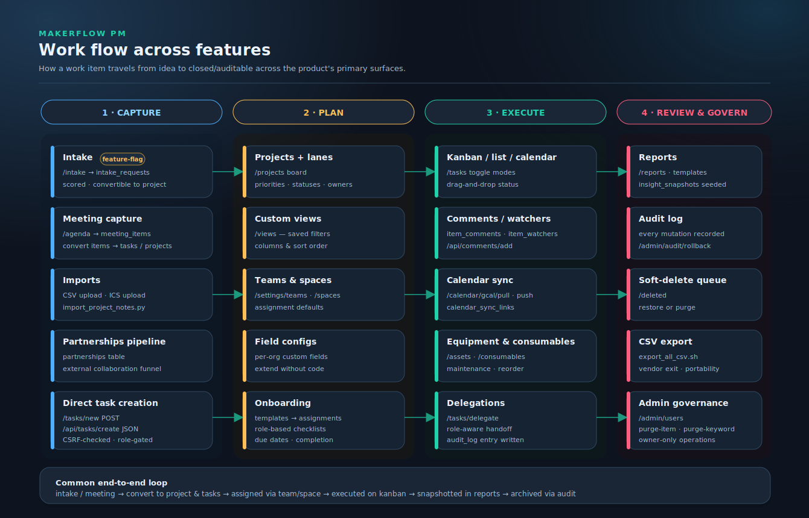
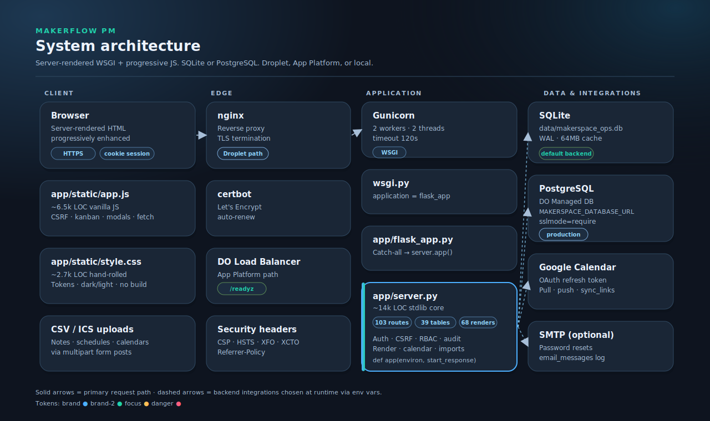
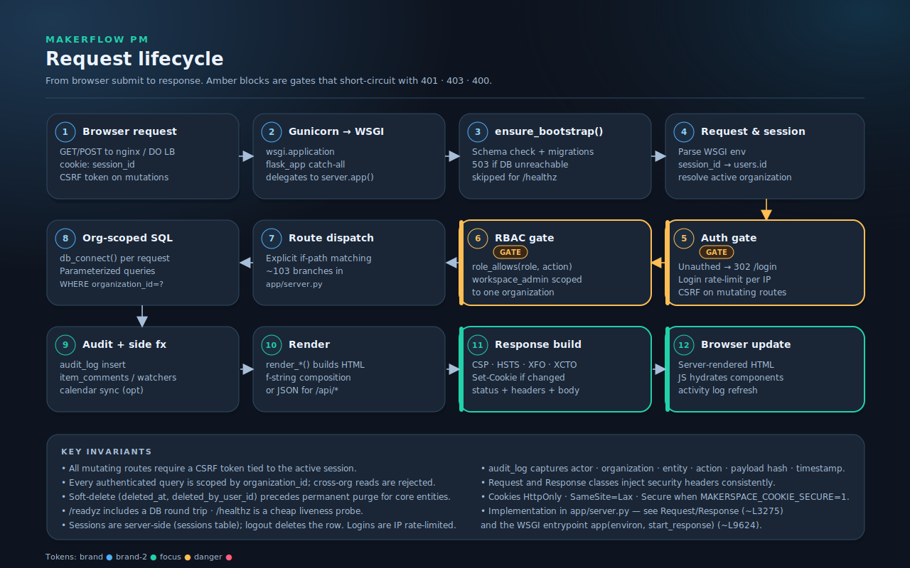
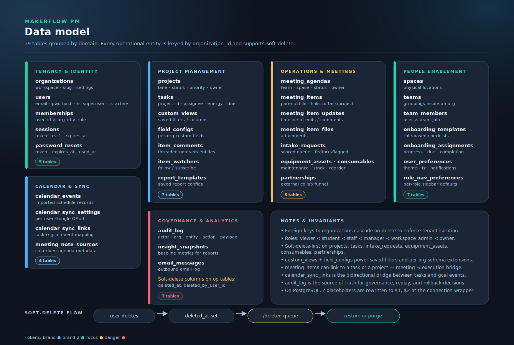
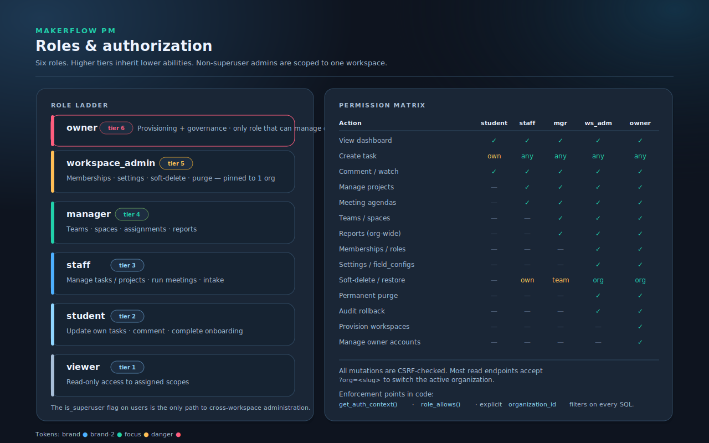
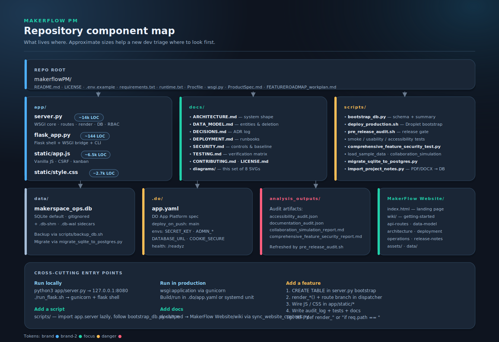
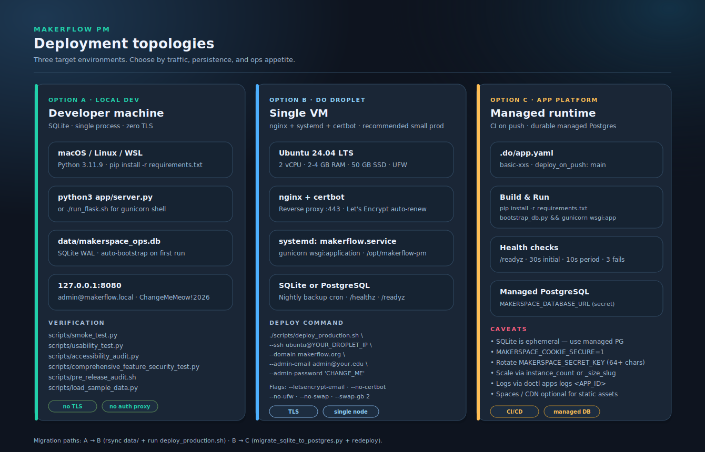

# MakerFlow PM — Product Spec & Developer Onboarding Guide

> Audience: a new developer who just cloned the repo and has not run the app yet.
> Goal: by the end of this document, you can run MakerFlow locally, find any feature in the code, ship a small change safely, and know where to go for deeper material.

- Repository: [https://github.com/ianroy/makerflowPM](https://github.com/ianroy/makerflowPM)
- Primary site: [https://makerflow.org](https://makerflow.org)
- License: [CC BY-SA 4.0](LICENSE)

---

## Table of contents

1. [What MakerFlow PM is](#1-what-makerflow-pm-is)
2. [Who it is for](#2-who-it-is-for)
3. [Product surface area](#3-product-surface-area)
4. [System architecture](#4-system-architecture)
5. [Request lifecycle](#5-request-lifecycle)
6. [Data model](#6-data-model)
7. [Authorization model](#7-authorization-model)
8. [Repository layout](#8-repository-layout)
9. [Run it locally in 5 minutes](#9-run-it-locally-in-5-minutes)
10. [How to find anything in `app/server.py`](#10-how-to-find-anything-in-appserverpy)
11. [Adding a new feature — the canonical recipe](#11-adding-a-new-feature--the-canonical-recipe)
12. [Design system (tokens, components, diagrams)](#12-design-system-tokens-components-diagrams)
13. [Frontend conventions](#13-frontend-conventions)
14. [Database conventions (SQLite + PostgreSQL)](#14-database-conventions-sqlite--postgresql)
15. [Security primitives](#15-security-primitives)
16. [Calendar sync (Google)](#16-calendar-sync-google)
17. [Testing, audits, and release gates](#17-testing-audits-and-release-gates)
18. [Deployment surfaces](#18-deployment-surfaces)
19. [Debugging cookbook](#19-debugging-cookbook)
20. [Known gaps and rough edges](#20-known-gaps-and-rough-edges)
21. [Where to go next](#21-where-to-go-next)

---

## 1. What MakerFlow PM is

MakerFlow PM is a self-hostable project management and operations platform built specifically for **makerspaces, university labs, fabrication studios, and service teams**. It tries to be the one tool a 2–20 person workshop needs to:

- plan and execute work (projects, tasks, kanban/list/calendar),
- run meetings and convert decisions directly into work items,
- track physical reality (spaces, equipment, consumables),
- enable people (onboarding checklists, partnerships, roles),
- preserve accountability (audit log, soft-delete + restore, CSV exports).

The product is implemented as a **server-rendered, stdlib-first Python application** with a thin Flask compatibility shell, dual SQLite/PostgreSQL support, and zero frontend build pipeline. It is intentionally cheap to host — a $6 DigitalOcean Droplet runs it comfortably for a single workshop.

It is built by [Ian Roy](https://github.com/ianroy) using the OpenAI Codex (GPT-5.3 family) workflow for implementation, iterative debugging, simulation-based testing, and documentation refinement.

## 2. Who it is for

| Role in the field | Why MakerFlow fits |
|---|---|
| University makerspace director | Manage staff/students, capture meeting decisions, track equipment maintenance and consumable reorders. |
| Departmental fab-lab manager | One tool for projects, intake, and partnerships; CSV portability for institutional reporting. |
| Service-team lead in industry | Self-hostable, no per-seat fees, clear RBAC for cross-functional access. |
| Faculty PI running a research workshop | Onboarding templates for students; audit history for safety/compliance reviews. |
| Open-source contributor | Hackable monolith — one file holds 90% of the backend logic, easy to grep. |

## 3. Product surface area



The product is organized around four product surfaces:

1. **Capture** — `/intake` (feature-flagged), `/agenda` meetings, CSV/ICS imports, partnerships pipeline, direct task creation.
2. **Plan** — `/projects` boards with lanes, `/views` saved filters, `/settings/teams` + `/settings/spaces`, per-org `field_configs`, onboarding templates.
3. **Execute** — `/tasks` (kanban/list/calendar), comments & watchers, `/calendar/gcal/pull|push`, `/assets` + `/consumables`, delegations.
4. **Review & govern** — `/reports`, audit log + `/admin/audit/rollback`, `/deleted` queue, CSV exports, `/admin/users` governance.

Every transition writes to `audit_log` (and, if configured, `calendar_sync_links`).

## 4. System architecture



- **Client** — a browser receives server-rendered HTML and progressively enhances it with [`app/static/app.js`](app/static/app.js) (~6.5k LOC vanilla JS) and [`app/static/style.css`](app/static/style.css) (~2.7k LOC). No frontend build step.
- **Edge** — on Droplet deploys, nginx terminates TLS and proxies to Gunicorn; on App Platform, the DO load balancer handles ingress and health checks at `/readyz`.
- **Application** — Gunicorn runs [`wsgi.py`](wsgi.py) → [`app/flask_app.py`](app/flask_app.py) (Flask shell + bootstrap hook + CLI) → [`app/server.py`](app/server.py) (the actual WSGI `app(environ, start_response)` function at line ~9624).
- **Data & integrations** — SQLite by default, PostgreSQL when `MAKERSPACE_DATABASE_URL` is set. Optional Google Calendar OAuth and SMTP outbound mail.

The compatibility chain matters: `gunicorn wsgi:application` → `flask_app.application` (the Flask app) → for any path, the catch-all delegates to `server.app(environ, start_response)`. Flask is essentially a thin runtime wrapper so production WSGI servers and CLI tooling work cleanly; routing remains hand-written in `server.py`.

## 5. Request lifecycle



A request walks through these checkpoints, in order:

1. **Browser request** — GET/POST hits the edge with `cookie: session_id` and, for mutations, a CSRF token in form/body.
2. **Gunicorn → WSGI** — `wsgi.py` exposes `application`. [`app/flask_app.py`](app/flask_app.py) catch-all routes proxy the WSGI call into `server.app()`.
3. **`ensure_bootstrap()`** — schema check + idempotent migrations. Returns 503 if the DB is unreachable. Skipped for `/healthz` so liveness stays cheap.
4. **Request & session** — env is parsed into a `Request`; session token resolves to `users.id`; active organization is resolved (URL slug, last-used, or default membership).
5. **Auth gate** — if the route needs auth and the session is missing/expired, redirect to `/login`. Login route is rate-limited per source IP.
6. **CSRF + RBAC** — mutating routes require a CSRF token bound to the session. `role_allows()` enforces the workspace-scoped permission matrix.
7. **Route dispatch** — explicit `if req.path == "/x" and req.method == "POST":` branches in `server.app()` — ~103 of them.
8. **Org-scoped SQL** — `db_connect()` per request; parameterized queries with `WHERE organization_id = ?` on every row touched.
9. **Audit + side effects** — `audit_log` insert; optional fan-out to `item_comments`, `item_watchers`, calendar sync.
10. **Render** — `render_*()` returns HTML; `/api/*` endpoints return JSON.
11. **Response build** — security headers (CSP, HSTS, XFO, XCTO), `Set-Cookie` if anything changed, body bytes.
12. **Browser update** — JS hydrates and refreshes activity feed.

## 6. Data model



Detailed reference: [`docs/DATA_MODEL.md`](docs/DATA_MODEL.md).

Six domains, 39 tables:

- **Tenancy & identity** — `organizations`, `users`, `memberships`, `sessions`, `password_resets`.
- **Project management** — `projects`, `tasks`, `custom_views`, `field_configs`, `item_comments`, `item_watchers`, `report_templates`.
- **Operations & meetings** — `meeting_agendas`, `meeting_items` (parent/child + linked task/project), `meeting_item_updates`, `meeting_item_files`, `intake_requests`, `equipment_assets`, `consumables`, `partnerships`.
- **People enablement** — `spaces`, `teams`, `team_members`, `onboarding_templates`, `onboarding_assignments`, `user_preferences`, `role_nav_preferences`.
- **Calendar & sync** — `calendar_events`, `calendar_sync_settings`, `calendar_sync_links`, `meeting_note_sources`.
- **Governance & analytics** — `audit_log`, `insight_snapshots`, `email_messages`.

Key invariants:

- Every operational row is **organization-scoped**. Foreign keys to `organizations` cascade on delete.
- Core operational entities use **soft-delete first**: `deleted_at` + `deleted_by_user_id` are set; permanent purge runs from `/deleted` or admin cleanup.
- `audit_log` is append-only and the source of truth for governance and rollback.
- `custom_views` and `field_configs` exist so workspaces can extend schema without code changes.

## 7. Authorization model



Roles, least to most privileged:

1. `viewer` — read-only.
2. `student` — update own tasks, comment, complete onboarding.
3. `staff` — manage tasks/projects, run meetings, handle intake.
4. `manager` — teams, spaces, assignments, reports.
5. `workspace_admin` — memberships, settings, soft-delete + purge. Pinned to one organization.
6. `owner` — provisioning, owner-level governance, can manage other owners' accounts.

The `is_superuser` flag on `users` is the only path to cross-workspace administration. Non-superuser admins are constrained to one workspace by design — see [`docs/DECISIONS.md`](docs/DECISIONS.md).

Enforcement lives in three places:

- `get_auth_context()` — resolves the session, user, and active membership at request time.
- `role_allows(role, action)` — central allowlist for high-level capabilities.
- Explicit `WHERE organization_id = ?` filters on every query — no implicit global scope.

## 8. Repository layout



```
makerflowPM/
├── app/
│   ├── server.py          # ~14k LOC monolithic WSGI core
│   ├── flask_app.py       # Flask shell + bootstrap hook + CLI
│   └── static/
│       ├── app.js         # ~6.5k LOC vanilla JS
│       └── style.css      # ~2.7k LOC hand-rolled CSS
├── wsgi.py                # Production WSGI entrypoint
├── scripts/               # Bootstrap, deploy, smoke, security, migration
├── docs/                  # ARCHITECTURE, DATA_MODEL, DECISIONS, DEPLOYMENT, SECURITY, TESTING
│   └── diagrams/          # SVG architecture diagrams
├── data/                  # SQLite DB (gitignored)
├── analysis_outputs/      # Snapshot artifacts from audit scripts
├── .do/app.yaml           # DigitalOcean App Platform spec
├── MakerFlow Website/     # Static landing + wiki (GitHub Pages-ready)
├── ProductSpec.md         # This file
├── FEATUREROADMAP_workplan.md  # Resumable agent-executable roadmap
├── README.md
├── requirements.txt
├── runtime.txt            # Python 3.11.9
├── Procfile               # Heroku-style worker decl
└── .env.example
```

## 9. Run it locally in 5 minutes

```bash
git clone https://github.com/ianroy/makerflowPM.git
cd makerflowPM
cp .env.example .env
python3 app/server.py
```

Open [http://127.0.0.1:8080/login](http://127.0.0.1:8080/login). Default bootstrap account: `admin@makerflow.local` / `ChangeMeMeow!2026`. Rotate immediately if anyone else can reach the host.

Optional, more production-like:

```bash
pip install -r requirements.txt
./run_flask.sh   # gunicorn wsgi:application
```

Seed sample data while exploring:

```bash
python3 scripts/load_sample_data.py
```

Reset to a clean state:

```bash
python3 scripts/reset_release_state.py
```

## 10. How to find anything in `app/server.py`

`app/server.py` is a single ~14,010-line file. It is organized as bands of related concerns. Here are the navigation cheats that survive future refactors:

| Looking for… | Grep for… |
|---|---|
| A route handler | `if req.path == "/projects"` |
| A render function | `def render_projects_page` |
| A table definition | `CREATE TABLE projects` |
| The RBAC matrix | `def role_allows` |
| Auth context | `def get_auth_context` |
| CSRF check | `def verify_csrf` |
| Session creation | `def create_session` |
| The WSGI entrypoint | `def app(environ` |
| The `Request` class | `class Request` |
| Calendar OAuth | `MAKERSPACE_GCAL_CLIENT_ID` |
| SQLite ↔ Postgres adapter | `def _adapt_sql_for_postgres` |
| Bootstrap & migrations | `def ensure_bootstrap` |

Approximate band layout (line numbers shift as code lands — treat as a map, not gospel):

- 1–600 — imports, env config, constants (lanes, statuses, role tables).
- 600–1500 — utilities (dates, hashing, tokens, timezones, GCal helpers).
- 1500–2300 — DB bootstrap, schema upgrades, table creation.
- 2300–4100 — auth, sessions, RBAC.
- 3275–3500 — `Request`/`Response` classes.
- 4000–5300 — dashboard/projects/tasks rendering.
- 5300–7100 — meeting agendas, calendar import/export.
- 7100–9500 — reports, custom views, admin, settings.
- 9624–13993 — route dispatcher (`def app(environ, start_response)`).
- 13993–end — local stdlib server bootstrap.

## 11. Adding a new feature — the canonical recipe

This is the recipe to add a new operational entity (call it `widget`) to MakerFlow. It is the same recipe for almost every feature.

### 1) Define the table

Add a `CREATE TABLE widgets` block to the bootstrap section of [`app/server.py`](app/server.py). Use the existing patterns:

- `id INTEGER PRIMARY KEY AUTOINCREMENT` (SQLite-style; the Postgres adapter rewrites placeholders, not types — see `_adapt_sql_for_postgres`).
- `organization_id INTEGER NOT NULL REFERENCES organizations(id) ON DELETE CASCADE`.
- `created_at`, `updated_at`, `created_by_user_id` columns.
- `deleted_at`, `deleted_by_user_id` if the entity should support soft-delete.
- Indices on common filter columns (`organization_id`, `status`, `assignee_id`).

### 2) Wire up CRUD routes

In the `def app(environ, start_response)` dispatcher, add route branches in the convention `'/widgets'` for the list, `'/widgets/new'` for create POSTs, `'/widgets/update'` for edit POSTs, `'/api/widgets/save'` for JSON. Reuse:

- `get_auth_context(req)` for session/org resolution.
- `role_allows(...)` to short-circuit unauthorized roles.
- `verify_csrf(req)` for mutating routes.
- `db_connect()` for the per-request DB handle (close in `finally`).

### 3) Render

Write a `render_widgets_page(ctx, conn, …)` that returns HTML by composing f-strings. Reuse existing layout helpers (`render_layout`, `render_nav`, `render_alert`). For JSON endpoints, build a dict and call `Response.json(...)`.

### 4) Frontend hooks

In [`app/static/app.js`](app/static/app.js), add any progressive enhancement (modal opener, fetch helper, kanban handler). Reuse the CSRF helper that already lives at the top of the file. In [`app/static/style.css`](app/static/style.css), reuse the `.card`, `.status-column`, `.btn` patterns.

### 5) Audit

Every mutation in step 2 must write an `audit_log` row: actor user id, organization, entity type, entity id, action, payload hash, timestamp. This is non-negotiable.

### 6) Soft-delete + restore

If `widgets` are deletable, add them to the `/deleted` queue: surface in `render_deleted_queue`, accept restore/purge POSTs in the dispatcher.

### 7) Tests

Add a stanza to `scripts/comprehensive_feature_security_test.py` and a smoke check to `scripts/smoke_test.py`. If you create a new endpoint, add it to `scripts/usability_test.py` so it gets exercised in the happy-path simulation.

### 8) Docs

Update [`docs/DATA_MODEL.md`](docs/DATA_MODEL.md). If the feature changes the request flow or deployment shape, update [`docs/ARCHITECTURE.md`](docs/ARCHITECTURE.md) and the relevant SVG in [`docs/diagrams/`](docs/diagrams/). Mirror via:

```bash
python3 scripts/sync_website_content.py
```

### 9) Add a task card to the roadmap

Record the feature in [`FEATUREROADMAP_workplan.md`](FEATUREROADMAP_workplan.md) using the schema documented at the top of that file. This keeps the agent-driven loop honest.

## 12. Design system (tokens, components, diagrams)

MakerFlow PM has a single, hand-rolled design system that lives in [`app/static/style.css`](app/static/style.css). There is no Tailwind, no component library, no Sass build. The visual language is also used for the SVG diagrams in [`docs/diagrams/`](docs/diagrams/) — when you add a diagram, use the same tokens.

### 12.1 Color tokens

Tokens are CSS custom properties declared on `:root`, then overridden on `body[data-theme="dark"]` and `body[data-theme="light"]`. Always reference tokens — never hard-code hex values in component-level rules.

| Token | Default (dark) | `[data-theme="light"]` | Purpose |
|---|---|---|---|
| `--bg` | `#0e141f` | `#f3f7ff` | Page background |
| `--bg-accent` | `#182640` | `#fff1df` | Secondary radial-gradient stop |
| `--card` | `#1a2636` | `#ffffff` | Card surface |
| `--card-soft` | `#1d2d40` | `#f7fbff` | Secondary card (inset / sub-card) |
| `--text` | `#edf4ff` | `#1b2330` | Primary text |
| `--muted` | `#a7bed8` | `#506079` | Secondary / labels |
| `--line` | `#304962` | `#d7dfeb` | Borders & dividers |
| `--brand` | `#4db0ff` | `#0b7bd9` | Primary accent (links, focus rings) |
| `--brand-2` | `#21d1aa` | `#00a882` | Success, "data" emphasis |
| `--focus` | `#ffbe55` | `#ff8f00` | Warning, gate / focus highlight |
| `--danger` | `#ff5e7e` | `#d7263d` | Destructive, error |
| `--shadow` | `#0b1019` | `#e9f0fa` | Card drop shadow (offset, no blur) |

Body backdrop is a layered radial gradient — defined once on `body` and overridden for dark mode. New surfaces inside the app should sit on top of this gradient, not paint a full opaque background.

### 12.2 Typography

```css
font-family: "Avenir Next", "Trebuchet MS", "Segoe UI", sans-serif;
```

- Headings: weight `700`, no fancy sizing — h1 ≈ 1.2 rem in the sidebar brand block.
- Body: default browser size, line-height inherited.
- Code / IDs / paths: a monospace family (Menlo, Consolas) for `MAKERSPACE_*`, route paths, table names — same convention used throughout the diagrams.
- Section labels in diagrams and admin panels use small-caps treatment: 11px, weight `700`, `letter-spacing: 1.6px`, color `--muted`. This is the visual marker for "this is a category header, not a value."

### 12.3 Shape, radius, and elevation

- **Radius scale:** 8 px (small chips / inputs) · 10 px (nav links / buttons) · 12 px (notices) · 16 px (cards, sidebars) · 999 px (pill chips).
- **Borders:** 1 px solid `--line` is the default. Use 2 px solid token-colored border to signal "this is the active / important / gated item" — e.g., a card behind a gate uses `border: 2px solid var(--focus)`.
- **Elevation:** flat, offset drop shadow — `box-shadow: 0 3px 0 var(--shadow)`. No multi-stop blurred shadows. This is the system's signature.
- **Spacing:** rem-based, generally 0.3 / 0.45 / 0.6 / 0.8 / 1.0 / 1.2 rem. Cards have ~0.8 rem internal padding; grids gap 0.4–1.0 rem.

### 12.4 Component primitives

| Primitive | Class(es) | Recipe |
|---|---|---|
| **Card** | `.card`, `.sidebar` | `background: var(--card)` · `border: 1px solid var(--line)` · `border-radius: 16px` · `box-shadow: 0 3px 0 var(--shadow)` |
| **Pill chip** | `.space-chip`, `.org-chip`, `.user-chip` | `border-radius: 999px` · `padding: 0.2rem 0.65rem` · soft-blue fill with darker border · `.active` state darkens the fill and bolds the text |
| **Nav link** | `.nav-link` | `border-radius: 10px` · `padding: 0.3rem 0.65rem` · `font-weight: 600` · hover paints a brand-tinted background |
| **Theme switch** | `.theme-switch` | 44 × 24 px capsule with an 18 × 18 px white knob that translates 20 px on dark-mode toggle |
| **Notice (success)** | `.notice` | green border + soft mint fill, 12 px radius |
| **Notice (error)** | `.error` | red border + soft pink fill |
| **Destructive button** | `.danger-btn`, `.logout-btn` | solid `--danger` fill, white text, 8 px radius |
| **Sticky sidebar** | `.sidebar` | 250 px column, `position: sticky; top: 1rem` so it scrolls with the page |
| **Kanban column** | `.status-column` | card-shaped, vertical stack with drag-and-drop targets |
| **Card-editor modal** | `.card-editor-modal` | full-screen on small viewports, 16 px radius, blurred backdrop |

### 12.5 Color-coding convention (semantic meaning)

The four accent tokens carry meaning consistently across the app, the diagrams, and the docs:

- `--brand` (`#4db0ff`) — informational, neutral primary. Routes, modules, normal links.
- `--brand-2` (`#21d1aa`) — success, data, "completed" or "verified" states. Used for `[x] done` checkboxes and the response side of the request lifecycle.
- `--focus` (`#ffbe55`) — gate / warning / human-in-the-loop. Used for auth + RBAC gates in diagrams and for the meeting/operations domain.
- `--danger` (`#ff5e7e`) — destructive, governance, audit-impact. Used for purge, audit log, owner-only actions, and the governance domain in the data model.

Use the existing semantics when you add new UI. Don't invent a new accent — extend the palette via a new CSS custom property and document it here.

### 12.6 Diagram conventions

Every SVG in [`docs/diagrams/`](docs/diagrams/) follows the same recipe so the docs and the app feel like one product:

- **Canvas background:** solid `#0e141f` plus two layered radial gradients (`<radialGradient>`) anchored at the top-left and top-right — mirrors the body backdrop.
- **Card shape:** `<rect rx="16">` with `fill="#1a2636"` and `stroke="#304962"`. Add a 6 px colored left border to mark the card's category (`<rect width="6">` filled with the relevant accent token).
- **Offset shadow:** draw a second `<rect>` of the same size, offset down by 6 px, filled `#0b1019` at `opacity="0.45"` — reproduces the signature `0 3px 0` shadow.
- **Pill chips:** `<rect rx="11">` with `fill="#1d2d40"` and a token-colored stroke; text in the matching accent color, weight 700, 10 px.
- **Section labels:** 11 px, weight 700, `letter-spacing="1.6"`, `fill="#a7bed8"`.
- **Body text:** 12 px `#a7bed8` (muted). Headings 14–16 px `#edf4ff`. Code-style identifiers in Menlo/Consolas.
- **Arrows:** stroke `#a7bed8` width `1.6`. Dashed (`stroke-dasharray="4,4"`) for "optional / configured at runtime." Use the brand-2 (`#21d1aa`) arrow marker for the recursive loop in the roadmap diagram.
- **Font stack:** declare `font-family="Avenir Next, Trebuchet MS, Segoe UI, sans-serif"` on the root `<svg>`.

Every diagram ends with a tokens footer line, e.g.:

```text
Tokens: brand ● brand-2 ● focus ● danger ●
```

This lets a reader cross-reference colors with the CSS variables without leaving the document.

### 12.7 Accessibility commitments

- Color contrast: the dark theme keeps text on cards at ≥ 7:1 (WCAG AAA for body) and ≥ 4.5:1 (AA for muted). The light theme targets 4.5:1 minimum.
- Focus rings use the `--focus` token at 2 px, never `outline: none` without a replacement.
- Theme is keyboard-toggleable. Dark mode follows OS preference unless overridden by `user_preferences.theme`.
- `scripts/accessibility_audit.py` exercises the canonical pages; do not regress its score.

### 12.8 Where to look in code

- Tokens: [`app/static/style.css:1-46`](app/static/style.css:1)
- Layout primitives: [`app/static/style.css`](app/static/style.css) — see `.app-shell`, `.sidebar`, `.topbar`, `.container`.
- Theme switch behavior: search `data-theme` in [`app/static/app.js`](app/static/app.js).
- Server-side preference: `user_preferences.theme` column; written via `/settings/profile`.

## 13. Frontend conventions

- **No build step.** Files in `app/static/` are served verbatim. Edit and reload.
- **CSRF.** Every fetch/POST must include the CSRF token in the body or header — see the helper at the top of `app.js`.
- **Modals.** The "card editor" modal is the canonical inline edit surface. Open with `openCardEditor({type, id})`; it fetches detail via `/api/<type>/detail`, renders form fields, and posts back to `/api/<type>/save`.
- **Lookups.** Selectable dropdowns (assignees, spaces, teams) hydrate from `/api/lookups`. Use the existing helper rather than calling `fetch` directly.
- **Theme.** Dark mode is driven by `prefers-color-scheme` plus a user preference saved to `user_preferences`. Don't hard-code colors — use CSS variables (see [§12. Design system](#12-design-system-tokens-components-diagrams)).
- **Activity log.** After any mutation, call the activity refresh helper so the user sees the audit timeline update without a hard reload.

## 14. Database conventions (SQLite + PostgreSQL)

- Default backend is SQLite at `data/makerspace_ops.db`. WAL mode, ~64 MB cache, ~256 MB mmap.
- Setting `MAKERSPACE_DATABASE_URL` flips the runtime to PostgreSQL. The connection wrapper provides a duck-typed cursor with SQLite-compatible semantics.
- Use `?` placeholders in all SQL strings. The adapter rewrites them to `$1, $2` for psycopg.
- Stay schema-portable: avoid SQLite-only features like `WITHOUT ROWID`. Avoid Postgres-only features (e.g., `RETURNING *`) unless gated behind the backend detector.
- Soft-delete first; permanent purge second.
- One transaction per request unless you have a clear reason. Close the connection in `finally`.
- Migrations live in `ensure_bootstrap()` / `run_schema_upgrades()`. Make them idempotent — they run on every cold start and every App Platform deploy via `scripts/bootstrap_db.py`.

## 15. Security primitives

Detailed reference: [`docs/SECURITY.md`](docs/SECURITY.md).

- **Passwords** — PBKDF2-SHA256 with per-user salts.
- **Sessions** — server-side `sessions` table with expiry and revocation. Logout deletes the row.
- **Cookies** — HttpOnly, SameSite=Lax, Secure when `MAKERSPACE_COOKIE_SECURE=1`.
- **CSRF** — required on all state-changing routes. Token bound to session, rotated on login.
- **SQL injection** — parameterized queries everywhere. No string concatenation into SQL.
- **Login rate-limit** — per source IP, sliding window.
- **Security headers** — CSP, HSTS, XFO, XCTO, Referrer-Policy injected by `Response`.
- **Audit log** — every sensitive mutation writes `audit_log`.
- **Production baseline** — HTTPS only, 64+ char `MAKERSPACE_SECRET_KEY`, rotated bootstrap admin password, optional SSO/MFA at the institution IdP layer.

## 16. Calendar sync (Google)

- Per-user OAuth credentials live in `calendar_sync_settings`.
- Pull (`/calendar/gcal/pull`) ingests events into `calendar_events` and creates `calendar_sync_links` for any matching task.
- Push (`/calendar/gcal/push`) writes MakerFlow tasks back to a Google Calendar.
- Required env vars: `MAKERSPACE_GCAL_CLIENT_ID`, `_CLIENT_SECRET`, `_REFRESH_TOKEN`, `_CALENDAR_ID` (default `primary`).
- The feature is optional — the app boots fine without it; routes return a friendly "not configured" page.

## 17. Testing, audits, and release gates

Reference: [`docs/TESTING.md`](docs/TESTING.md).

Fast checks (run on every PR):

```bash
python3 scripts/smoke_test.py
python3 scripts/usability_test.py
python3 scripts/accessibility_audit.py
```

Release gate:

```bash
python3 scripts/comprehensive_feature_security_test.py
```

Collaboration sim:

```bash
python3 scripts/load_sample_data.py
python3 scripts/collaboration_simulation.py
python3 scripts/test_data_cleanup.py
```

Full preflight:

```bash
./scripts/pre_release_audit.sh
```

There is **no `pytest` suite yet.** Introducing one is tracked in [`FEATUREROADMAP_workplan.md`](FEATUREROADMAP_workplan.md).

Audit artifacts are written to [`analysis_outputs/`](analysis_outputs/). Check that directory after running scripts.

## 18. Deployment surfaces



Reference: [`docs/DEPLOYMENT.md`](docs/DEPLOYMENT.md).

- **Local** — SQLite, stdlib server, no TLS.
- **Droplet** — Ubuntu 24.04 + nginx + systemd + certbot, provisioned end-to-end via `scripts/deploy_production.sh`.
- **App Platform + Managed Postgres** — `.do/app.yaml` deploys on push to `main`, runs `scripts/bootstrap_db.py && gunicorn wsgi:application`, health-checks `/readyz`.

Critical envs in production: `MAKERSPACE_SECRET_KEY` (64+ chars, secret), `MAKERSPACE_COOKIE_SECURE=1`, `MAKERSPACE_ADMIN_EMAIL`, `MAKERSPACE_ADMIN_PASSWORD` (secret), `MAKERSPACE_DATABASE_URL` (secret, PostgreSQL DSN).

## 19. Debugging cookbook

| Symptom | Likely cause | Where to look |
|---|---|---|
| 503 on every request right after deploy | DB unreachable during `ensure_bootstrap()` | Logs; `MAKERSPACE_DATABASE_URL`; trusted sources allowlist on managed PG. |
| Login redirects back to `/login` forever | Cookie not making it back: secret mismatch, `Secure` flag on HTTP, or session table write failure | `MAKERSPACE_SECRET_KEY` stable across deploys; `MAKERSPACE_COOKIE_SECURE=1` only on HTTPS; check `sessions` row count. |
| CSRF mismatch (400) | Stale browser session after deploy, or split between www/apex hostnames | Logout/clear cookies; force one canonical domain. |
| `spaces` table missing | Bootstrap didn't run | Run `python3 scripts/bootstrap_db.py` manually; ensure App Platform run command chains it. |
| Internal server error after switching to PostgreSQL | SQL edge case the adapter doesn't cover | Logs show the parameterized SQL — usually a `RETURNING` clause or SQLite-only feature. |
| Calendar pull silently does nothing | Refresh token expired | Re-run OAuth flow; rotate `MAKERSPACE_GCAL_REFRESH_TOKEN`. |
| Soft-deleted item not visible in `/deleted` | Wrong org context | Confirm the active organization matches the entity's `organization_id`. |

Health endpoints: `/healthz` (cheap liveness — does not touch DB) and `/readyz` (includes a DB round trip).

## 20. Known gaps and rough edges

These are honest acknowledgments — see [`FEATUREROADMAP_workplan.md`](FEATUREROADMAP_workplan.md) for the curated work plan.

- **Single-file monolith.** `app/server.py` is ~14k LOC. IDE refactor tools struggle. Splitting into modules is on the roadmap as a P2.
- **No CI.** `.github/workflows/` does not exist yet. Adding a smoke + security + a11y pipeline is a top-priority roadmap task.
- **No `pytest` suite.** Verification is script-based. Introducing pytest with fixtures + DB tear-down is on the roadmap.
- **No OpenAPI spec.** `/api/*` endpoints exist but are documented only in source.
- **No background job queue.** Heavy work (email, calendar sync) runs in-request. Acceptable for current scale; replace before going multi-tenant SaaS.
- **Minimal type hints.** Onboarding mypy/pyright is a future task.
- **Hard-purge story is incomplete.** Soft-delete is solid; GDPR-grade hard purge needs work.

## 21. Where to go next

1. Run the app locally ([§9](#9-run-it-locally-in-5-minutes)) and click through every left-nav item.
2. Skim [`docs/DECISIONS.md`](docs/DECISIONS.md) — it explains *why* the architecture looks the way it does.
3. Read the eight SVG diagrams in [`docs/diagrams/`](docs/diagrams/) in order (01 → 08).
4. Open [`FEATUREROADMAP_workplan.md`](FEATUREROADMAP_workplan.md), pick a task whose Status is `[ ] ready`, follow the embedded execution prompt.
5. Make a small change end-to-end using the [feature recipe](#11-adding-a-new-feature--the-canonical-recipe). Submit a PR.

Welcome aboard.
