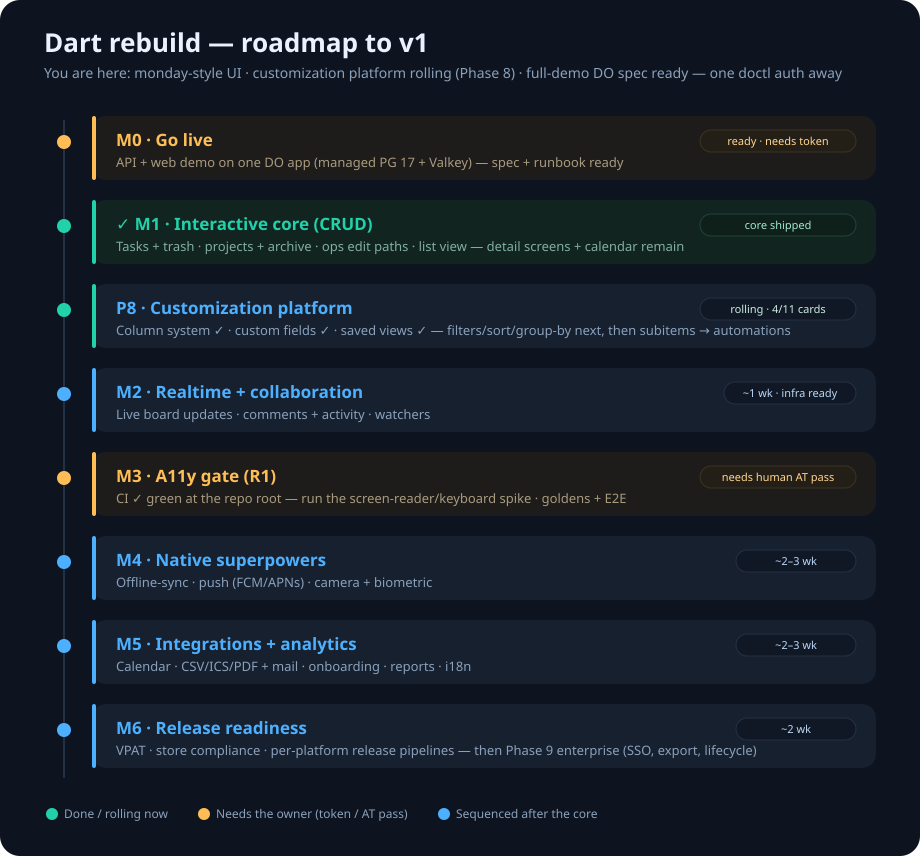

# NEXTSTEPS.md — MakerFlow PM Dart rebuild

The near-term, sequenced roadmap from *here* (live-tested PM + ops core,
deploy-ready, [PR #6](https://github.com/ianroy/makerflowPM/pull/6) open) to a
shippable v1 and beyond. The full per-card backlog lives in
[`../FLUTTER_REBUILD_PLAN.md`](../FLUTTER_REBUILD_PLAN.md); this file is the
prioritized milestone view. Effort: S≈hours · M≈1–2d · L≈3–5d · XL≈1–2wk (one dev).

## Where we are
Backend contract proven (19 live integration tests); the app does live reads +
task create/edit + ops-feature create; auth persists; packaged for DigitalOcean.
Gaps: not running anywhere yet, CRUD partial, realtime/offline/native are
server-side-only, and the **web-a11y decision (R1) is still unmade**.

---

## M0 — Go live (unblocks everything) · ~1–2 days
A real URL on managed Postgres.

| Task | Effort | Deps | Notes |
|---|---|---|---|
| M0.1 Decide PR #6: merge to `main` or keep deploying from `staging` | — | — | **Owner decision** |
| M0.2 Live DO deploy ([DEPLOY.md](DEPLOY.md)) | S | doctl token | **Blocked on owner** |
| M0.3 Production `--seed` server flag | S | — | seed only runs in the build stage today |
| M0.4 Deployed web build → live API; browser-smoke | S | M0.2 | `--dart-define=MAKERFLOW_API=…` |

**DoD:** open URL → sign in → create a task → it persists.

## M1 — Finish the interactive core · ~1 wk (no blockers)
| Task | Effort | Notes |
|---|---|---|
| ~~M1.1 Edit paths for equipment/consumables/meetings~~ ✅ | M | done — create/edit dialogs, tap-to-edit, non-destructive fetch-merge |
| M1.2 Delete + Trash UI | M | `TrashEndpoint` (restore/purge) exists |
| M1.3 Task list + calendar views | M | kanban exists |
| M1.4 Project create/edit + project→task linkage | M | `ProjectEndpoint` exists |
| M1.5 Detail screens: meeting agenda (convert-to-task), intake→project, partnerships | L | endpoints exist |

**DoD:** every core entity is full CRUD from the UI against live data; widget-tested.

## M2 — Realtime + collaboration · ~1 wk
Infra exists (`RealtimeEndpoint`, Redis `Channels`, `ChangeEvent`, `ItemComment`/`ItemWatcher`).

| Task | Effort | Notes |
|---|---|---|
| M2.1 Client `ChangeEvent` subscription; live board/list; reconnect-from-cursor | L | streaming endpoint built |
| M2.2 Comments + activity-stream UI w/ live-region announce | M | `CollabEndpoint.activityStream` |
| M2.3 Watchers | S | `ItemWatcher` model |

**DoD:** two browsers see each other's moves live; comments stream in.

## M3 — Accessibility gate (R1) + CI · ~1 wk — *schedule M3.1 early*
| Task | Effort | Deps | Notes |
|---|---|---|---|
| M3.1 Run `/spike` AT matrix (NVDA+Firefox, VoiceOver+Safari, keyboard); record verdict; decide web vs server-rendered fallback | M | **Human AT pass** | the R1 gate; fixture + report built |
| M3.2 CI gates: 19 server tests (ephemeral PG/Redis) + 5 Flutter tests + axe-core | M | — | `dart-ci.yml` scaffold exists |
| M3.3 Golden tests (both themes) + one Patrol E2E | M | — | — |

**DoD:** CI blocks regressions; recorded AT verdict; web-target decision made.

## M4 — Native superpowers · ~2–3 wk
| Task | Effort | Notes |
|---|---|---|
| M4.1 Offline-sync: Drift cache + mutation queue + reconciler | XL | `SyncEndpoint` keyset-pull + tombstones server-side |
| M4.2 Push (FCM/APNs) + `DeviceToken` | L | model exists |
| M4.3 Camera→`Attachment` upload + biometric (`local_auth`) | L | model exists |

## M5 — Integrations + people/analytics · ~2–3 wk
Calendar sync (googleapis), CSV/ICS/PDF + SMTP, onboarding UI, reports/admin/settings UI, i18n scaffold (ARB/RTL/`<html lang>`), observability (request-id, Insights, error tracker). Models/endpoints mostly stubbed; this is client UI + a few `FutureCall`s.

## M6 — Release readiness · ~2 wk
VPAT (after M3 verdict), store compliance (privacy manifests, signing), per-platform release pipelines.

---

## Recommended sequence
1. **M0 now** — a live URL makes everything demoable + testable.
2. **M1 in parallel** — unblocked, completes the interactive core.
3. **Schedule M3.1 ASAP** — every week of new web UI rides on an unverified web-a11y assumption (R1); waiting compounds rework risk.
4. **M3.2 CI** early + cheap — protect the green state.
5. Then **M2 → M4 → M5 → M6**.

## Blocked on the owner
- **doctl token** → M0.2 live deploy.
- **A screen-reader/keyboard AT pass** (or a tester) → M3.1, or a decision to defer web.
- **Merge call** on PR #6.

## Open follow-ups (non-blocking)
Production seed flag · ops-feature edit paths · equipment space-name resolution
(Space join) · password-reset flow · validate/refresh a restored session key.

_Last updated: 2026-06-25._
